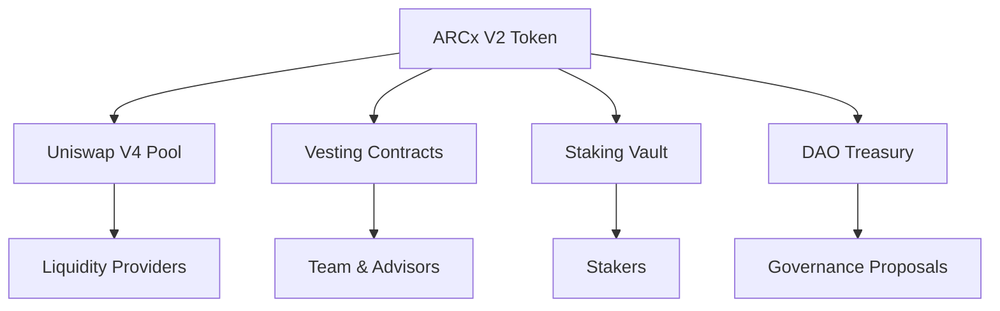

# ARC Ecosystem - Complete System Map
## Canonical Source of Truth for Functions, Endpoints, and Components

**Version:** 1.0.0  
**Generated:** 2026-01-17  
**Purpose:** Comprehensive mapping of the entire ARC ecosystem for building UIs and integrations

---

## Table of Contents

1. [System Overview](#system-overview)
2. [Smart Contracts Registry](#smart-contracts-registry)
3. [Token Systems](#token-systems)
4. [Governance & DAO](#governance--dao)
5. [DeFi Infrastructure](#defi-infrastructure)
6. [NFT & SBT Systems](#nft--sbt-systems)
7. [AI & Attestation Services](#ai--attestation-services)
8. [APIs & Endpoints](#apis--endpoints)
9. [Frontend Interfaces](#frontend-interfaces)
10. [Deployment Configuration](#deployment-configuration)
11. [Network Information](#network-information)
12. [Management Scripts](#management-scripts)

---

## System Overview

### Architecture Layers

```
┌─────────────────────────────────────────────────────────────┐
│                    Frontend Layer                           │
│  - TUI Dashboard (arc-cli)                                 │
│  - Web Interfaces (HTML/React)                             │
│  - AI Assistant Interface                                  │
└─────────────────────────────────────────────────────────────┘
                            ↓
┌─────────────────────────────────────────────────────────────┐
│                   API & Service Layer                       │
│  - AI Engine Backend (TypeScript)                          │
│  - RPC Providers (Infura/Alchemy)                          │
│  - IPFS/IPNS Services                                       │
│  - Block Explorers (BaseScan)                              │
└─────────────────────────────────────────────────────────────┘
                            ↓
┌─────────────────────────────────────────────────────────────┐
│                  Smart Contract Layer                       │
│  - Core Contracts (Base L2)                                │
│  - Governance System                                        │
│  - DeFi Protocols                                          │
│  - Token Systems                                            │
└─────────────────────────────────────────────────────────────┘
                            ↓
┌─────────────────────────────────────────────────────────────┐
│                   Blockchain Layer                          │
│  - Base L2 Mainnet (Chain ID: 8453)                       │
│  - Ethereum L1 (Settlement)                                │
└─────────────────────────────────────────────────────────────┘
```

### Core Components

| Component | Status | Network | Purpose |
|-----------|--------|---------|---------|
| ARCx V2 Enhanced Token | ✅ Live | Base L2 | Core utility token |
| ARCs NFT System | 🚧 Phase 1 | Base L2 | Evolving companion NFTs |
| SBT Identity System | 🚧 Development | Base L2 | Soul-bound credentials |
| ADAM Governance | ✅ Deployed | Base L2 | Meta-governance framework |
| DAO Infrastructure | ✅ Live | Base L2 | Governance and treasury |
| Uniswap V4 Integration | ✅ Live | Base L2 | DEX liquidity |
| Bridge System | ✅ Deployed | Multi-chain | Cross-chain transfers |
| AI Engine Backend | 🚧 Development | Off-chain | AI-powered features |
| Attestation Service | 📋 Planned | IPFS/Blockchain | Verification system |

---

## Smart Contracts Registry

### Deployed Contracts (Base L2 Mainnet)

#### Core Token Contracts

**ARCx V2 Enhanced Token**
- **Address:** `0xDb3C3f9ECb93f3532b4FD5B050245dd2F2Eec437`
- **Network:** Base L2 (Chain ID: 8453)
- **Contract:** `contracts/tokens/arc-x/ARCxV2.sol`
- **Functions:**
  ```solidity
  // ERC20 Standard
  function transfer(address to, uint256 amount) external returns (bool)
  function approve(address spender, uint256 amount) external returns (bool)
  function transferFrom(address from, address to, uint256 amount) external returns (bool)
  function balanceOf(address account) external view returns (uint256)
  function totalSupply() external view returns (uint256)
  function allowance(address owner, address spender) external view returns (uint256)
  
  // Enhanced Features
  function burn(uint256 amount) external
  function mint(address to, uint256 amount) external onlyOwner
  function pause() external onlyOwner
  function unpause() external onlyOwner
  function blacklist(address account) external onlyOwner
  function unblacklist(address account) external onlyOwner
  
  // Supply Management
  function maxSupply() external view returns (uint256)
  function finalizeSupply() external onlyOwner
  function isSupplyFinalized() external view returns (bool)
  ```

**ARCxMath Library**
- **Address:** Deployed as library
- **Contract:** `contracts/tokens/arc-x/ARCxMath.sol`
- **Purpose:** Gas-optimized mathematical operations for ARCx

**GasOptimizedARCx**
- **Contract:** `contracts/tokens/arc-x/GasOptimizedARCx.sol`
- **Purpose:** Alternative implementation with optimized gas usage

#### Infrastructure Contracts

**ARCx Vesting Contract**
- **Contract:** `contracts/tokens/vesting/ARCxVestingContract.sol`
- **Purpose:** Time-locked token distribution
- **Functions:**
  ```solidity
  function createVestingSchedule(address beneficiary, uint256 start, uint256 duration, uint256 amount) external onlyOwner
  function release(address beneficiary) external
  function revoke(address beneficiary) external onlyOwner
  function getVestingSchedule(address beneficiary) external view returns (VestingSchedule memory)
  function getReleasableAmount(address beneficiary) external view returns (uint256)
  ```

**ARCx Airdrop Contract**
- **Contract:** `contracts/tokens/airdrop/ARCxAirdropContract.sol`
- **Purpose:** Merkle-tree based token distribution
- **Functions:**
  ```solidity
  function setMerkleRoot(bytes32 _merkleRoot) external onlyOwner
  function claim(uint256 amount, bytes32[] calldata proof) external
  function isClaimed(address account) external view returns (bool)
  function withdraw() external onlyOwner
  ```

#### Governance Contracts

**ARCDAO**
- **Contract:** `contracts/dao/governance/ARCDAO.sol`
- **Purpose:** Core DAO management
- **Functions:**
  ```solidity
  function propose(address[] memory targets, uint256[] memory values, bytes[] memory calldatas, string memory description) external returns (uint256)
  function castVote(uint256 proposalId, uint8 support) external
  function execute(uint256 proposalId) external payable
  function queue(uint256 proposalId) external
  function cancel(uint256 proposalId) external
  ```

**ARCGovernor**
- **Contract:** `contracts/dao/governance/ARCGovernor.sol`
- **Purpose:** Governor contract for proposals
- **Functions:**
  ```solidity
  function propose(address[] memory targets, uint256[] memory values, bytes[] memory calldatas, string memory description) external returns (uint256)
  function castVote(uint256 proposalId, uint8 support) external returns (uint256)
  function execute(address[] memory targets, uint256[] memory values, bytes[] memory calldatas, bytes32 descriptionHash) external payable returns (uint256)
  function getVotes(address account, uint256 blockNumber) external view returns (uint256)
  function state(uint256 proposalId) external view returns (ProposalState)
  ```

**ARCTimelock**
- **Contract:** `contracts/dao/governance/ARCTimelock.sol`
- **Purpose:** Time-delayed execution for governance
- **Functions:**
  ```solidity
  function schedule(address target, uint256 value, bytes calldata data, bytes32 predecessor, bytes32 salt, uint256 delay) external onlyRole(PROPOSER_ROLE)
  function execute(address target, uint256 value, bytes calldata data, bytes32 predecessor, bytes32 salt) external payable onlyRole(EXECUTOR_ROLE)
  function cancel(bytes32 id) external onlyRole(CANCELLER_ROLE)
  function getMinDelay() external view returns (uint256)
  ```

**ARCTreasury**
- **Contract:** `contracts/dao/governance/ARCTreasury.sol`
- **Purpose:** DAO treasury management
- **Functions:**
  ```solidity
  function allocateFunds(address recipient, uint256 amount, string calldata purpose) external onlyGovernance
  function withdrawETH(address payable recipient, uint256 amount) external onlyGovernance
  function withdrawToken(address token, address recipient, uint256 amount) external onlyGovernance
  function getBalance() external view returns (uint256)
  function getTokenBalance(address token) external view returns (uint256)
  ```

**ARCVoting**
- **Contract:** `contracts/dao/governance/ARCVoting.sol`
- **Purpose:** Voting mechanism implementation
- **Functions:**
  ```solidity
  function createVote(string memory description, uint256 duration) external returns (uint256)
  function vote(uint256 voteId, bool support) external
  function getVoteResult(uint256 voteId) external view returns (bool passed, uint256 forVotes, uint256 againstVotes)
  ```

#### ADAM Meta-Governance System

**AdamHost**
- **Contract:** `contracts/dao/adam/AdamHost.sol`
- **Purpose:** Executes governance actions with policy checks
- **Functions:**
  ```solidity
  function executeWithAdam(address target, bytes calldata data, bytes calldata context) external returns (bytes memory)
  function registerPolicy(address policy, uint256 priority) external onlyOwner
  function setPolicyStatus(address policy, bool active) external onlyOwner
  function checkPolicies(address target, bytes calldata data, bytes calldata context) external view returns (bool, string memory)
  ```

**AdamRegistry**
- **Contract:** `contracts/dao/adam/AdamRegistry.sol`
- **Purpose:** Registry for ADAM policies and contracts
- **Functions:**
  ```solidity
  function registerContract(string memory name, address contractAddress) external onlyOwner
  function registerPolicy(string memory name, address policyAddress) external onlyOwner
  function getContract(string memory name) external view returns (address)
  function getPolicy(string memory name) external view returns (address)
  ```

**ADAM Policies**
- **Dual2FAPolicy:** `contracts/dao/adam/policies/Dual2FAPolicy.sol`
- **ParamsGuardPolicy:** `contracts/dao/adam/policies/ParamsGuardPolicy.sol`
- **RWARecencyPolicy:** `contracts/dao/adam/policies/RWARecencyPolicy.sol`
- **TreasuryLimiterPolicy:** `contracts/dao/adam/policies/TreasuryLimiterPolicy.sol`

#### DeFi Contracts

**ARCSwap**
- **Contract:** `contracts/defi/ARCSwap.sol`
- **Purpose:** DEX integration for token swaps
- **Functions:**
  ```solidity
  function swap(address tokenIn, address tokenOut, uint256 amountIn, uint256 minAmountOut) external returns (uint256)
  function addLiquidity(address tokenA, address tokenB, uint256 amountA, uint256 amountB) external returns (uint256)
  function removeLiquidity(address tokenA, address tokenB, uint256 liquidity) external returns (uint256, uint256)
  ```

**ARCBridge**
- **Contract:** `contracts/defi/infrastructure/ARCBridge.sol`
- **Purpose:** Cross-chain token transfers
- **Functions:**
  ```solidity
  function bridgeToL1(uint256 amount) external payable
  function bridgeFromL1(uint256 amount, bytes calldata proof) external
  function getPendingTransfers(address user) external view returns (Transfer[] memory)
  ```

**ARCxLPHook (Uniswap V4)**
- **Contract:** `contracts/defi/hooks/ARCxLPHook.sol`
- **Purpose:** Custom Uniswap V4 hook for liquidity
- **Functions:**
  ```solidity
  function beforeSwap(address sender, PoolKey calldata key, IPoolManager.SwapParams calldata params) external returns (bytes4)
  function afterSwap(address sender, PoolKey calldata key, IPoolManager.SwapParams calldata params, BalanceDelta delta) external returns (bytes4)
  ```

**StakingVault**
- **Contract:** `contracts/defi/StakingVault.sol`
- **Purpose:** Token staking and rewards
- **Functions:**
  ```solidity
  function stake(uint256 amount) external
  function withdraw(uint256 amount) external
  function claim() external returns (uint256)
  function getStakedAmount(address user) external view returns (uint256)
  function getPendingRewards(address user) external view returns (uint256)
  ```

#### NFT Contracts

**EvolvingCompanion**
- **Contract:** `contracts/tokens/nft/contracts/EvolvingCompanion.sol`
- **Purpose:** Dynamic NFTs that evolve
- **Functions:**
  ```solidity
  function mint(address to, string memory archetype) external onlyRole(MINTER_ROLE) returns (uint256)
  function evolve(uint256 tokenId, string memory newStage) external onlyRole(EVOLVER_ROLE)
  function addTrait(uint256 tokenId, string memory traitType, string memory traitValue) external onlyRole(TRAIT_MANAGER_ROLE)
  function getCompanionData(uint256 tokenId) external view returns (CompanionData memory)
  function tokenURI(uint256 tokenId) external view returns (string memory)
  ```

**ModelRegistry**
- **Contract:** `contracts/tokens/nft/contracts/ModelRegistry.sol`
- **Purpose:** Registry for AI models and archetypes
- **Functions:**
  ```solidity
  function registerModel(string memory name, string memory metadataURI) external onlyOwner returns (uint256)
  function getModel(uint256 modelId) external view returns (Model memory)
  function getAllModels() external view returns (Model[] memory)
  ```

**TraitVault**
- **Contract:** `contracts/tokens/nft/contracts/TraitVault.sol`
- **Purpose:** Storage for NFT traits and attributes
- **Functions:**
  ```solidity
  function storeTrait(uint256 tokenId, string memory traitType, string memory traitValue) external onlyAuthorized
  function getTrait(uint256 tokenId, string memory traitType) external view returns (string memory)
  function getAllTraits(uint256 tokenId) external view returns (Trait[] memory)
  ```

#### SBT Contracts

**ARC_IdentitySBT**
- **Contract:** `contracts/tokens/sbt/ARC_IdentitySBT.sol`
- **Purpose:** Soul-bound identity tokens
- **Functions:**
  ```solidity
  function issue(address to, string memory credentialType, bytes memory data) external onlyIssuer returns (uint256)
  function revoke(uint256 tokenId) external onlyIssuer
  function verify(uint256 tokenId) external view returns (bool valid, CredentialData memory data)
  function getCredentials(address holder) external view returns (uint256[] memory)
  function tokenURI(uint256 tokenId) external view returns (string memory)
  ```

**ARC_Eligibility**
- **Contract:** `contracts/tokens/sbt/ARC_Eligibility.sol`
- **Purpose:** Eligibility checking for governance
- **Functions:**
  ```solidity
  function isEligible(address account) external view returns (bool)
  function checkEligibilityScore(address account) external view returns (uint256)
  function setRequirement(string memory requirement, uint256 value) external onlyOwner
  ```

#### Genesis Contracts

**ARCModelRegistry**
- **Contract:** `contracts/dao/governance/arc-genesis/contracts/registry/ARCModelRegistry.sol`
- **Purpose:** Registry for AI model attestations
- **Functions:**
  ```solidity
  function registerModel(bytes32 modelHash, string memory metadataURI) external returns (uint256)
  function verifyModel(uint256 modelId) external view returns (bool)
  function getModelMetadata(uint256 modelId) external view returns (string memory)
  ```

**ARCProtocolGenesis**
- **Contract:** `contracts/dao/governance/arc-protocol-genesis/contracts/ARCProtocolGenesis.sol`
- **Purpose:** Protocol initialization and state management
- **Functions:**
  ```solidity
  function initialize(bytes calldata initData) external onlyOwner
  function createCheckpoint() external returns (uint256)
  function getGenesisState() external view returns (GenesisState memory)
  ```

---

## Token Systems

### ARCx V2 Enhanced Token

**Token Details:**
- **Name:** ARCx V2 Enhanced
- **Symbol:** ARCX2
- **Decimals:** 18
- **Total Supply:** 1,000,000 ARCX2 (finalized)
- **Network:** Base L2 (Chain ID: 8453)
- **Contract Address:** `0xDb3C3f9ECb93f3532b4FD5B050245dd2F2Eec437`

**Supply Distribution:**
```
Total Supply: 1,000,000 ARCX2
├── Liquidity Pool (Uniswap V4): 500,000 ARCX2 (50%)
├── Vesting Contracts: 300,000 ARCX2 (30%)
├── Airdrop: 100,000 ARCX2 (10%)
└── Marketing & Development: 100,000 ARCX2 (10%)
```

**Token Features:**
- ✅ ERC20 Standard Compliant
- ✅ Burnable
- ✅ Pausable
- ✅ Blacklist Functionality
- ✅ Supply Finalized (no new minting)
- ✅ Gas Optimized
- ✅ Upgradeable (via proxy)

**Uniswap V4 Integration:**
- **Pool Address:** Uniswap V4 Base
- **Pair:** ARCX2/WETH
- **Position ID:** 242940
- **Liquidity:** 500,000 ARCX2
- **Hook:** Custom LP hook at `contracts/defi/hooks/ARCxLPHook.sol`

### ARCs Token

**Token Details:**
- **Name:** ARCs
- **Symbol:** ARCS
- **Contract:** `contracts/tokens/arc-s/ARCs.sol`
- **Purpose:** Utility token for NFT ecosystem
- **Status:** 🚧 In Development

### Token Interactions



---

## Governance & DAO

### Governance Flow

```
1. Proposal Creation (ARCGovernor)
   ↓
2. Voting Period (ARCVoting)
   ↓
3. Timelock Queue (ARCTimelock)
   ↓
4. ADAM Policy Check (AdamHost)
   ↓
5. Execution (ARCDAO)
```

### Voting Parameters

| Parameter | Value | Description |
|-----------|-------|-------------|
| Voting Delay | 1 block | Time before voting starts |
| Voting Period | 50,400 blocks (~7 days) | Duration of voting |
| Proposal Threshold | 10,000 ARCX2 | Tokens needed to propose |
| Quorum | 100,000 ARCX2 | Minimum votes for validity |
| Timelock Delay | 172,800 blocks (~1 day) | Delay before execution |

### Governance Roles

**ARCDAO Roles:**
- `DEFAULT_ADMIN_ROLE`: Can grant/revoke other roles
- `PROPOSER_ROLE`: Can create proposals
- `EXECUTOR_ROLE`: Can execute approved proposals
- `CANCELLER_ROLE`: Can cancel proposals

**ARCTimelock Roles:**
- `TIMELOCK_ADMIN_ROLE`: Timelock administration
- `PROPOSER_ROLE`: Can schedule operations
- `EXECUTOR_ROLE`: Can execute scheduled operations
- `CANCELLER_ROLE`: Can cancel scheduled operations

---

## DeFi Infrastructure

### Uniswap V4 Integration

**Pool Configuration:**
```javascript
{
  token0: "0x4200000000000000000000000000000000000006", // WETH
  token1: "0xDb3C3f9ECb93f3532b4FD5B050245dd2F2Eec437", // ARCX2
  fee: 3000, // 0.3%
  tickSpacing: 60,
  hooks: "ARCxLPHook Address"
}
```

**Position Details:**
- Position ID: 242940
- Range: Full range liquidity
- Amount ARCX2: 500,000
- Amount WETH: ~1.5 ETH (at launch)

### Staking System

**Staking Vault Features:**
- Single-sided ARCX2 staking
- Reward distribution from treasury
- Flexible lock periods
- Auto-compounding option

**Reward Structure:**
```
Base APY: 5%
Lock Multipliers:
- No lock: 1x (5% APY)
- 30 days: 1.5x (7.5% APY)
- 90 days: 2x (10% APY)
- 180 days: 3x (15% APY)
```

### Bridge System

**Supported Chains:**
- Base L2 (native)
- Ethereum L1
- Planned: Polygon, Arbitrum, Optimism

**Bridge Operations:**
```javascript
// L2 to L1
bridgeToL1(amount) -> Lock on L2, Mint on L1

// L1 to L2
bridgeFromL1(amount, proof) -> Burn on L1, Unlock on L2
```

---

## NFT & SBT Systems

### Evolving Companion NFTs

**Archetypes:**
1. Warrior - Combat-focused traits
2. Mage - Magic and intelligence
3. Rogue - Stealth and agility
4. Healer - Support and restoration
5. Scholar - Knowledge and wisdom

**Evolution Stages:**
```
Level 1: Initiate
  ↓ (1000 XP)
Level 2: Adept
  ↓ (5000 XP)
Level 3: Expert
  ↓ (10000 XP)
Level 4: Master
  ↓ (25000 XP)
Level 5: Legendary
```

**Trait System:**
- Base Traits (immutable)
- Evolved Traits (gained through evolution)
- Dynamic Traits (change based on activity)
- Special Traits (rare, event-based)

### Soul-Bound Token (SBT) System

**Credential Types:**
1. **Identity SBT**: Personal verification
2. **Achievement SBT**: Milestone completion
3. **Role SBT**: Governance roles
4. **Skill SBT**: Expertise attestation
5. **Reputation SBT**: Community standing

**SBT Properties:**
- Non-transferable
- Revocable by issuer
- Time-bound (optional)
- On-chain verification
- Off-chain metadata (IPFS)

---

## AI & Attestation Services

### AI Engine Backend

**Location:** `ai-engine/backend/`

**Services:**
- **LLMService**: AI model interactions
- **MCPService**: Model Context Protocol
- **VectorDBService**: Embeddings and search
- **BlockchainService**: On-chain interactions
- **ContractService**: Smart contract operations

**API Endpoints:**
```
POST /api/chat - AI chat interface
POST /api/contract/analyze - Contract analysis
POST /api/contract/generate - Code generation
GET /api/models - List available models
POST /api/verify - Verify attestations
```

### Attestation Service (Planned)

**Purpose:** Decentralized verification of AI model outputs and credentials

**Architecture:**
```
┌──────────────────────────────────────────┐
│     AI Model / User Action               │
└────────────────┬─────────────────────────┘
                 ↓
┌──────────────────────────────────────────┐
│  Attestation Generator (Off-chain)       │
│  - Hash generation                       │
│  - Signature creation                    │
│  - IPFS upload                           │
└────────────────┬─────────────────────────┘
                 ↓
┌──────────────────────────────────────────┐
│  Attestation Contract (On-chain)         │
│  - Store hash                            │
│  - Verify signatures                     │
│  - Track revocations                     │
└────────────────┬─────────────────────────┘
                 ↓
┌──────────────────────────────────────────┐
│  IPFS/IPNS Storage                       │
│  - Full attestation data                 │
│  - Metadata                              │
│  - Verification proofs                   │
└──────────────────────────────────────────┘
```

**Attestation Structure:**
```javascript
{
  id: "unique-attestation-id",
  type: "model-output | credential | verification",
  subject: "address or entity",
  issuer: "attesting party address",
  timestamp: "block timestamp",
  data: {
    modelHash: "0x...",
    inputHash: "0x...",
    outputHash: "0x...",
    metadata: "ipfs://..."
  },
  signature: "0x...",
  chainId: 8453,
  status: "active | revoked"
}
```

**Contract Functions (Planned):**
```solidity
function createAttestation(bytes32 dataHash, string memory metadataURI) external returns (uint256)
function verifyAttestation(uint256 attestationId) external view returns (bool)
function revokeAttestation(uint256 attestationId) external
function getAttestation(uint256 attestationId) external view returns (Attestation memory)
```

---

## APIs & Endpoints

### RPC Endpoints

**Base L2 Mainnet:**
- Infura: `https://base-mainnet.infura.io/v3/{PROJECT_ID}`
- Alchemy: `https://base-mainnet.g.alchemy.com/v2/{API_KEY}`
- Public: `https://mainnet.base.org`

**Base Sepolia Testnet:**
- Infura: `https://base-sepolia.infura.io/v3/{PROJECT_ID}`
- Alchemy: `https://base-sepolia.g.alchemy.com/v2/{API_KEY}`
- Public: `https://sepolia.base.org`

### Block Explorer APIs

**BaseScan:**
- API: `https://api.basescan.org/api`
- Browser: `https://basescan.org`
- Rate Limit: 5 calls/second

**API Examples:**
```bash
# Get ARCx V2 token info
curl "https://api.basescan.org/api?module=token&action=tokeninfo&contractaddress=0xDb3C3f9ECb93f3532b4FD5B050245dd2F2Eec437&apikey=YOUR_KEY"

# Get transaction details
curl "https://api.basescan.org/api?module=transaction&action=gettxinfo&txhash=0x...&apikey=YOUR_KEY"

# Get contract ABI
curl "https://api.basescan.org/api?module=contract&action=getabi&address=0xDb3C3f9ECb93f3532b4FD5B050245dd2F2Eec437&apikey=YOUR_KEY"
```

### Uniswap V4 Subgraph

**Endpoints:**
- Base: `https://api.thegraph.com/subgraphs/name/uniswap/uniswap-v4-base`

**Query Examples:**
```graphql
# Get pool info
{
  pool(id: "POOL_ID") {
    token0 { symbol }
    token1 { symbol }
    liquidity
    sqrtPrice
    tick
    volumeUSD
    feeTier
  }
}

# Get positions
{
  positions(where: { pool: "POOL_ID" }) {
    id
    liquidity
    owner
    tickLower
    tickUpper
  }
}
```

---

## Frontend Interfaces

### Terminal UI (arc-cli)

**Location:** `arc-cli/`

**Main Modules:**
- `index.js` - Entry point and main application
- `lib/navigation.js` - Menu system
- `lib/ecosystem.js` - Ecosystem overview
- `lib/deployments.js` - Deployment management
- `lib/tokens.js` - Token operations
- `lib/nfts.js` - NFT management
- `lib/sbts.js` - SBT operations
- `lib/monitoring.js` - Real-time monitoring
- `lib/config.js` - Configuration management
- `lib/theme.js` - UI theming
- `lib/utils.js` - Utility functions

**Available Commands:**
```bash
npm run cli              # Launch TUI
npm run cli:dev          # Launch in dev mode
```

### Web Interfaces

**Development Engine:**
- Location: `docs/html/artifact_development_engine.html`
- Purpose: Unified development platform
- Features: Contract IDE, deployment, monitoring

**Contract Deployment IDE:**
- Location: `docs/html/contract_deployment_ide.html`
- Purpose: Write, compile, and deploy contracts
- Features: Syntax highlighting, compilation, deployment

**Bridge Interface:**
- Location: `docs/html/bridge.html`
- Purpose: Cross-chain token transfers
- Features: L1↔L2 bridging, history tracking

**NFT Frontend:**
- Location: `contracts/tokens/nft/frontend/`
- Framework: Next.js + React
- Features: Minting, viewing, trait management

**AI Assistant:**
- Location: `ai-engine/frontend/ai-assistant.html`
- Purpose: AI-powered contract interactions
- Features: Chat interface, contract analysis

---

## Deployment Configuration

### Network Configuration

**hardhat.config.ts:**
```typescript
networks: {
  hardhat: { /* local development */ },
  ganache: { /* local testing */ },
  base: {
    url: "https://base-mainnet.infura.io/v3/${INFURA_PROJECT_ID}",
    chainId: 8453,
    accounts: ["0x${DEPLOYER_PRIVATE_KEY}"]
  },
  "base-sepolia": {
    url: "https://base-sepolia.infura.io/v3/${INFURA_PROJECT_ID}",
    chainId: 84532,
    accounts: ["0x${DEPLOYER_PRIVATE_KEY}"]
  }
}
```

### Contract Deployment Addresses

**Location:** `address.book`

**Format:**
```
Network: Base L2 Mainnet (8453)

ARCx V2 Enhanced: 0xDb3C3f9ECb93f3532b4FD5B050245dd2F2Eec437
Vesting Contract: 0x...
Airdrop Contract: 0x...
DAO Contract: 0x...
Governor: 0x...
Timelock: 0x...
Treasury: 0x...
```

### Environment Variables

**Required Variables:**
```env
# RPC Providers
INFURA_PROJECT_ID=your_infura_project_id
ALCHEMY_API_KEY=your_alchemy_api_key

# Block Explorer
ETHERSCAN_API_KEY=your_etherscan_api_key

# Deployment
DEPLOYER_PRIVATE_KEY=your_private_key_without_0x

# Gas Settings
GAS_PRICE_MAINNET=20
GAS_PRICE_TESTNET=10
REPORT_GAS=true

# Optional
COINMARKETCAP_API_KEY=your_cmc_api_key
```

---

## Network Information

### Base L2 Mainnet

**Network Details:**
- **Chain ID:** 8453
- **Currency:** ETH
- **Block Time:** ~2 seconds
- **Finality:** Soft (L2) / Hard (L1 settlement)
- **Explorer:** https://basescan.org

**Network Metadata:**
```json
{
  "chainId": "0x2105",
  "chainName": "Base",
  "nativeCurrency": {
    "name": "Ether",
    "symbol": "ETH",
    "decimals": 18
  },
  "rpcUrls": ["https://mainnet.base.org"],
  "blockExplorerUrls": ["https://basescan.org"]
}
```

### Base Sepolia Testnet

**Network Details:**
- **Chain ID:** 84532
- **Currency:** ETH (testnet)
- **Faucet:** https://www.coinbase.com/faucets/base-ethereum-sepolia-faucet
- **Explorer:** https://sepolia.basescan.org

---

## Management Scripts

### Available Scripts

**Token Management:**
```bash
npm run deploy:base              # Deploy to Base L2
npm run ecosystem:health         # Check system health
npm run monitor:report           # Generate monitoring report
npm run config:validate          # Validate configuration
```

**Vesting Management:**
```bash
npm run vesting:check-beneficiaries
npm run vesting:check-status
npm run vesting:setup-finalize
```

**Liquidity Management:**
```bash
npm run lp:check                 # Check LP positions
npm run lp:configure             # Configure LP settings
```

**Airdrop Management:**
```bash
npm run airdrop:status           # Check airdrop status
npm run airdrop:setup            # Setup airdrop
npm run airdrop:merkle           # Generate merkle tree
```

**Testing:**
```bash
npm test                         # Run all tests
npm run test:security            # Run security tests
npm run test:coverage            # Generate coverage report
npm run test:gas                 # Gas usage analysis
```

**Development:**
```bash
npm run build                    # Compile contracts
npm run clean                    # Clean artifacts
npm run lint                     # Lint Solidity
npm run format                   # Format code
```

### Script Locations

**Location:** `scripts/`

**Key Scripts:**
- `ecosystem-manager.ts` - Ecosystem management
- `deployment-manager.ts` - Deployment orchestration
- `monitor.ts` - Real-time monitoring
- `config.ts` - Configuration management
- `vesting-manager.ts` - Vesting operations
- `airdrop-manager.ts` - Airdrop operations
- `lp-manager.ts` - Liquidity management

---

## Integration Examples

### Web3 Provider Setup

```javascript
import { ethers } from 'ethers';

// Connect to Base L2
const provider = new ethers.JsonRpcProvider(
  `https://base-mainnet.infura.io/v3/${INFURA_PROJECT_ID}`
);

// Load ARCx V2 contract
const arcxAddress = '0xDb3C3f9ECb93f3532b4FD5B050245dd2F2Eec437';
const arcxABI = [...]; // From compiled artifacts
const arcx = new ethers.Contract(arcxAddress, arcxABI, provider);

// Get balance
const balance = await arcx.balanceOf(userAddress);
```

### React Component Example

```jsx
import { useContract, useAccount } from 'wagmi';

function TokenBalance() {
  const { address } = useAccount();
  const arcx = useContract({
    address: '0xDb3C3f9ECb93f3532b4FD5B050245dd2F2Eec437',
    abi: arcxABI,
  });
  
  const [balance, setBalance] = useState('0');
  
  useEffect(() => {
    if (address && arcx) {
      arcx.balanceOf(address).then(setBalance);
    }
  }, [address, arcx]);
  
  return <div>Balance: {ethers.formatEther(balance)} ARCX2</div>;
}
```

### CLI Script Example

```javascript
const { ethers } = require('hardhat');

async function checkEcosystemHealth() {
  const arcx = await ethers.getContractAt(
    'ARCxV2',
    '0xDb3C3f9ECb93f3532b4FD5B050245dd2F2Eec437'
  );
  
  const totalSupply = await arcx.totalSupply();
  const isFinalized = await arcx.isSupplyFinalized();
  const isPaused = await arcx.paused();
  
  console.log('Health Check:');
  console.log(`- Total Supply: ${ethers.formatEther(totalSupply)}`);
  console.log(`- Supply Finalized: ${isFinalized}`);
  console.log(`- Contract Paused: ${isPaused}`);
}
```

---

## Version History

| Version | Date | Changes |
|---------|------|---------|
| 1.0.0 | 2026-01-17 | Initial comprehensive system map |

---

## Appendix

### Useful Links

- **GitHub:** https://github.com/Artifact-Virtual/ARC
- **Documentation:** https://github.com/Artifact-Virtual/ARC/tree/main/docs
- **BaseScan:** https://basescan.org/address/0xDb3C3f9ECb93f3532b4FD5B050245dd2F2Eec437
- **Uniswap Position:** https://app.uniswap.org/positions/v4/base/242940

### Contact & Support

- **Email:** security@arcexchange.io
- **Discord:** [Join our community](https://discord.gg/arc)
- **Twitter:** [@ARCEcosystem](https://twitter.com/ARCEcosystem)
- **Issues:** [GitHub Issues](https://github.com/Artifact-Virtual/ARC/issues)

---

*This document is maintained as the canonical source of truth for the ARC ecosystem. For updates or corrections, please submit a pull request.*
