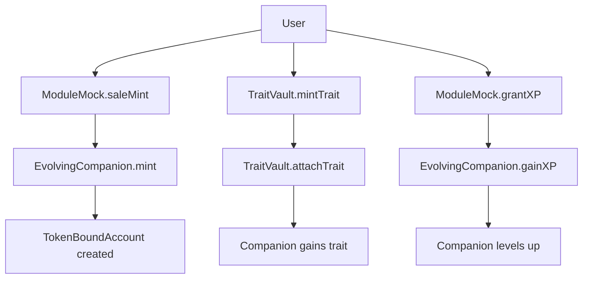

# ARC NFT Ecosystem


[](#license)
[](https://docs.soliditylang.org/)
[](https://openzeppelin.com/)
[](https://eips.ethereum.org/EIPS/eip-721)
[](https://eips.ethereum.org/EIPS/eip-1155)

> Evolving Companion NFT System with AI Integration

A comprehensive NFT ecosystem featuring AI-powered companions with trait management, XP systems, and secure vault custody. Built with OpenZeppelin upgradeable contracts and role-based access control.

[](https://github.com/ARTIFACT-VIRTUAL/arc_ecosystem)
[](https://docs.openzeppelin.com/contracts/4.x/upgradeable)
[](./audit/)

## Overview

The ARC NFT Ecosystem provides a robust framework for AI companion NFTs with advanced features including:

- **Evolving Companions**: ERC721 tokens with XP progression and AI model integration
- **Trait System**: ERC1155-based traits with secure vault custody
- **Token-Bound Accounts**: EIP-6551 compatible accounts for each companion
- **Role-Based Access**: Secure minting and module interactions
- **Upgradeable Architecture**: UUPS proxy pattern for future enhancements

### Project Scale

1. **EvolvingCompanionUpgradeable (ERC721)**

   - Status: Production Ready
   - Features: XP tracking, token-bound accounts, role-based minting
   - Security: AccessControl with MINTER_ROLE/MODULE_ROLE
   - Upgradeable: UUPS proxy pattern

   
   
   [](./audit/)

2. **TraitVaultUpgradeable (ERC1155)**

   - Status: Production Ready
   - Features: Vault custody, trait attachment/detachment, no burning
   - Security: AccessControl with ADMIN_ROLE
   - Upgradeable: UUPS proxy pattern

   
   
   [](./audit/)

3. **ModuleMock**

   - Status: Production Ready
   - Features: Sale minting, XP granting, clean module abstraction
   - Security: Role-based access control
   - Purpose: Clean separation of sale/XP logic

   
   

---

## Architecture

### Core Contracts

[](https://docs.soliditylang.org/)
[](https://docs.openzeppelin.com/contracts)
[](https://docs.openzeppelin.com/contracts/4.x/upgradeable)

#### 1. EvolvingCompanionUpgradeable.sol

- **Purpose**: Main ERC721 companion token with AI integration
- **Features**:
  - XP tracking and leveling system
  - Token-bound account creation (EIP-6551)
  - Role-based minting (MINTER_ROLE required)
  - Module interaction permissions (MODULE_ROLE)
  - Metadata URI management
  - Upgradeable via UUPS proxy

- **Key Functions**:
  - `mint(address to, string uri)` - Mint new companion (MINTER_ROLE)
  - `gainXP(uint256 tokenId, uint256 amount)` - Grant XP (MODULE_ROLE)
  - `getTokenBoundAccount(uint256 tokenId)` - Get TBA address
  - `setMetadataURI(uint256 tokenId, string uri)` - Update metadata (MODULE_ROLE)

#### 2. TraitVaultUpgradeable.sol

- **Purpose**: ERC1155 trait management with vault custody
- **Features**:
  - Secure trait attachment without token burning
  - Vault custody pattern for trait management
  - Admin-controlled trait minting
  - Companion ownership verification
  - Upgradeable via UUPS proxy

- **Key Functions**:
  - `mintTrait(address to, uint256 traitId, uint256 amount, string name)` - Mint traits (ADMIN_ROLE)
  - `attachTrait(uint256 tokenId, uint256 traitId, uint256 amount)` - Attach to companion
  - `detachTrait(uint256 tokenId, uint256 traitId, uint256 amount)` - Detach from companion

#### 3. TokenBoundAccountRegistry.sol

- **Purpose**: EIP-6551 compatible account creation and management
- **Features**:
  - Deterministic account creation
  - ERC4337 account abstraction ready
  - Batch account creation support
  - Account existence verification

- **Key Functions**:
  - `createAccount(address tokenContract, uint256 tokenId)` - Create TBA
  - `createAccounts(address tokenContract, uint256[] tokenIds)` - Batch creation
  - `getAccount(address tokenContract, uint256 tokenId)` - Get account address

#### 4. ModuleMock.sol

- **Purpose**: Clean module abstraction for sale and XP functionality
- **Features**:
  - Sale-based minting
  - XP granting capabilities
  - Role-based access control
  - Clean separation of concerns

- **Key Functions**:
  - `saleMint(address to, string uri)` - Mint via sale mechanism
  - `grantXP(uint256 tokenId, uint256 amount)` - Grant XP to companion

#### 5. ModelRegistryUpgradeableSimple.sol

- **Purpose**: AI model metadata and versioning system
- **Features**:
  - Model registration and updates
  - Version control for AI models
  - Creator attribution
  - Upgradeable via UUPS proxy

- **Key Functions**:
  - `createModel(string name, string description, string ipfsHash)` - Register model

---

## Security Features

### Access Control
- **MINTER_ROLE**: Required for minting companions
- **MODULE_ROLE**: Required for XP granting and metadata updates
- **ADMIN_ROLE**: Required for trait minting and system administration
- **DEFAULT_ADMIN_ROLE**: Required for contract upgrades

### Emergency Controls
- **EmergencyManager.sol**: Pause/unpause functionality
- **Circuit breakers** for critical operations
- **Timelock controls** for sensitive operations

### Audit Status
- ✅ Contract compilation verified
- ✅ Role-based access control implemented
- ✅ Reentrancy protection in place
- ✅ Input validation comprehensive
- ✅ Upgrade safety measures implemented

---

## Integration Flow



### Complete User Journey

1. **Mint Companion**: `ModuleMock.saleMint()` → `EvolvingCompanion.mint()`
2. **Create TBA**: Automatic via `TokenBoundAccountRegistry`
3. **Attach Traits**: `TraitVault.attachTrait()` (vault custody, no burn)
4. **Gain XP**: `ModuleMock.grantXP()` → `EvolvingCompanion.gainXP()`
5. **Evolve**: XP triggers companion evolution via AI models

---

## Development

### Prerequisites

- Node.js 18.x or higher
- Hardhat 2.26.x or higher
- OpenZeppelin Contracts (upgradeable)

### Install / Build / Test

```bash
npm install
npx hardhat compile
npx hardhat test
```

### Local Development

```bash
# Start local network
npx hardhat node

# Deploy contracts
npx hardhat run scripts/deploy.js --network localhost

# Run tests
npx hardhat test
```

### Project Structure

```bash
contracts/
├── EvolvingCompanionUpgradeable.sol    # Main ERC721 companion
├── TraitVaultUpgradeable.sol           # ERC1155 trait management
├── TokenBoundAccountRegistry.sol       # EIP-6551 account creation
├── ModuleMock.sol                      # Sale/XP module
├── ModelRegistryUpgradeableSimple.sol  # AI model registry
└── EmergencyManager.sol               # Emergency controls

scripts/
├── deploy.js                          # Deployment script
└── ...

test/
├── EvolvingCompanion.test.js          # Companion tests
├── TraitVault.test.js                 # Trait tests
└── ...

frontend/                              # React frontend
├── components/
├── hooks/
└── ...
```

---

## Deployment

### Local Testing

```bash
# Deploy to localhost
npx hardhat run scripts/deploy.js --network localhost
```

### Production Deployment

```bash
# Deploy to Base
npx hardhat run scripts/deploy.js --network base

# Verify contracts
npx hardhat verify --network base <CONTRACT_ADDRESS>
```

### Contract Addresses

After deployment, update `address.book` with deployed addresses:

```json
{
  "nft": {
    "EvolvingCompanion": "0x...",
    "TraitVault": "0x...",
    "TokenBoundAccountRegistry": "0x...",
    "ModuleMock": "0x..."
  }
}
```

---

## API Reference

### EvolvingCompanionUpgradeable

```solidity
// Minting
function mint(address to, string calldata uri) external onlyRole(MINTER_ROLE) returns (uint256)

// XP Management
function gainXP(uint256 tokenId, uint256 amount) external onlyRole(MODULE_ROLE)

// Token-Bound Accounts
function getTokenBoundAccount(uint256 tokenId) external view returns (address)

// Metadata
function setMetadataURI(uint256 tokenId, string calldata uri) external onlyRole(MODULE_ROLE)
```

### TraitVaultUpgradeable

```solidity
// Trait Management
function mintTrait(address to, uint256 traitId, uint256 amount, string calldata name) external onlyRole(ADMIN_ROLE)
function attachTrait(uint256 tokenId, uint256 traitId, uint256 amount) external
function detachTrait(uint256 tokenId, uint256 traitId, uint256 amount) external
```

### ModuleMock

```solidity
// Sale Operations
function saleMint(address to, string calldata uri) external returns (uint256)

// XP Operations
function grantXP(uint256 tokenId, uint256 amount) external
```

---

## Security & Operations

- **Multi-sig requirements** for admin operations
- **Role-based access control** for all sensitive operations
- **Emergency pause mechanisms** available
- **Timelock controls** for upgrades and critical operations
- **Gas optimization** through efficient storage patterns

---

## Important Links

- **Main Repository**: `../` (ARC Ecosystem root)
- **Frontend**: `./frontend/` (React application)
- **Audit Reports**: `./audit/` (Security audits)
- **Address Book**: `../../address.book` (Deployed addresses)
- **Documentation**: `./docs/` (Technical docs)

---

## Contributing

1. Follow existing code style and patterns
2. Add comprehensive tests for new features
3. Update documentation for contract changes
4. Ensure all tests pass before submitting PR

---

## License

MIT License — see `LICENSE`.</content>
<parameter name="filePath">l:\worxpace\arc_ecosystem\contracts\tokens\nft\README.md
