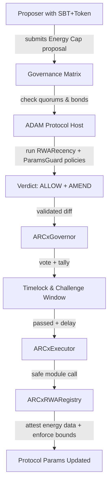

## Energy Cap Update

1. **SBT (Identity Layer)**
   Voter/proposer eligibility checked → must hold active SBTs (roles: validator, curator, etc.) with non-expired heartbeat. Their identity weight contributes to eligibility.

2. **Governance Matrix (Rules Layer)**
   Proposal is tagged `ENERGY`. Matrix enforces:

   * Layers = TOKEN + SBT + RWA\_ENERGY
   * Quorums = TOKEN ≥ 5%, SBT ≥ 8%, RWA\_ENERGY ≥ 5%
   * Total quorum = 7%
   * Supermajority = 58% yes
   * Bond = 100 ARCx

3. **ADAM Protocol (Constitutional Engine)**
   Host evaluates proposal against policies:

   * **ParamsGuard**: ensure `ENERGY_CAP` stays within bounds.
   * **RWARecency**: oracle proofs ≤ R\_k recency.
   * **Dual-2FA**: requires a second confirmation (e.g., SBT-only quorum) within 2–7200 blocks.

   Verdict: `ALLOW` (if proofs + bounds good, and 2FA satisfied).

4. **Governor + Timelock**
   Proposal passes vote → enters timelock (7d). Challenge window = 72h after timelock expiry.
   If no bonded dispute succeeds, proposal is queued.

5. **Executor (Safe Module)**
   Executes validated diff → calls ParamManager.

6. **RWA Registry (Domain Module)**
   `setUint(ENERGY_CAP, newVal)` applied. Event emitted. Subgraphs index update.

7. **Monitor**
   Dashboards track new cap; oracle operators & voters can challenge future anomalies.


## Energy Cap Update Flow


#### Legend

- Proposal originates with identity & token stake.
- Governance Matrix enforces topic quorums and bonds.
- ADAM policies check proof recency, bounds, monotonicity.
- Governor & MACI handle voting.
- Timelock & challenge window protect against rushed execution.
- Executor routes only to allowlisted module.
- RWA Registry validates and commits the Energy Cap update.
- 

# ============== Energy Cap Swimlane ==================

Governor & MACI handle voting.

Timelock & challenge window protect against rushed execution.

Executor routes only to allowlisted module.

RWA Registry validates and commits the Energy Cap update.


## Swimlane Flow

```mermaid
flowchart TD
    subgraph SBT["ARCx Identity SBT (Who)"]
        A[Check proposer has active SBT roles] --> B[Aggregate role weights with decay]
    end

    subgraph Matrix["Governance Matrix (Rules)"]
        B --> C[Topic=ENERGY → enforce<br/>quorums: Token 5%, SBT 8%, RWA 5%]
        C --> D[Require total quorum 7% + 58% supermajority]
        D --> E[Proposer bond 100 ARCx locked]
    end

    subgraph ADAM["ADAM Protocol (How)"]
        E --> F[Host builds Context snapshot]
        F --> G[Run Policy Chain:<br/>ParamsGuard, RWARecency, Dual-2FA]
        G --> H[Verdict = ALLOW/AMEND/DENY/2FA]
    end

    subgraph Governor["Governor + Timelock (When)"]
        H --> I[Proposal passes vote]
        I --> J[7d Timelock + 72h Challenge Window]
    end

    subgraph Executor["Executor (Where)"]
        J --> K[Safe Module executes validated diff]
    end

    subgraph Registry["RWA Registry (What)"]
        K --> L[ParamManager.setUint(ENERGY_CAP,newVal)]
        L --> M[Emit Event + Update Subgraphs]
    end

    subgraph Monitor["Monitor & Disputes"]
        M --> N[Dashboards, alerts, anomaly detection]
        N --> O[If fraud → bonded dispute → override outcome]
    end
```

#### Legend

* **SBT** = who’s allowed
* **Matrix** = what rules apply
* **ADAM** = how policy logic checks
* **Governor** = when decision flows
* **Executor** = where code executes
* **Registry** = what changes on-chain
* **Monitor** = how it’s verified & disputed


