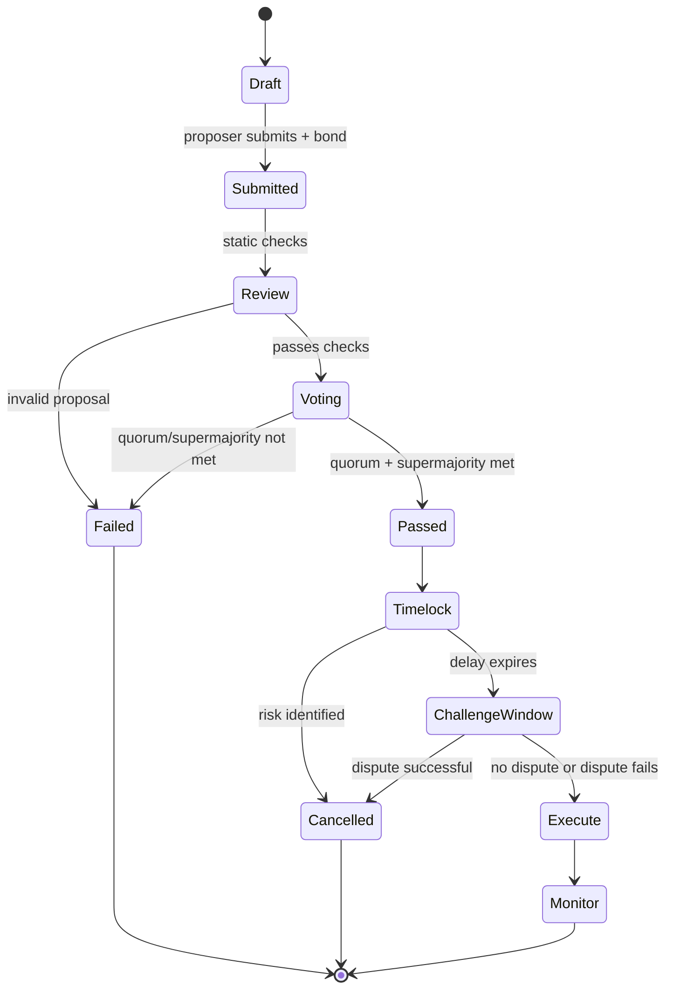

Got it. Let’s capture the **lifecycle of a proposal** from creation to monitoring, first in words, then in Mermaid.

## **Verbal Lifecycle — State Machine**

1. **Draft**
   Proposal is authored off-chain or in staging, not yet submitted.

2. **Submitted**
   Proposer posts on-chain transaction with proposer bond. Subject to immediate **review checks** (allowlist, bounds, syntax, duplicate cooldown).

3. **Review** *(soft gate)*
   24h window for automated + human/static checks. Can be rejected here if invalid.

4. **Voting**
   Voting period begins. Eligibility engine fixes snapshot at `onVoteStart`. MACI/eligibility applies. Votes tallied only at end-of-period.
   Possible outcomes:

   * Quorum not met → **Failed**.
   * Quorum met, supermajority passed → **Passed**.
   * Else → **Failed**.

5. **Timelock**
   If Passed, proposal waits the configured delay. Can still be **cancelled** if new risk discovered.

6. **Challenge Window**
   After timelock, a 48–72h window where bonded disputes may overturn execution (via AdamHost re-checks).

7. **Execute**
   Safe Executor calls allowlisted modules. Execution is atomic, validated again through ADAM policy.

8. **Monitor**
   Post-execution monitoring: dashboards, subgraphs, anomaly detection, potential dispute resolution.

## **Mermaid — Proposal Lifecycle State Machine**

