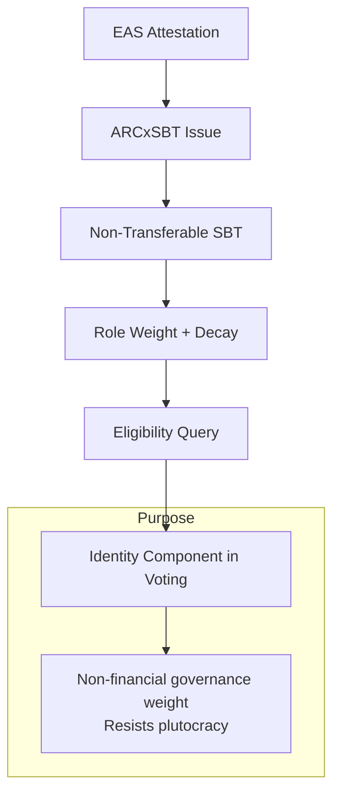
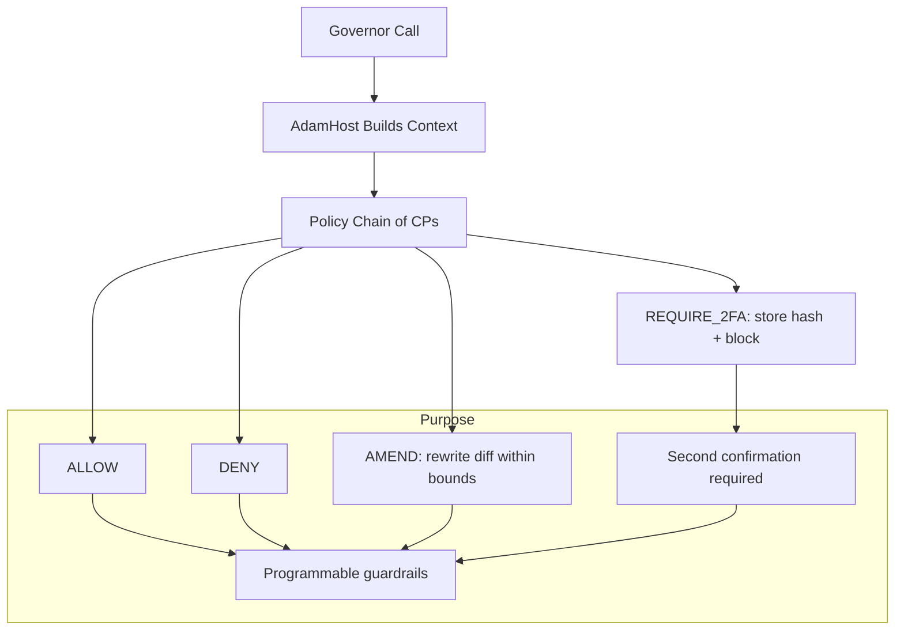
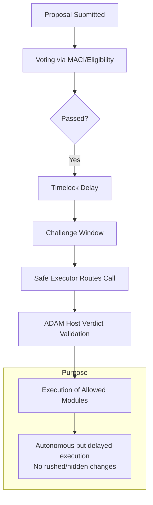
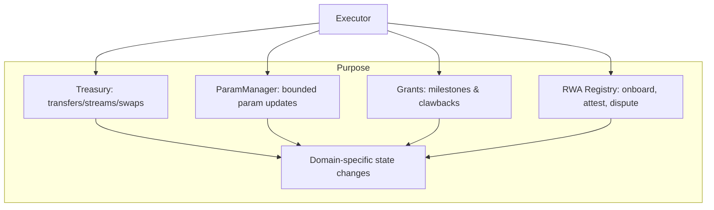

Here are clean **Mermaid diagrams** for each core piece, showing how it works in isolation and its purpose. You can paste these into any Mermaid renderer or Markdown viewer with Mermaid enabled.

## **1. ARC Identity SBT (ARCxSBT)**



## **2. Governance Matrix**

```mermaid
flowchart TD
    A[Proposal Topic] --> B[Layers: Token, SBT, RWA]
    B --> C[Quorum & Supermajority Checks]
    C --> D[Timelock + Challenge Window]
    C --> E[Proposer Bond + FIFO Queue]
    C --> F[Emergency Path: pause()/cancel() + 2FA]

    subgraph Purpose
      D --> G[Deterministic thresholds & rules]
      E --> G
      F --> G
    end
```

## **3. ADAM Protocol**



## **4. ARCxGovernor + Timelock + Executor**



## **5. Execution Modules**


