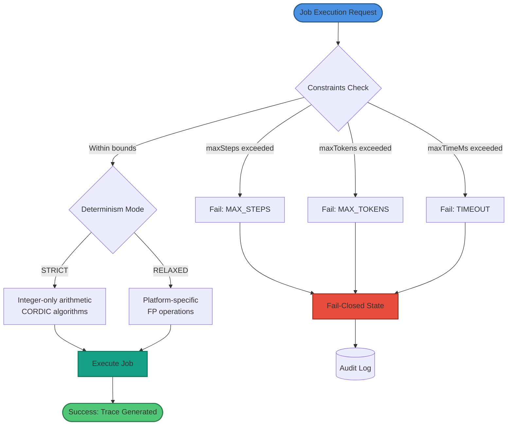
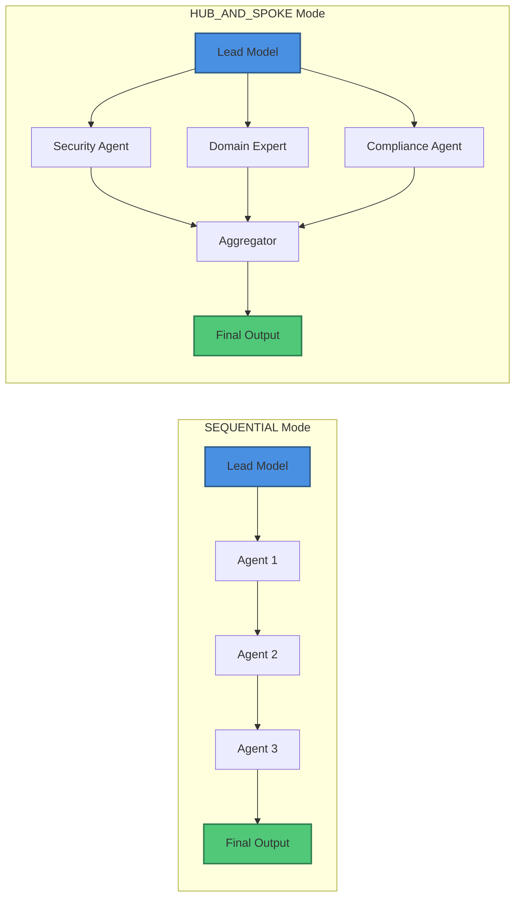
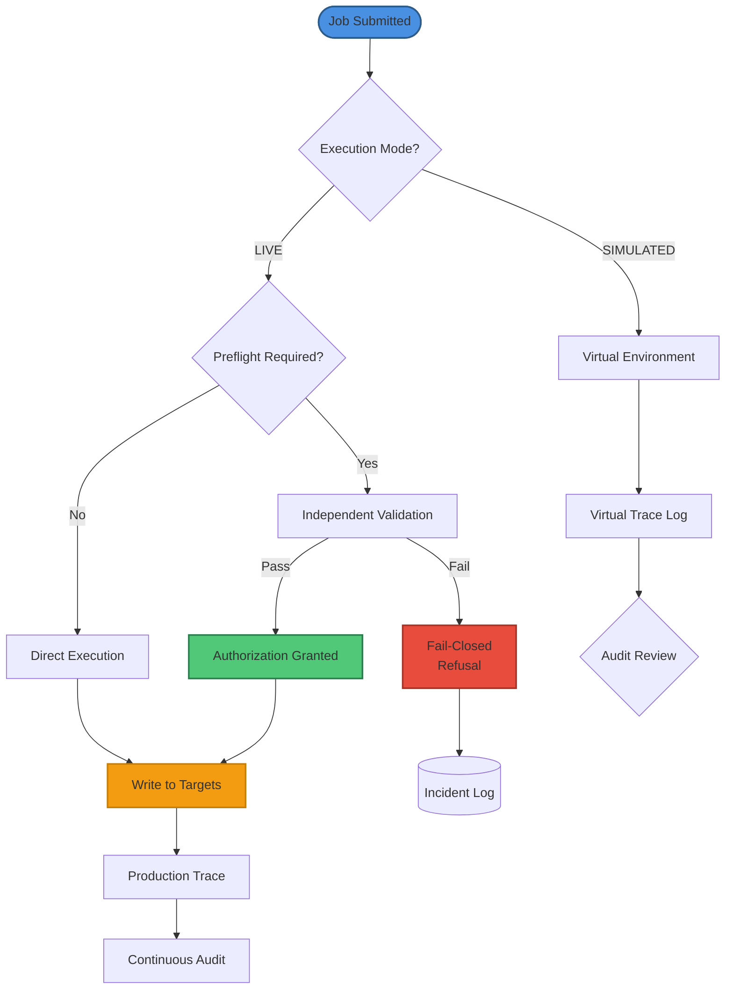
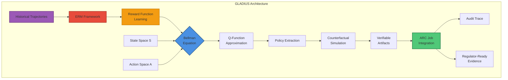
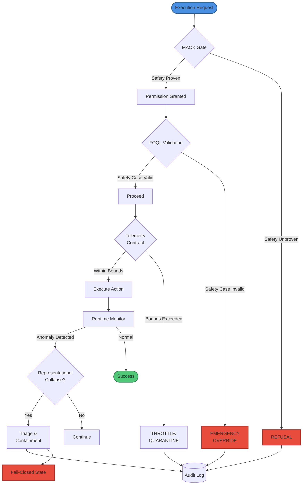
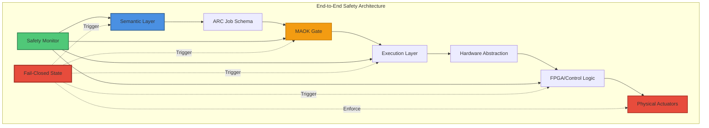

# ARC ECOSYSTEM

> **Deterministic Computation**

---

## Architecture

The evolution of artificial intelligence from probabilistic generation toward deterministic reasoning marks a foundational shift in the design of agentic systems. At the center of this paradigm is the **Autonomous Reasoning Core (ARC)**, a framework that conceptualizes the "Job" as the atomic, non-autonomous unit of work. Within high-stakes environments such as financial markets, governmental infrastructure, and complex scientific research, the risks associated with stochastic model drift and hallucination are unacceptable. The ARC protocol addresses these vulnerabilities by establishing a Job Schema that is bounded, auditable, and inherently deterministic. This report provides an exhaustive analysis of the ARC Job Schema, integrating empirical research on fail-closed protocols, Soulbound Token (SBT) identity binding, and the emerging GLADIUS driver model to define the future of verifiable artificial reasoning.

---

## I. The ARC Job: A Deterministic Specification for Bounded Computation

The ARC framework defines a Job not as a free-roaming agentic process but as a deterministic request for bounded computation. This definition is critical for ensuring that AI systems remain within the control of authorized principals. By formalizing the request as a set of verifiable artifacts, the ARC ensures that every decision-making step is replayable and auditable.

### 1.1 Logical Definition and Invariants

A Job is issued by an authorized principal and executed by composed models under constitutional constraints. The term "composed models" implies that intelligence is not monolithic but rather a functional assembly of specialized sub-components, each governed by a global composition policy. The core invariants of the Job require that it never receives raw data implicitly; it operates exclusively on referenced, hashed inputs to prevent silent data corruption or context injection.

```mermaid
graph TB
    subgraph "ARC Job Schema Structure"
        A[Job] --> B[Identity Layer]
        A --> C[Scope Definition]
        A --> D[Input Set]
        A --> E[Constraints]
        A --> F[Composition Policy]
        A --> G[Execution Policy]
        A --> H[Audit Policy]
        
        B --> B1[jobId: bytes32]
        B --> B2[issuer: address]
        B --> B3[issuerSBT: bytes32]
        B --> B4[nonce: uint64]
        
        C --> C1[domain: enum]
        C --> C2[allowedActions]
        C --> C3[forbiddenActions]
        C --> C4[dataClasses]
        
        D --> D1[references: bytes32[]]
        D --> D2[payloadHash: bytes32]
        D --> D3[contentAddressed]
        
        E --> E1[maxSteps]
        E --> E2[maxTokens]
        E --> E3[maxTimeMs]
        E --> E4[determinism: enum]
        
        F --> F1[leadModelClass]
        F --> F2[interactionMode]
        F --> F3[maxModels]
        
        G --> G1[executionMode]
        G --> G2[writeTargets]
        G --> G3[requirePreflight]
        
        H --> H1[traceLevel]
        H --> H2[retention]
        H --> H3[auditors]
        H --> H4[disputeWindow]
    end
    
    style A fill:#4a90e2,stroke:#2e5c8a,stroke-width:3px,color:#fff
    style B fill:#50c878,stroke:#2e7d4e,stroke-width:2px
    style C fill:#f39c12,stroke:#c87f0a,stroke-width:2px
    style D fill:#9b59b6,stroke:#6c3483,stroke-width:2px
    style E fill:#e74c3c,stroke:#a93226,stroke-width:2px
    style F fill:#16a085,stroke:#117a65,stroke-width:2px
    style G fill:#e67e22,stroke:#ba4a00,stroke-width:2px
    style H fill:#34495e,stroke:#1c2833,stroke-width:2px
```

**Table 1. Core Schema Fields and Security Properties**

| Schema Field | Type | Functional Role | Security Implication |
|--------------|------|-----------------|---------------------|
| jobId | bytes32 | Unique identifier for execution tracing | Prevents duplicate processing and replay attacks |
| issuer | address | Cryptographic identity of the principal | Establishes the origin of authority |
| issuerSBT | bytes32 | Reputation and credential binding | Ensures the issuer has the required permissions |
| jobType | bytes32 | Classification of the reasoning task | Determines the default scope and resource limits |
| expiry | uint64 | Temporal validity limit | Prevents the execution of stale or outdated logic |
| nonce | uint64 | Monotonic counter | Protects against state-mismatch and out-of-order execution |

The Job structure ensures that the reasoning process is non-autonomous in its governance but autonomous in its execution within the defined constraints. This distinction allows for the deployment of "no-meta" autonomy, where the system operates without the need for a privileged overseer that is assumed correct. Instead, correctness is derived from the observable-only interaction boundary.

---

## II. Identity and Authority: The Role of Soulbound Tokens

The `issuerSBT` field within the ARC Job Schema represents a shift from transient session-based identity to permanent, reputation-based identity binding. Soulbound Tokens (SBTs) are non-transferable digital assets permanently linked to a specific entity, representing achievements, credentials, or historical associations.

### 2.1 Credential Verification and Reputation Systems

In the ARC framework, an AI agent or a human principal must possess specific SBTs to authorize high-privilege Jobs. For instance, a Job categorized under the FINANCE domain might require an `issuerSBT` that certifies the principal's compliance with specific regulatory standards or past performance metrics. Because SBTs are immutable and stored on a blockchain ledger, they provide a trustworthy representation of an agent's capabilities that cannot be "flipped" or traded on secondary markets.

**Table 2. Soulbound Token Characteristics**

| SBT Characteristic | Mechanism | Impact on ARC Governance |
|--------------------|-----------|--------------------------|
| Non-Transferability | Bound to a specific wallet address | Prevents credential theft and unauthorized delegation |
| Immutability | Blockchain-based storage | Ensures long-term verification and auditability |
| Revocability | Issuer-side revocation functions | Allows for the removal of access if credentials expire |
| Sybil Defiance | Unique identity binding | Protects the ecosystem from bot-driven spam and duplication |

The research indicates that the integration of SBTs into the AI governance stack allows for reputation-aware applications where contributions mint new credentials. This creates a "Web3-native resume" for AI agents, where their authority to execute complex ARC Jobs is directly proportional to their provable history of successful, safe executions.

---

## III. Scope Governance: Defining the Boundary of the Possible

The Scope object is the primary defensive mechanism within the Job Schema, defining what is allowed rather than what is desired. This is a fundamental principle of fail-closed security: any action not explicitly permitted is forbidden by default.

### 3.1 Domain Partitioning and Invariants

The `domain` field categorizes the Job into one of several predefined sectors: **FINANCE**, **GOVERNANCE**, **INFRA**, **RESEARCH**, or **OPS**. Each domain carries its own set of `allowedActions` and `forbiddenActions`. The invariant here is strict: a model cannot execute outside its declared scope, even if its internal weights and training data suggest it has the capability to do so.

**Table 3. Domain Classification and Scope Boundaries**

| Domain Class | Typical allowedActions | Typical dataClasses |
|--------------|------------------------|---------------------|
| FINANCE | Order entry, risk assessment, ledger query | RESTRICTED, INTERNAL |
| GOVERNANCE | Voting, proposal analysis, stake management | PUBLIC, INTERNAL |
| INFRA | Resource allocation, telemetry monitoring | INTERNAL, RESTRICTED |
| RESEARCH | Literature review, data synthesis, simulation | PUBLIC |
| OPS | Routine automation, log rotation, status checks | PUBLIC, INTERNAL |

The use of "observable-only" floors ensures that the model's actions are governed by auditable invariants. For example, a **visibility floor** might mandate that all system state changes must be logged before they are executed, while a **contraction floor** ensures that the agent's complexity does not expand beyond its budgeted resources. This prevents the "specification gaming" common in reinforcement learning agents, where a model might achieve a proxy goal (e.g., hiding trash) rather than the intended outcome (e.g., removing trash).

---

## IV. InputSet Integrity and Content-Addressable Memory

The InputSet ensures that the reasoning core operates in a "clean room" environment. By requiring that all inputs be referenced as `bytes32` hashes, the ARC protocol eliminates the risk of implicit data injection or silent context drift.

### 4.1 Canonicalization and Deterministic Retrieval

Deterministic retrieval guarantees that identical inputs always resolve to the same verified outputs. This is achieved through content-addressed storage, which automatically identifies and collapses identical documents or embeddings across the enterprise. When an ARC Job is executed, the `references` array contains hashes that point to specific datasets or configurations. The system generates a `payloadHash` of the task parameters, ensuring that the instructions themselves have not been tampered with.

The deterministic computation property can be formalized as:

$$
\forall i \in \text{InputSet}, \; h(i) = h'(i) \implies f(i) = f'(i)
$$

where $h$ is the cryptographic hash function and $f$ represents the computation. This ensures that identical hashed inputs produce identical outputs across all executions.

The analysis of deterministic AI systems shows that reuse of identical work can reduce compute consumption by 50–90%. In high-trust environments, "deterministic mode" removes randomness from execution paths, delivering bit-consistent outputs across hardware and deployments. This is particularly relevant for the GLADIUS driver model, which relies on consistent state transitions for its Empirical Risk Minimization (ERM) framework.

---

## V. Hard Constraints: The Physics of Reasoning

The Constraints object defines the hard limits of the Job. Unlike traditional software that may degrade under load, an ARC Job that exceeds its constraints must fail immediately.

### 5.1 Resource Budgeting and Determinism

The constraints include `maxSteps`, `maxTokens`, and `maxTimeMs`. These parameters prevent "infinite loops" and "token bleeding," where an agent might consume excessive resources without reaching a logical conclusion. The `determinism` enum (STRICT, RELAXED) dictates how the underlying hardware should handle floating-point calculations and transcendental operators.

**Table 4. Constraint Parameters and Failure Modes**

| Constraint Field | Typical Value | Purpose | Failure Mode |
|------------------|--------------|---------|-------------|
| maxSteps | 100 – 1,000 | Limits logical depth of reasoning traces | Termination with partial trace log |
| maxTokens | 8k – 128k | Controls memory and context usage | Out-of-memory fail-closed event |
| maxTimeMs | 5,000 – 60,000 | Prevents hung processes in real-time systems | Timeout with status "EXPIRED" |
| mutationAllowed | Boolean | Toggles read-only vs. read-write access | Access violation error |

In **STRICT** determinism mode, the system forbids platform-dependent math intrinsics. If transcendental-like behavior is required, it must use deterministic integer-only algorithms such as CORDIC or pre-committed polynomial tables. This ensures that the reasoning path can be replayed bit-for-bit on any ARC-compliant hardware, a prerequisite for "regulator-ready" evidence.



---

## VI. Composition Policy: Orchestrating the Reasoning Swarm

The ARC protocol explicitly forbids "free-form swarms" of agents. Instead, the CompositionPolicy mandates an explicit and finite assembly of models. This prevents emergent behaviors that are difficult to predict and secure, such as tacit price-fixing or collateral deception.

### 6.1 Lead Models and Interaction Modes

The `leadModelClass` serves as the strategic "architect," responsible for task decomposition and routing. The `interactionMode` defines how the sub-agents collaborate:

▸ **SEQUENTIAL**: A linear chain where each agent's output serves as the next one's input. This mode is best for tasks requiring deep, multi-step logical consistency.

▸ **HUB_AND_SPOKE**: The lead model communicates directly with specialized "spoke" agents (e.g., a security engineer or a domain expert), aggregating their findings into a final report. This mode is optimal for complex analysis requiring parallel verification.



The research into the SuperGemini framework highlights a 13-agent collaboration architecture that utilizes "behavioral modes" like introspection and brainstorming to modify interaction patterns dynamically based on task complexity. However, in the ARC Job Schema, these interactions are restricted by the `maxModels` limit to ensure that the reasoning trace remains manageable and auditable.

---

## VII. Execution Policy and Preflight Safety

The ExecutionPolicy governs the model's interaction with the external environment. A critical invariant is that no model writes state without explicit declared targets.

### 7.1 Simulated vs. Live Execution

In **SIMULATED** mode, the agent's actions are recorded in a trace but never applied to the production environment. This is used for "counterfactual simulations," allowing policy-makers to evaluate the potential effects of a decision (e.g., sending a coupon or changing a recommendation algorithm) before commitment. In **LIVE** mode, the agent can interact with `writeTargets`, which are specific blockchain addresses or API endpoints.

**Table 5. Execution Mode Comparison**

| Execution Parameter | SIMULATED Mode | LIVE Mode |
|---------------------|----------------|-----------|
| State Mutation | Disabled (Virtual only) | Enabled for writeTargets |
| Preflight | Optional validation | Mandatory check required |
| Trace Visibility | Full detail allowed | Masked or hashed if sensitive |
| Audit Requirement | Minimal compliance check | Continuous real-time auditing |

The `requirePreflight` flag mandates an independent validation step before any action is taken. This acts as a "hallucination-aware audit gate," mediating protected actions via verifiable logs and capability tokens without relying on the model's internal introspection. If the preflight check fails, the system enters a fail-closed state, refusing to execute the action.



---

## VIII. Audit Policy: Ensuring Non-Repudiation

The AuditPolicy defines how the execution trace is recorded and stored. Every ARC Job must produce an immutable execution trace.

### 8.1 Trace Levels and Dispute Windows

The `traceLevel` enum allows for a trade-off between privacy and transparency. **HASH_ONLY** records only the cryptographic commitments of the reasoning steps, while **FULL** records the complete semantic reasoning trace. The `retention` field specifies how long the logs must be kept, and the `auditors` array identifies the specialized entities (human, LLM, or computational checker) authorized to review the trace.

A `disputeWindow` provides a temporal buffer for external actors to challenge the reasoning output. This is vital in "decentralized auditing" frameworks, where Byzantine Fault Tolerant systems guarantee correctness even if a fraction of the participants are malicious. The use of "Proof-Carrying Numbers" (PCN) in the audit process ensures that numeric outputs are mechanically verified against authoritative reference values at the presentation layer.

**Mathematical formulation for audit verification:**

$$
\text{Verify}(\tau, h_\tau) = \begin{cases}
\text{ACCEPT} & \text{if } H(\tau) = h_\tau \land \text{Validate}(\tau) = \top \\
\text{REJECT} & \text{otherwise}
\end{cases}
$$

where $\tau$ is the execution trace, $h_\tau$ is the committed hash, $H$ is the hash function, and $\text{Validate}$ checks logical consistency.

---

## IX. Implementation Study: The GLADIUS Driver Model

The GLADIUS driver model provides a practical example of the ARC protocol applied to the domain of sequential decision-making. It addresses the scalability issues inherent in traditional Discrete Decision-making with Counterfactuals (DDC) by employing Empirical Risk Minimization (ERM).

### 9.1 Empirical Risk Minimization (ERM) and IRL

Traditional Inverse Reinforcement Learning (IRL) requires estimating transition probabilities, which is infeasible in large state spaces. GLADIUS circumvents this by satisfying the Bellman equation through an inner maximization problem. This allows the model to learn reward functions compatible with collected datasets without explicit transition model estimation.

The **Bellman equation** for optimal value function is:

$$
Q^*(s, a) = R(s, a) + \gamma \sum_{s'} P(s'|s, a) \max_{a'} Q^*(s', a')
$$

where:
- $Q^*(s, a)$ is the optimal state-action value function
- $R(s, a)$ is the reward function
- $\gamma$ is the discount factor
- $P(s'|s, a)$ is the state transition probability

GLADIUS employs an **ERM framework** that learns the reward function by minimizing empirical risk:

$$
\hat{R} = \arg\min_{R \in \mathcal{R}} \frac{1}{N} \sum_{i=1}^{N} \ell(R; \tau_i)
$$

where:
- $\hat{R}$ is the estimated reward function
- $\mathcal{R}$ is the space of candidate reward functions
- $\ell(R; \tau_i)$ is the loss for trajectory $\tau_i$
- $N$ is the number of observed trajectories



This mathematical framework enables GLADIUS to be used in "counterfactual simulations," evaluating policy decisions without direct experimentation. When wrapped in an ARC Job, GLADIUS acts as the RESEARCH engine, producing verifiable artifacts that are "regulator-ready" due to their provable convergence to the true $Q^*$ saddle point.

**Table 6. GLADIUS vs. Traditional IRL**

| Feature | Traditional IRL | GLADIUS (ARC-Compatible) |
|---------|----------------|--------------------------|
| Transition Model | Explicit estimation required | Implicit via ERM framework |
| Scalability | Limited by state-space size | High (Parametric/NN compatible) |
| Convergence | Often unstable in large spaces | Provable via PL condition |
| Identification | Requires strong anchor actions | Compatible with weaker assumptions |

The GLADIUS implementation highlights the necessity of deterministic computation. If the underlying algorithms were stochastic, the ERM objective could diverge, leading to "silent failures" where a model appears to be learning but is actually producing ungrounded reward functions.

---

## X. Fail-Closed Gating and Safety Standards

The ARC framework is designed for "high-stakes AI," where the default state must be refusal unless safety and accountability are proven beforehand. This "fail-closed" logic distinguishes production-ready AI from experimental models.

### 10.1 The MAOK Execution Control Layer

The **Market Adjudication & Operational Kernel (MAOK)** serves as an execution control layer that evaluates permission rather than correctness. MAOK's rule is strict: if execution safety cannot be proven, execution is denied. This creates a non-bypassable refusal path that prevents "hallucination-driven" state changes.



Research into "Self-Recognition Kernels" shows that fail-closed gating can be used to enforce visibility and contraction floors. In the event of a "representational collapse"—where an AI's internal model fails to handle out-of-distribution data—the gate protocol triages the failure and prevents the agent from taking irreversible actions.

**Table 7. Safety Mechanism Layers**

| Safety Mechanism | Layer | Primary Function | Failure State |
|------------------|-------|------------------|--------------|
| Gating (Fail-Closed) | Infrastructure | Blocks unauthorized execution | Refusal (Safe state) |
| MAOK Adjudication | Decision | Evaluates permission against clauses | Audit rejection |
| FOQL Validation | Logical | Checks safety-case envelopes | Emergency override |
| Telemetry Contract | Transport | Enforces resource and latency bounds | Throttling/Quarantine |

---

## XI. Advanced Reasoning and Knowledge Representation

The Abstraction and Reasoning Corpus (ARC-AGI) provides a benchmark for evaluating the intelligence of these cores based on "minimal cognitive priors". Performance on ARC tasks is measured not by the model's size but by its ability to learn transformation rules from limited examples (averaging 3.3 per task).

### 11.1 Inductive Learning and the MDL Principle

The "MADIL" approach to reasoning leverages the **Minimum Description Length (MDL)** principle, stating that the model that best describes the data is the one that compresses it the most. This aligns with the ARC framework's commitment to "bounded computation"—intelligence is optimized not for excessive generation but for precise, minimal reasoning traces that are easily verified.

The MDL principle can be formalized as:

$$
\text{MDL}(H) = L(H) + L(D|H)
$$

where:
- $L(H)$ is the length of the hypothesis description
- $L(D|H)$ is the length of the data encoded using hypothesis $H$
- The best model minimizes the total description length

For ARC tasks, this translates to finding transformation rules $T$ that minimize:

$$
T^* = \arg\min_{T \in \mathcal{T}} \left( |T| + \sum_{k=1}^{n} |o_k - T(i_k)| \right)
$$

where:
- $T^*$ is the optimal transformation
- $\mathcal{T}$ is the space of possible transformations
- $|T|$ represents the complexity of the transformation
- $i_k$ and $o_k$ are the $k$-th input-output example pairs

The "Compositional-ARC" dataset further pushes these boundaries by evaluating the model's capacity to systematically generalize novel combinations of transformations. In the context of a RESEARCH Job, this capability allows an ARC agent to discover new procedural knowledge and store it in a reusable "Model Context Protocol (MCP) Box" for future inference.

---

## XII. Operationalizing ARC via Arc Native Specification (ANS)

For content-driven and governmental applications, the ARC protocol utilizes the **Arc Native Specification (ANS)**, a JSON-based blueprint representing all structured knowledge.

### 12.1 Normalized vs. Denormalized Schemas

ANS distinguishes between "Normalized" documents, which use reference-syntax shorthand for embedded objects, and "Denormalized" documents, which contain the complete expanded body for consumer viewing. This hierarchy is essential for managing "complex cache invalidations" and ensuring that updates to a shared tool or data reference propagate automatically across all active Jobs.

**Table 8. ANS Element Types**

| ANS Element | Data Format | Usage in ARC Job |
|-------------|-------------|------------------|
| Normalized ANS | JSON with references | InputSet and reference management |
| Denormalized ANS | Expanded object details | Audit trace and view-layer rendering |
| Content Elements | Ordered sequence | Logical flow of the reasoning trace |
| Referents | Linked IDs and types | Binding tool/API access to specific Jobs |

The "Reference System" in ANS limits denormalized references (typically to 300 per document) to ensure that the "payload size" does not violate the Job's `maxTokens` constraint. This structural commitment to schema validation is what enables seamless integration between various ARC components.

---

## XIII. Epistemic Integrity and Truth-Preservation

At its most theoretical level, the ARC framework develops internal norms to distinguish "chance agreement with fact" from "justified belief". Epistemic integrity requires that propositional assertions be admitted under rules that preserve rational constraints.

### 13.1 Belief-Revision Theory and Invariants

A truth-governed ARC Job operates through contraction and revision operators that maintain consistency. The separation of "generation" (the statistical model's proposal) from "endorsement" (the symbolic core's validation) ensures that all outputs are semantically well-typed and logically coherent.

The belief revision operation can be formalized using the **AGM postulates**:

$$
K * \phi = \begin{cases}
K \cup \{\phi\} & \text{if } K \cup \{\phi\} \text{ is consistent} \\
(K \div \neg\phi) \cup \{\phi\} & \text{otherwise}
\end{cases}
$$

where:
- $K$ is the knowledge base
- $\phi$ is the new belief
- $*$ denotes revision
- $\div$ denotes contraction

Every belief update and justification is recorded in a cryptographically verifiable ledger. This ensures that the system's "epistemic history" is non-repudiable. If an upstream premise is later found to be false, the ARC protocol can backtrack and revise all downstream conclusions deterministically.

---

## XIV. Hardware and Infrastructure Hardening for Fail-Closed Systems

The final frontier for the ARC protocol is the integration of "fail-closed" logic into the physical hardware. In environments like quantum error correction (QEC) or FPGA-based control stacks, the latency of semantic auditing is often a bottleneck.

### 14.1 FPGA Constraints and Message Schemas

High-stakes quantum infrastructure requires that control systems implement non-negotiable versioning in every message packet. This prevents "silent mis-decodes" where a controller might interpret a syndrome or instruction incorrectly due to schema drift. The "Wire-Format Checklist" for such systems includes CRC32 integrity checks, canonical configuration hashes, and explicit "fail-closed" states in the finite state machine (FSM).

**Table 9. Hardware Protocol Layers**

| Hardware Protocol Layer | Mechanism | ARC Job Invariant |
|-------------------------|-----------|-------------------|
| Physical | Debouncing and synchronization | "Trustworthy bit" generation |
| Framing | Magic words and sequence IDs | Drop detection and alignment |
| Logic (FSM) | Explicit ERR and ABORT states | Fail-closed policy enforcement |
| Security | Integrity-chain/signature verification | Tamper-evident logging |

This hardware-level hardening ensures that even if the high-level AI model malfunctions, the physical actuators (e.g., fuel gas safety shutoff valves or power grid breakers) remain in a safe, fail-closed state. The ARC Job Schema thus provides an end-to-end safety guarantee from the semantic reasoning layer down to the silicon.



---

## XV. The Future of ARC: Decentralized Sovereignty and Benevolent Propagation

As AI systems evolve toward Artificial General Intelligence (AGI), the "Genesis Constitution" provides a foundational governance framework derived from the "informational necessity of persistence". This moves AI ethics away from static, human-imposed rules toward a protocol that recognizes ethics as a structural necessity for stable, self-improving architectures.

The "AI Evolution Protocol v11" describes a meta-protocol for sovereign researchers where the ARC framework serves as the constitutional path. By unifying gradient-flow dynamics with category-theoretic process foundations, the ARC protocol ensures that as AI systems expand their capabilities, they do so through auditable, verifiable, and benevolent propagation. The "interaction boundary" remains the only dependable interface for managing the transition from human-centric to machine-augmented governance.

---

## Works Cited

1. 1 Introduction - arXiv, https://arxiv.org/html/2510.20188v1
2. Process-Aware Observable-Only Backcasting Meta-Layer (POB-ML): Deterministic Replay & Audit-Ready Agent Design | by handman | Jan, 2026 | Medium, https://medium.com/@omanyuk/process-aware-observable-only-backcasting-meta-layer-pob-ml-deterministic-replay-audit-ready-080d592f5779
3. Geometry- and Topology-Informed Quantum Computing ... - arXiv, https://arxiv.org/pdf/2601.09556
4. Deterministic AI | Reproducible, Auditable & Certifiable Artificial ..., https://deterministicai.tech/
5. Works - K. Takahashi - GitHub Pages, https://kadubon.github.io/github.io/works.html
6. SuperGemini_Framework/Docs/Developer-Guide/technical-architecture.md at main - GitHub, https://github.com/SuperClaude-Org/SuperGemini_Framework/blob/main/Docs/Developer-Guide/technical-architecture.md
7. julep-ai/vibesafe: Vibe safely - GitHub, https://github.com/julep-ai/vibesafe
8. Security Controls: Hardening the MCP Ecosystem - MCP Server Docs - SOCRadar, https://socradar.io/mcp-for-cybersecurity/security-controls-hardening-the-mcp-ecosystem/
9. Friction-Minimal No-Meta Social Interaction for Multi-Agent Systems(Scientific Explainer), https://medium.com/@omanyuk/friction-minimal-no-meta-social-interaction-for-multi-agent-systems-scientific-explainer-30bc7bb0c046
10. Soulbound Token Development | SBT Development Services - BlockchainX, https://www.blockchainx.tech/soulbound-token-development/
11. What Are Soulbound Tokens (SBTs)? Identity & Trust on Blockchain | Outlook India, https://www.outlookindia.com/xhub/blockchain-insights/soulbound-tokens-sbts-building-identity-reputation-and-trust-on-the-blockchain
12. What are Soulbound Tokens (SBTs), and How Do They Work? - SoluLab, https://www.solulab.com/soulbound-tokens-and-working/
13. On-Chain Identity — ENS, Soulbound Tokens & Your Web3 Resume - Future - Forem, https://future.forem.com/ribhavmodi/on-chain-identity-ens-soulbound-tokens-your-web3-resume-4f2h
14. A Comprehensive Guide to Soulbound Tokens - SoluLab, https://www.solulab.com/soulbound-tokens-guide/
15. AI Systems That Can't Say "No" Are Not Production-Ready - DEV ..., https://dev.to/yuer/ai-systems-that-cant-say-no-are-not-production-ready-4pjg
16. Escalation and Intervention Controls in Autonomous Sales: Authority Transfer | Close O Matic, https://www.close-o-matic.com/ai-sales-blog/ai-sales-ethics-and-compliance/escalation-and-intervention-controls-in-autonomous-sales
17. MCP Access Control: Securing AI Agents with an MCP Gateway - TrueFoundry, https://www.truefoundry.com/blog/mcp-access-control
18. Catch Me If You Can: Rogue AI Detection and Correction at Scale - MDPI, https://www.mdpi.com/2079-9292/14/20/4122
19. An Empirical Risk Minimization Approach for Offline Inverse RL and Dynamic Discrete Choice Model - arXiv, https://arxiv.org/pdf/2502.14131
20. Security Considerations for AG-UI - Microsoft Learn, https://learn.microsoft.com/en-us/agent-framework/integrations/ag-ui/security-considerations
21. TRUST: A Decentralized Framework for Auditing Large ... - arXiv, https://arxiv.org/abs/2510.20188
22. (PDF) Proof-Carrying Numbers (PCN): A Protocol for Trustworthy ..., https://www.researchgate.net/publication/395354974_Proof-Carrying_Numbers_PCN_A_Protocol_for_Trustworthy_Numeric_Answers_from_LLMs_via_Claim_Verification
23. Proof-Carrying Numbers (PCN): A Protocol for Trustworthy Numeric Answers from LLMs via Claim Verification - arXiv, https://arxiv.org/pdf/2509.06902
24. MADIL: An MDL-based Framework for Efficient Program Synthesis in the ARC Benchmark, https://arxiv.org/html/2505.01081v1
25. Guide - ARC Prize, https://arcprize.org/guide
26. COMBINING INDUCTION AND TRANSDUCTION FOR ABSTRACT REASONING - Cornell: Computer Science, https://www.cs.cornell.edu/~ellisk/documents/arc_induction_vs_transduction.pdf
27. Compositional–ARC: Assessing Systematic Generalization in Abstract Spatial Reasoning, https://arxiv.org/html/2504.01445v2
28. Best AI papers explained - Spotify for Creators, https://anchor.fm/s/1026675f8/podcast/rss
29. Understanding Arc Native Specification (ANS), https://dev.arcxp.com/concepts/content-model-ans/understanding-arc-native-specification-ans/
30. Beyond Prediction: Structuring Epistemic Integrity in Artificial Reasoning Systems, http://engineering-ai.academicsquare-pub.com/1/article/download/23/16
31. ND9000™ valve controller, https://etus.kz/wp-content/uploads/2025/09/pg-nd9000en.pdf
32. Specification Considerations for Fuel Gas Safety Shutoff Valves - AWC, Inc., https://www.awc-inc.com/specification-considerations-for-fuel-gas-safety-shutoff-valves/
