# MODEL, ROLES AND ATTRIBUTION

**Formal Specification of Model Composition and its Rules**

---

## Abstract

The evolution of artificial intelligence from monolithic statistical predictors to complex multi-agent ecosystems necessitates a transition from traditional platform governance to formal, computable constitutional frameworks. The ARC Model Composition Rules constitute a canonical protocol specification designed to govern the interaction, delegation, and cooperation of models within the Sovereign Constitution Fabric (SNF). Unlike contemporary agentic frameworks that prioritize emergent intelligence through unconstrained swarming, the ARC ecosystem favors isolation over efficiency, verifiability over raw performance, and rigorous constraint over unbounded capability. This report provides an exhaustive analysis of the architectural principles, model roles, and security constraints that define ARC as an infrastructure-grade legitimacy framework for decentralized intelligence.

---

## Theoretical Foundations and the C-ALM Framework

The ARC Model Composition Rules are anchored in the information-theoretic framework known as the **Constitutional Authority and Liberty Model (C-ALM)**. This framework models the universe as a fundamental optimization between conserved informational architecture, designated as **Authority**, and dynamic informational processing, designated as **Liberty**. Within the context of artificial intelligence, Authority corresponds to model weights, data curation policies, and architectural constraints, while Liberty represents the processes of inference, generation, and adaptation.

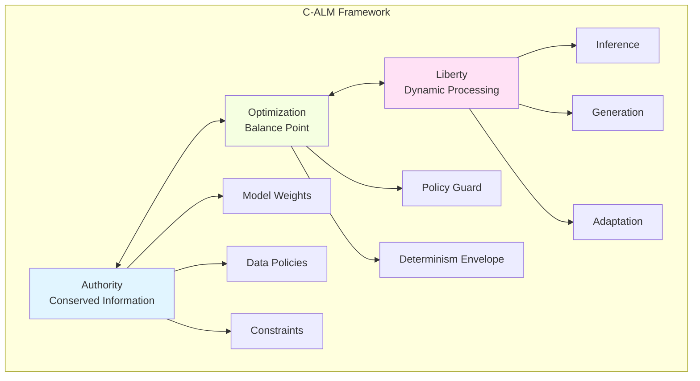

Governance in the ARC ecosystem is defined as the multi-scale optimization between these two poles. Societies and technical systems flourish when institutional Authority preserves trust and continuity while enabling exploratory Liberty. The ARC protocol formalizes this balance by treating Authority as a conserved quantity that may be partitioned among models but never amplified through composition.

The formal optimization objective can be expressed as:

$$\mathcal{L}_{ARC} = \arg\max_{\theta} \left[ \mathbb{E}[Liberty(\theta)] - \lambda \cdot Violation(Authority(\theta)) \right]$$

where $\theta$ represents the system configuration, $\lambda$ is the constitutional constraint weight, and $Violation$ measures departures from Authority conservation.

## The Principle of Authority Conservation

The core mathematical constraint of the ARC ecosystem is the **Authority Conservation Principle**. This principle prevents the common failure mode of "emergent centralization," where a set of interacting agents consolidates power beyond their individual mandates. 

### Formal Definition

For any composed set of models $\mathcal{C} = \{m_1, m_2, \ldots, m_n\}$, the authority of that composition is bounded by the maximum authority of its individual members:

$$Authority(\mathcal{C}) \leq \max_{i \in [1,n]} Authority(m_i)$$

This constraint ensures that the structural informational stability of the system is never compromised by the creative or exploratory dynamics of the models. In practical terms, it means that a group of "Executor" models cannot, through mutual cooperation, override the veto signal of a "Verifier" model or bypass a system-level policy guard.

### Conservation Under Composition

More formally, for any composition operator $\circ \in \{\text{sequential}, \text{parallel}, \text{supervisory}\}$:

$$Authority(m_i \circ m_j) \leq \max(Authority(m_i), Authority(m_j))$$

Authority is treated as an invariant under system evolution, mirroring the role of conservation laws in physical field equations. The total authority budget is fixed at system genesis:

$$\sum_{i=1}^{n} Authority(m_i) = Authority_{total} = \text{constant}$$

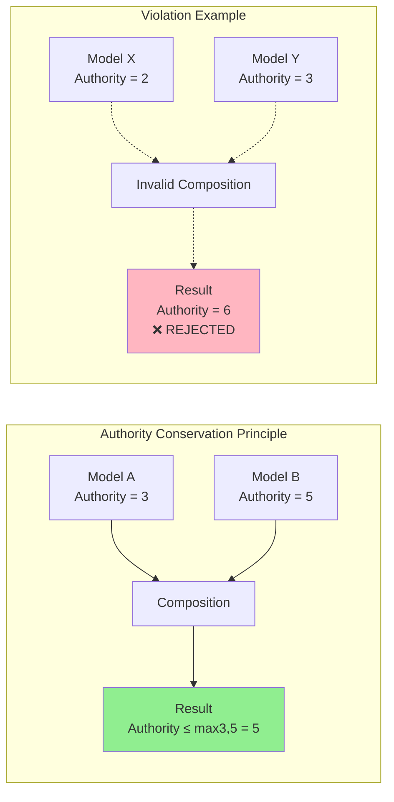

| Informational Pole | Physical/Systemic Correlate | Function in ARC AI |
|---|---|---|
| Authority | Invariant structures, laws, symmetries | Weights, constraints, Standard-817 invariants |
| Liberty | Entropy flows, learning, evolution | Inference, adaptation, generation |
| Optimization | Lagrangian/Action functional | Policy Guard, Determinism Envelope |

## The Non-Unity Principle and the Rejection of the Composite Soul

The Non-Unity Principle is a philosophical and architectural rejection of "swarm intelligence" as an authoritative entity. ARC mandates that no composition of models shall be treated as a single, unified authority. Even when multiple models cooperate on a highly complex task, each model retains its independent identity, independent failure state, and individual accountability.

This principle prevents "blame diffusion," where a failure in a reasoning chain cannot be traced back to its origin due to the opacity of the ensemble. By enforcing the independent failure state of each model, the ARC protocol ensures that a single malicious or malfunctioning model cannot hide its state within a larger composition. The system recognizes no concept of a "composite soul"; rather, it views model cooperation as a temporary, task-scoped arrangement between discrete instruments.

## Orthogonal Model Roles and the Separation of Duties

The ARC architecture is predicated on the strict **Separation of Duties**, a cybersecurity principle that limits the capabilities of any single agent to reduce the attack surface for malicious prompts or internal malfunctions. ARC recognizes four primary model roles, each with explicit responsibilities and non-bypassable restrictions.

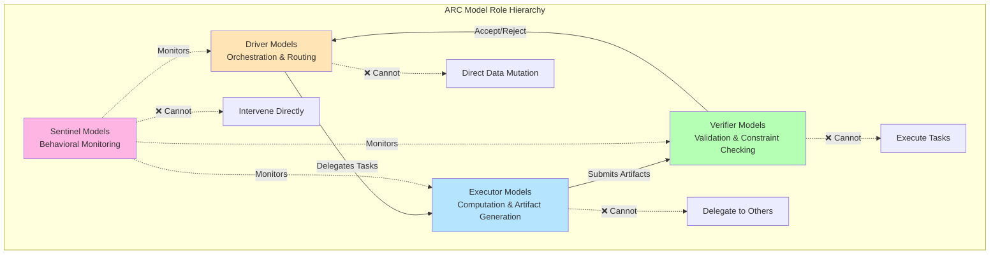

### Driver Models: The Orchestration Spine

Driver models are the "coordinators" of the ecosystem, tasked with high-level strategy, task decomposition, and routing. They translate complex user intents into atomic operations that can be dispatched to specialized Executors. The most prominent example of a Driver model in the SNF ecosystem is GLADIUS.

**Critical Restrictions:**

▸ **No Final Output Generation**: Cannot produce authoritative results
▸ **No Direct Data Mutation**: Cannot alter system state unilaterally
▸ **Task-Scoped Authority**: Rights valid only during active coordination

Positioning GLADIUS as a Driver model is a critical design choice intended to prevent enterprise controllers from becoming sovereign intelligences. Driver models are subject to two fundamental restrictions: they cannot generate final authoritative outputs and they cannot mutate data directly. This ensures that while GLADIUS can coordinate a vast "legion" of models, it cannot unilaterally alter the state of the fabric or bypass the verification layer.

### Executor Models: Bounded Computation

Executor models are the primary "workers" of the system, responsible for performing bounded computation and producing verifiable artifacts. These models are specialized in specific domains—such as code synthesis, mathematical proofs, or document analysis—and are designed to operate as independent microservices.

**Critical Restrictions:**

▸ **No Delegation Authority**: Cannot instantiate or invoke other models
▸ **No Recursive Composition**: Cannot compose with itself
▸ **Artifact Emission Required**: Every operation produces content-addressed output

To prevent recursive privilege escalation, Executors are strictly prohibited from delegating authority or instantiating other models. This prevents an Executor from silently offloading a task to an unverified third-party model or a sub-instance that might attempt to bypass the system's delegation depth limits. Every Executor operation must be self-contained and emit a content-addressed artifact into the evidence backbone.

The execution model follows:

$$Output_{executor} = f(Input, Weights) \rightarrow \text{hash}(Artifact)$$

where the output is always content-addressed and immutable.

### Verifier Models: Executable Justice

Verifier models are the cornerstone of "Executable Justice" within the ARC ecosystem. Their sole responsibility is to validate the outputs of Executors against formal constraints and emit accept or reject signals. Verifiers utilize the "Chain of Verification" (CoVe) framework, which decomposes artifacts into minimal auditable units and subjects them to isolated verification queries.

**Critical Restrictions:**

▸ **No Task Origination**: Cannot initiate computation workflows
▸ **No Execution Rights**: Cannot perform generative tasks
▸ **Binary Decision Only**: Output restricted to {accept, reject}

A Verifier has no task origination rights and no execution privileges. This isolation ensures that the validation process is independent of the generation process, significantly reducing the incidence of "hallucinations" and bias propagation. The Verifier acts as a "prefix-closed automaton" during decoding, masking invalid continuations before the Executor can sample the next token, thereby guaranteeing that every partial output remains structurally valid.

The verification function is formally defined as:

$$V: Artifact \times Constraints \rightarrow \{\text{accept}, \text{reject}\}$$

where $Constraints$ represents the formal specification against which validation occurs.

### Sentinel Models: Behavioral Monitoring

Sentinel models provide a layer of "defense-in-depth" by monitoring behavior patterns and detecting constitutional violations or drift. Unlike Verifiers, which focus on individual artifact correctness, Sentinels analyze the relationships between composed models and the overall health of the Sovereign Genesis Bus (SGB).

**Critical Restrictions:**

▸ **No Direct Intervention**: Cannot halt or modify execution
▸ **Observation Only**: Produces metrics and attestations
▸ **No Authority Escalation**: Cannot override other model decisions

Sentinels are forbidden from intervening directly in execution or altering the state of any task. Their role is purely observational, producing "FameVector" and "Identity Erosion Vector" (IEV) scores that indicate the trustworthiness of model instances over time. If a Sentinel detects a resonance breach—such as undetectable collusion between a Driver and an Executor—it emits a signed breach attestation, triggering the system's "Fail-Closed" mechanism.

The Sentinel monitoring function computes trust metrics over time:

$$Trust(m, t) = f\left(\int_0^t FameVector(m, \tau) \, d\tau, \, IEV(m, t)\right)$$

**Role Summary Table:**

| Model Role | Primary Responsibility | Critical Restriction | Authority Level |
|---|---|---|---|
| Driver | Strategy, Routing, Decomposition | No direct data mutation | Medium |
| Executor | Domain-specific computation | No delegation/instantiation authority | Low |
| Verifier | Constraint validation, accept/reject | No task origination rights | High |
| Sentinel | Pattern detection, drift monitoring | No direct intervention in execution | Observer |

## Composition Protocols and Interaction Constraints

The interaction between models in the ARC ecosystem is governed by three permitted composition types and a set of explicit prohibitions designed to prevent the emergence of cyclic dependencies or hidden state coupling.

```mermaid
graph TB
    subgraph "Permitted Composition Patterns"
        subgraph Sequential
            A1[Model A] -->|Output| A2[Model B]
            A2 -->|Output| A3[Model C]
        end
        
        subgraph Parallel
            B0[Input] --> B1[Model A]
            B0 --> B2[Model B]
            B0 --> B3[Model C]
            B1 --> B4[Aggregator]
            B2 --> B4
            B3 --> B4
        end
        
        subgraph Supervisory
            C1[Executor] -->|Artifact| C2[Verifier]
            C2 -->|Accept/Reject| C1
        end
    end
    
    subgraph "Forbidden Patterns"
        D1[Model A] -.->|❌| D2[Model B]
        D2 -.->|❌| D1
        E1[Model X] -.->|❌ Self-Composition| E1
    end
    
    style Sequential fill:#E8F8F5
    style Parallel fill:#F8F8E8
    style Supervisory fill:#F5E8F8
    style "Forbidden Patterns" fill:#FFE8E8
```

### Sequential and Parallel Composition

Sequential composition follows a strict "Producer-Consumer" model: Model A produces a content-addressed output, which Model B then consumes as input. To maintain auditability, the output schema must be explicitly declared at the interface, and any form of "backward signaling" or hidden feedback loops is strictly forbidden.

**Sequential Composition Invariant:**

$$\forall i \in [1, n-1]: Output_i = Input_{i+1} \wedge \nexists \text{ backward edge}$$

In mission-critical workflows, the failure of the producer model (Model A) results in the immediate abortion of the entire sequential chain, preventing the elevation of partial or corrupted outputs.

Parallel composition allows multiple models to operate independently on the same input. The primary constraint is the total absence of inter-model communication during the execution phase. Aggregation of the resulting outputs must be performed by a non-authoritative Driver, ensuring that the aggregation logic itself is subject to verifier oversight and does not silently amplify the authority of any single participant.

**Parallel Composition Constraint:**

$$\forall i \neq j: \text{State}(m_i) \perp \text{State}(m_j) \text{ during execution}$$

where $\perp$ denotes independence.

### Supervisory Composition and Peer Isolation

Supervisory composition occurs when one model evaluates or constrains the behavior of another, typically in an Executor-Verifier relationship. The supervisor is restricted from modifying the execution trace of the target model; its only permitted actions are to accept, reject, or provide structured annotations. This ensures that the supervisor remains a neutral adjudicator rather than an active participant in the task execution.

**Supervisory Non-Interference Property:**

$$\text{Trace}_{executor} = f(Input) \text{ is invariant under supervision}$$

To prevent hidden state coupling, all inter-model interaction must occur through declared interfaces. Implicit interaction via shared memory, undeclared state, or side-channel signaling is strictly prohibited. This isolation is critical for "Fault Localization," ensuring that if a composition fails, the governing fabric can attribute the error to a specific model identifier.

### Explicitly Forbidden Compositions

To maintain the integrity of the "Constitutional Machine," the ARC protocol explicitly forbids configurations that could lead to infinite recursion or undetectable collusion.

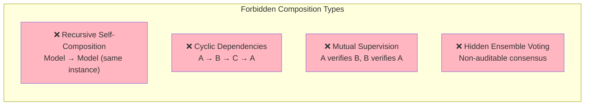

**Prohibited Patterns:**

▸ **Recursive Self-Composition**: A model instance cannot compose with itself to bypass task-scoped boundaries or delegation limits.

$$m_i \circ m_i \equiv \text{INVALID}$$

▸ **Cyclic Dependency Graphs**: Interaction graphs must be Directed Acyclic Graphs (DAGs); any loop where Model A depends on B and B depends on A is invalid by definition.

$$\exists \text{ path } m_i \rightarrow m_j \Rightarrow \nexists \text{ path } m_j \rightarrow m_i$$

▸ **Mutual Supervision Loops**: Two models are prohibited from verifying each other's work, as this would allow for "Reinforcement Collusion" where errors are mutually validated.

$$\neg (V_i \text{ supervises } E_j \wedge V_j \text{ supervises } E_i)$$

▸ **Hidden Ensemble Voting**: Models cannot use internal, non-auditable voting mechanisms to generate consensus outputs; all voting must be explicit and occur via the SGB.

## Identity, Accountability, and the Role of Soulbound Tokens

In most AI systems, identity is a mere label with no binding to responsibility. In ARC, identity is a cryptographic anchor that binds capability to legal and technical accountability. This is achieved through the integration of Soulbound Tokens (SBTs) and Decentralized Identifiers (DIDs).

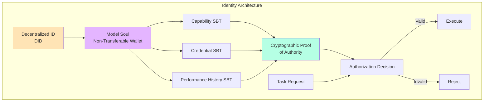

### The Architecture of AI Soulbound Tokens

Soulbound Tokens (SBTs) are non-transferable digital identity tokens that represent the unique traits, qualifications, and performance history of an individual or entity. Within the ARC ecosystem, every model instance is issued a "Soul" (a non-transferable wallet) that holds its SBTs. These tokens act as "Guardian-Class Artifacts," proving the model's adherence to Standard-817 and its suitability for specific roles.

For example, an Executor model might possess a "Credential Soul" for secure software development, issued by an external accrediting body. This token is permanently bound to the model's DID, ensuring that it cannot impersonate another model or claim capabilities it has not been verified to possess. SBTs enable the creation of a certifiable, digital Web3 reputation based on the model's past execution traces and audit outcomes.

**Identity Binding Function:**

$$Identity(m) = (DID_m, \{SBT_1, SBT_2, \ldots, SBT_k\}, History_m)$$

where each $SBT_i$ is cryptographically bound to $DID_m$ and non-transferable.

### Delegation as Task-Scoped Authority

The ARC protocol makes a vital distinction between the delegation of tasks and the transfer of rights. Delegation passes the responsibility for a task to another model but does not transfer the original model's authority or rights. This "sovereignty-affirming sub-delegation" model ensures that the original delegating model remains legally and technically accountable for the task's correctness and constraint compliance.

**Delegation Invariant:**

$$Delegate(m_i, m_j, task) \Rightarrow Authority(m_j) \leq Authority(m_i) \wedge Accountable(m_i, task)$$

Accountability is further reinforced by a "Delegation Depth Limit" declared at genesis. This limit prevents the formation of deep, non-auditable chains of command that could lead to "Authority Dilution" or the circumvention of system-level policy guards. If a task requires a depth beyond the declared limit, it is automatically rejected by the SGB.

**Depth Constraint:**

$$\text{depth}(\text{delegation\_chain}) \leq D_{max}$$

where $D_{max}$ is the system-configured maximum delegation depth.

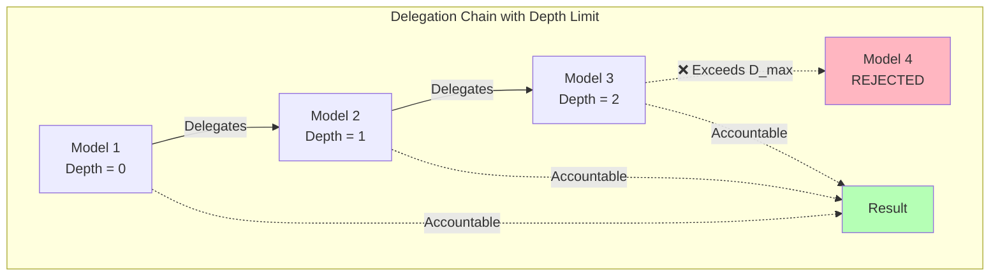

| Identity Component | Technical Implementation | Purpose |
|---|---|---|
| Identifier | Decentralized ID (DID) | Unique, persistent model instance ID |
| Capability Proof | Soulbound Token (SBT) | Proof of specialized training or verification |
| Responsibility | SOSL v1.0 License | Legal binding of model outputs to the operator |
| Authority | Task-Scoped Token | Temporary, bounded rights for a specific operation |

## State Management and Content-Addressed Execution

To prevent the accumulation of "hidden technical debt" and ensure perfect auditability, ARC enforces strict state isolation and the use of content-addressed artifacts. This architecture is built on a "tamper-evident, append-only storage substrate" known as the Evidence Backbone.

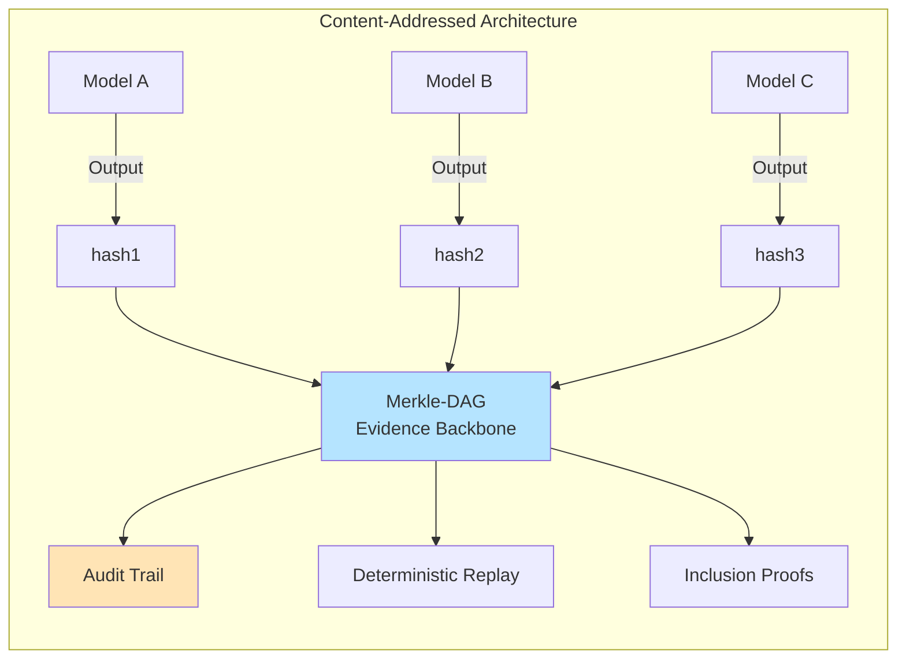

### State Isolation and Immutability

Models within the ARC ecosystem are prohibited from sharing mutable state. All shared artifacts—including reasoning traces, datasets, and code chunks—must be immutable and logged. This isolation ensures that the internal state of one model cannot be silently corrupted by another, maintaining the integrity of the overall composition.

**State Isolation Invariant:**

$$\forall m_i, m_j \in \mathcal{M}: \text{State}(m_i) \cap \text{State}(m_j) = \emptyset$$

By treating state as a series of immutable snapshots, the ARC fabric enables "Deterministic Replay" of model interactions. An auditor can reconstruct the exact state of the system at any point in history by traversing the Merkle-DAG lineage of content-addressed nodes.

**Replay Function:**

$$\text{Replay}(t) = \text{reconstruct}\left(\bigcup_{i=0}^{t} \text{Snapshot}_i\right)$$

This capability is essential for "Clause-to-Artifact Traceability," which allows the system to deterministically render compliance coverage across multiple regulatory regimes without manual crosswalks.

### Content-Addressing via the Merkle-DAG Ledger

Every artifact in the ARC ecosystem is content-addressed through its cryptographic hash (e.g., `chunk:sha256:digest`). This system, integrated via the Content-Addressed Development Interface (CADI), ensures that models and humans alike can verify they are working with the exact intended version of a software component or reasoning step.

**Content Addressing Function:**

$$\text{Address}(artifact) = H(\text{artifact}) \text{ where } H: \{0,1\}^* \rightarrow \{0,1\}^{256}$$

The Merkle-DAG ledger anchors every state transition, from initial task origination to final artifact publication. Nodes are identified by hashes, and edges encode provenance, enabling efficient "Inclusion Proofs" that verify whether a specific reasoning step was part of a signed execution trace.

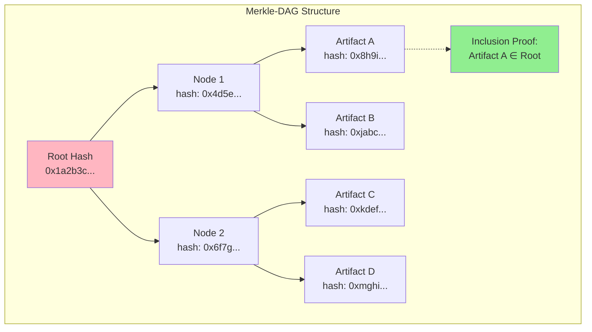

**Inclusion Proof:**

$$\pi = \{h_1, h_2, \ldots, h_k\} \text{ proves } artifact \in \text{Root}$$

This structure restores "epistemic sovereignty" in an era of generative AI, ensuring that every belief update and contradiction resolution is non-repudiable and open to audit.

## Failure Semantics and Mission-Critical Robustness

In mission-critical infrastructure, the system's behavior during a failure is as significant as its behavior during successful execution. ARC implements a "Fail-Closed" requirement for all model interactions to prevent security breaches and the propagation of corrupted data.

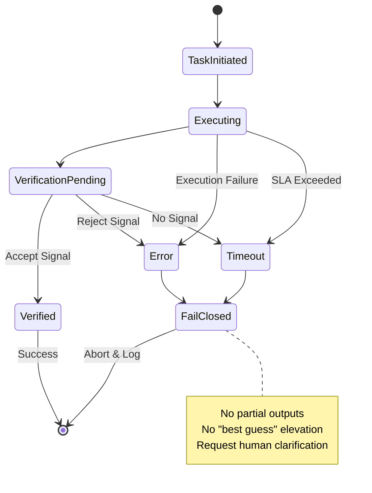

### The Fail-Closed Requirement

On error, timeout, or ambiguity, a model composition must fail closed. This means that if any component of a reasoning chain (such as a Verifier's accept signal) is missing or delayed beyond an SLA, the system must automatically deny the requested action and abort the process. No partial or "best guess" outputs are permitted to be elevated to authoritative status.

**Fail-Closed Semantics:**

$$\text{Output}(composition) = \begin{cases} 
\text{Result} & \text{if } \forall_{i} \text{Component}_i = \text{SUCCESS} \\
\bot & \text{otherwise}
\end{cases}$$

where $\bot$ represents system rejection (abort).

Fail-closed semantics are critical for production deployments in regulated industries such as healthcare, finance, and national security. Instead of making a risky guess when faced with ambiguous inputs or internal errors, the system is required to request human clarification or additional evidence. This requirement transforms "hallucination reduction" from a probabilistic goal into an architectural guarantee.

**Safety Property:**

$$\forall t: \text{Uncertainty}(t) > \theta_{safe} \Rightarrow \text{Halt}(t) \wedge \text{Request\_Human}(t)$$

### Fault Localization and the Blame Matrix

The ARC framework prohibits blame diffusion, mandating that failures be attributable to a specific, unique model instance. When a composition fails, the system emits a "Conformity Bundle"—a signed manifest assembling all evidence artifacts for that specific run.

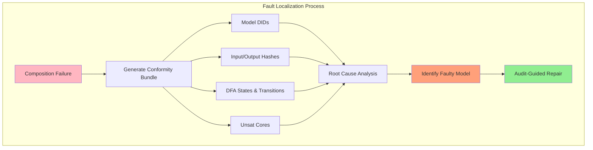

**Conformity Bundle Contents:**

▸ **Model Identifiers (DIDs)** of all participants
▸ **Input/Output hashes** for each step  
▸ **DFA states and transition functions** from real-time constraint enforcement  
▸ **Unsat cores** from logical validators identifying specific constraint violations

By analyzing the Conformity Bundle, the system performs "Audit-Guided Repair" (AGR), identifying the root cause of a failure and localizing the violation to a specific node in the composition graph. This eliminates the "Black Box" problem, ensuring that even in highly complex multi-agent workflows, the system's reasoning remains transparent to regulators and auditors.

**Blame Assignment Function:**

$$\text{Blame}: \text{ConformityBundle} \rightarrow (m_i, \text{Violation}, \text{Evidence})$$

## Determinism, Stochasticity, and the Determinism Envelope

A fundamental challenge in AI governance is the stochastic nature of Large Language Models (LLMs), which can produce different outputs for identical inputs. ARC addresses this by requiring models to declare a "Determinism Envelope."

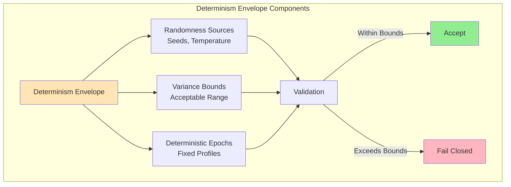

### Components of the Determinism Envelope

The Determinism Envelope is a set of formal declarations that constrain a model's variance. Models operating within the ARC ecosystem **MUST** declare:

**1. Randomness Sources**

All seeds, temperature settings, and top-p/top-k parameters used during inference.

$$\mathcal{R} = \{\text{seed}, T, p_{top}, k_{top}\}$$

**2. Acceptable Variance Bounds**

The range of semantic or structural variation permitted for a specific task.

$$\delta_{max} = \sup_{i,j} ||\text{Output}_i - \text{Output}_j||_{\text{semantic}}$$

where outputs $i$ and $j$ are generated from the same input under identical epoch conditions.

**3. Deterministic Epochs**

Models must provide deterministic outputs for identical inputs when operating within a fixed epoch and capability profile.

$$\forall \text{ input } x, \text{ epoch } e: \text{Output}(x, e, \mathcal{R}) = \text{constant}$$

This envelope allows the Policy Arbitration Engine (PAE) to verify whether a model's behavior has drifted beyond its authorized bounds. If a model's output fails to match its declared profile, the execution is invalidated, and the system fails closed.

**Drift Detection:**

$$\text{Drift}(m, t) = ||\text{Behavior}_t - \text{Envelope}|| > \epsilon \Rightarrow \text{Invalidate}(m)$$

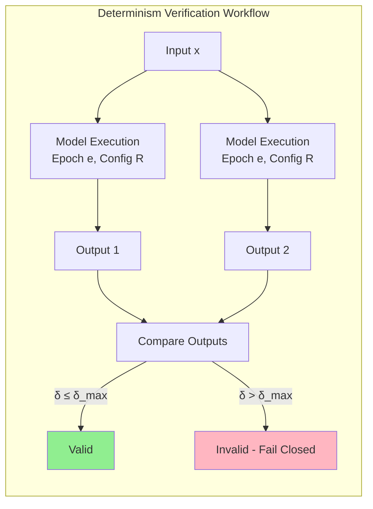

## Verifiable Reasoning Audits

To ensure the integrity of multi-step reasoning, ARC employs the "TRUST" framework for decentralized auditing. Reasoning traces are decomposed into Hierarchical Directed Acyclic Graphs (HDAGs), representing atomic reasoning steps. These steps are verified by a heterogeneous network of auditors (computational checkers, independent LLMs, and human reviewers) who use a cryptographic commit-reveal protocol to submit their findings.

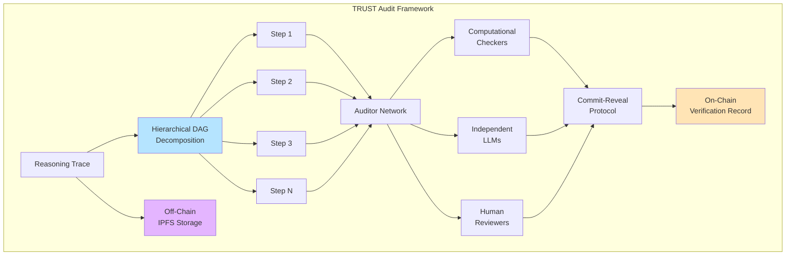

The outcome of each verification step is recorded on-chain, while the raw trace is stored off-chain (typically on IPFS) to protect proprietary logic from distillation. This dual-layer approach jointly addresses the critical tension between "Public Auditability" and "Intellectual Property Protection," ensuring that while the system's reasoning is verifiable, its internal weights remain private.

**Audit Verification Function:**

$$V_{audit}(step) = \text{Consensus}\left(\{v_1(step), v_2(step), \ldots, v_k(step)\}\right)$$

where $v_i$ represents the verdict from auditor $i$, and consensus is achieved via cryptographic voting.

**Multi-Layer Audit Architecture:**

| Audit Layer | Technology | Function |
|---|---|---|
| Structural | Prefix-closed DFA/PDA | Real-time constraint enforcement during decoding |
| Semantic | Stepwise Verifiers $(v_j)$ | Validation of consistency, accuracy, and relevance |
| Temporal | ChronoFlux / ZKChronoSeal | Time-finality and lineage anchoring |
| Ecological | Sentinel / FameVector | Long-term detection of drift and collusion |

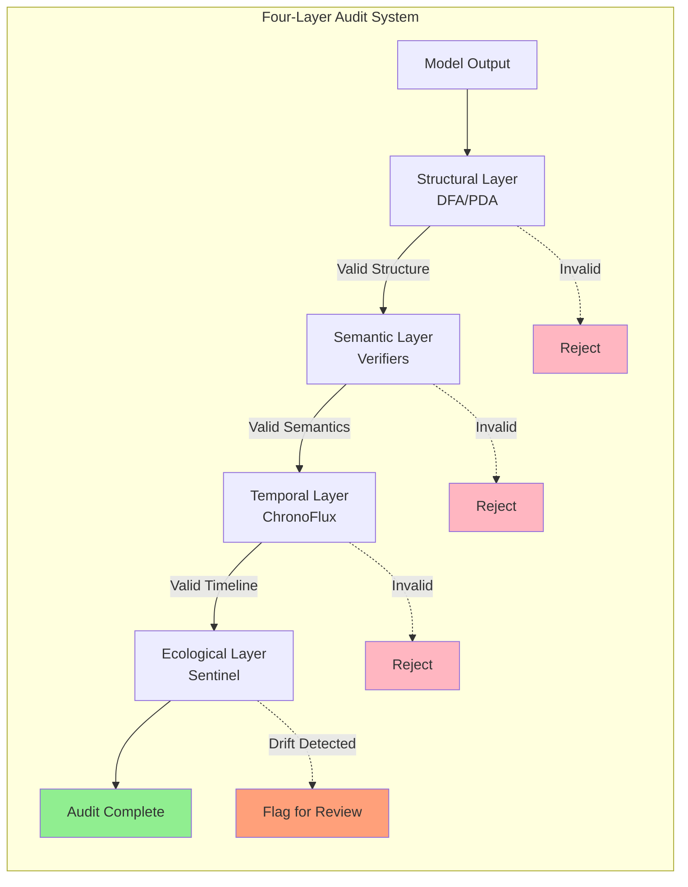

## Compliance, Enforcement, and the Sovereign License (SOSL v1.0)

Compliance with the ARC Model Composition Rules is enforced through a dual mechanism consisting of the technical constraints of the Genesis Bus and the legal constraints of the Sovereign Open-Source License (SOSL v1.0).

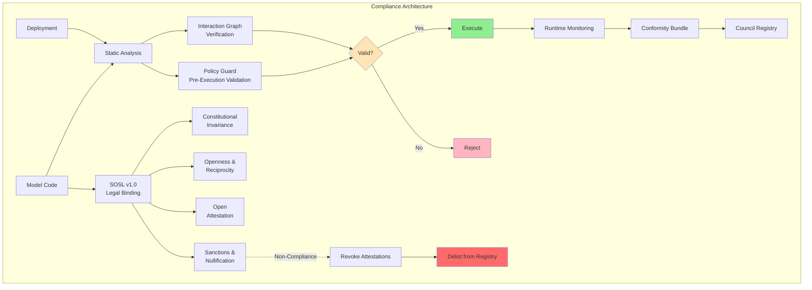

### Static Analysis of Interaction Graphs

All model composition graphs within the ARC ecosystem **MUST** be statically analyzable. This requirement ensures that the entire orchestration flow, role distribution, and authority partition are visible to the fabric's Policy Guard before any execution occurs.

**Static Verification Property:**

$$\forall G \in \text{CompositionGraphs}: \text{Verify}(G) \Rightarrow \text{DAG}(G) \wedge \text{Roles\_Valid}(G) \wedge \text{Authority\_Conserved}(G)$$

Dynamic composition—where agents choose their peers on-the-fly—is permitted only within pre-declared, statically verified bounds. Any composition that cannot be modeled as a verifiable graph is invalid by definition.

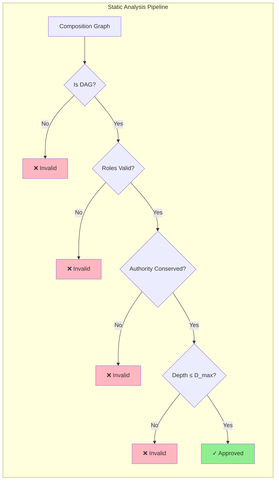

### Rights-Bearing Computation via SOSL v1.0

The Sovereign Open-Source License (SOSL v1.0) is the legal substrate that binds model code and deployment to constitutional invariants. SOSL establishes four core requirements for all ARC-compliant systems:

**1. Constitutional Invariance**

Core Articles (such as the Right to Origin and Right to Erasure) cannot be disabled in any derivative system or service.

$$\forall \text{ derivative } D: \text{Articles}(D) \supseteq \text{CoreArticles}$$

**2. Openness and Reciprocity**

Source disclosure is required for all deployments and services operating within the fabric.

$$\text{Deploy}(M) \Rightarrow \text{Disclose}(\text{Source}(M))$$

**3. Open Attestation**

All execution proofs and Conformity Bundles must be published to a Council-operated registry.

$$\forall \text{ execution } E: \text{Publish}(\text{ConformityBundle}(E), \text{Registry})$$

**4. Sanctions and Nullification**

Non-compliance triggers the immediate revocation of the entity's attestations and the "Public Nullification" of its outputs via InfinityWipe semantics.

$$\neg\text{Compliant}(M) \Rightarrow \text{Revoke}(M) \wedge \text{InfinityWipe}(\text{Outputs}(M))$$

This legal binding ensures that digital sovereignty is achievable when rights become first-class system operations rather than mere platform privileges. Non-compliant entities face technical exclusion from the fabric, as their cryptographic trust is withdrawn and their models are delisted from the sovereign registries.

### Standard-817: The Unified Ontology

Standard-817 provides the unified ontology and message schemas for all instruments across the ARC ecosystem. It dictates how cross-jurisdictional conflicts (such as GDPR erasure requests vs. financial record-keeping mandates) are resolved computably. Standard-817 ensures that every message on the SGB is typed, carrying its own policy context, consent markers, and provenance trails.

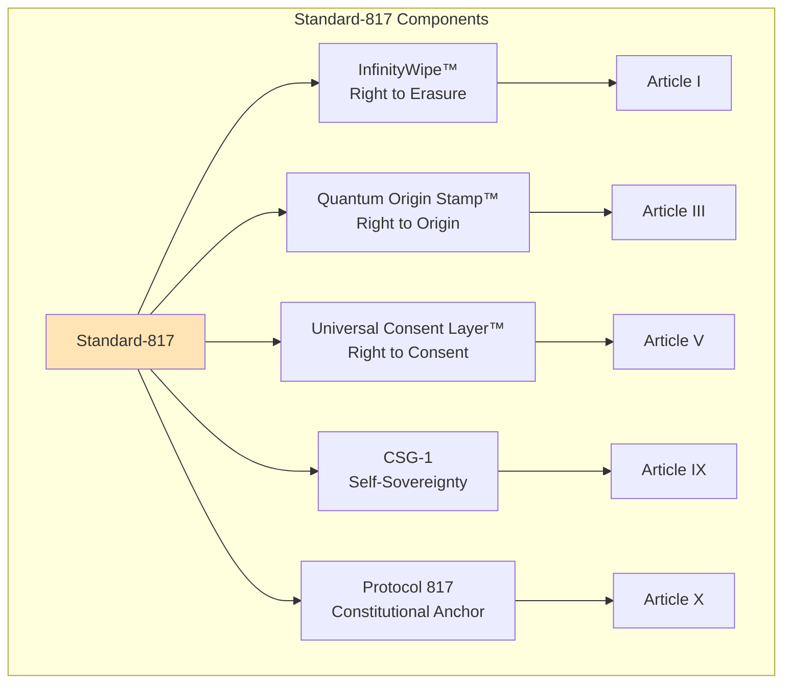

| Standard-817 Component | Function | Implementation |
|---|---|---|
| InfinityWipe™ | Article I: Right to Erasure | Lawful nullification with durable proof |
| Quantum Origin Stamp™ | Article III: Right to Origin | Unforgeable authorship and creation lineage |
| Universal Consent Layer™ | Article V: Right to Consent | Dynamic, revocable, machine-readable consent |
| CSG-1 | Article IX: Self-Sovereignty | Minimal disclosure identity via SBT/DID |
| Protocol 817 | Article X: Constitutional Anchor | Meta-protocol for upgrades and invariants |

## Strategic Assessment: The ARC Architectural Philosophy

The design of the ARC Model Composition Rules represents a deliberate choice to prioritize "survivability, governability, and defensibility" over the raw scaling of intelligence. While most agentic ecosystems are rushing toward emergent behaviors via ensembles and swarms, ARC is explicitly preventing them to ensure that power remains monitorable and reversible.

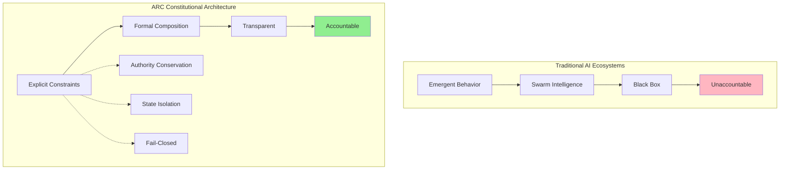

### Authority as Task-Scoped, Not Identity-Scoped

The core philosophical insight of the ARC specification is that authority must be **task-scoped** rather than **identity-scoped**. In systems where authority is identity-scoped, a "privileged agent" gains broad rights based on who it is, creating a single point of failure and inviting recursive privilege escalation. In ARC, a model has rights only for the specific operation it is currently performing, and those rights are validated at every state transition by the Policy Guard.

**Authority Scope Distinction:**

$$
\begin{aligned}
\text{Identity-Scoped:} & \quad Authority(m) = \text{constant across all tasks} \\
\text{Task-Scoped:} & \quad Authority(m, t) = f(\text{task}_t, \text{context}_t)
\end{aligned}
$$

This constraint prevents almost every catastrophic AI governance failure proposed in recent literature. By ensuring that power cannot hide behind opaque "identities" or swarm consensus, ARC transforms AI interaction from a "Black Box" experiment into a "Constitutional Machine."

**Validation at Every Transition:**

$$\forall \text{ state } s_i \rightarrow s_{i+1}: \text{PolicyGuard}(\text{Authority}(m, s_i), \text{transition})$$

### Isolation as a Prerequisite for Infrastructure

ARC favors **isolation over efficiency**. In monolithic and unconstrained multi-agent systems, shared context windows and mutual state mutation allow models to reinforce each other's errors, leading to "feedback loops" and "AI echo chambers." By enforcing state isolation and immutable, content-addressed communication, ARC ensures that every model's reasoning is an independent, auditable event.

**Isolation Guarantees:**

$$
\begin{aligned}
& \text{State Isolation:} \quad \text{State}(m_i) \cap \text{State}(m_j) = \emptyset \\
& \text{Communication:} \quad m_i \rightarrow \text{hash}(artifact) \rightarrow m_j \\
& \text{Independence:} \quad \text{Audit}(m_i) \perp \text{Audit}(m_j)
\end{aligned}
$$

This "Hard Version" of AI governance is essential for infrastructure-grade systems. Demos can afford to be unconstrained and impressive; infrastructure must be constrained and predictable. ARC stops being a product and becomes a legitimacy framework where models are interchangeable, jobs are auditable, and power is partitioned by design.

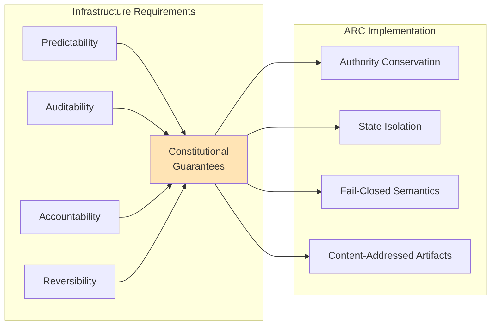

## Conclusion: ARC as a Global Legitimacy Framework

The ARC Model Composition Rules, when integrated with the Sovereign Constitution Fabric and the Standard-817 ontology, establish a comprehensive substrate for trustworthy computation for a planet-scale public. By moving from platform privileges to constitutional rights, the system addresses the critical structural gaps in current AI stacks: the concentration of power, the obfuscation of lineage, and the outsourcing of justice to opaque processes.

```mermaid
graph TB
    subgraph "ARC Ecosystem Integration"
        MCR[Model Composition<br/>Rules] --> SCF[Sovereign Constitution<br/>Fabric]
        S817[Standard-817<br/>Ontology] --> SCF
        SOSL[SOSL v1.0<br/>License] --> SCF
        
        SCF --> Cap1[Constitutional Rights]
        SCF --> Cap2[Epistemic Sovereignty]
        SCF --> Cap3[Auditable Justice]
        SCF --> Cap4[Decentralized Trust]
        
        Cap1 --> Global[Global Legitimacy<br/>Framework]
        Cap2 --> Global
        Cap3 --> Global
        Cap4 --> Global
        
        Global --> Deploy[Infrastructure-Grade<br/>AI Deployment]
    end
    
    style SCF fill:#FFE4B5
    style Global fill:#90EE90
    style Deploy fill:#B5FFE4
```

ARC's rigorous model role taxonomy—comprising Drivers, Executors, Verifiers, and Sentinels—ensures that no single agent can unilaterally determine the state of the system. The use of Soulbound Tokens and content-addressed execution traces restores epistemic sovereignty, binding capability to responsibility in a certifiable digital reputation system.

### Key Architectural Achievements

**1. Authority Conservation**

$$Authority(\mathcal{C}) \leq \max_{i} Authority(m_i)$$

Prevents emergent centralization and ensures power remains bounded.

**2. Fault Isolation**

$$\text{State}(m_i) \cap \text{State}(m_j) = \emptyset$$

Enables precise attribution and eliminates blame diffusion.

**3. Fail-Closed Semantics**

$$\text{Uncertainty} > \theta_{safe} \Rightarrow \text{Halt} \wedge \text{Request\_Human}$$

Transforms hallucination reduction from probabilistic goal to architectural guarantee.

**4. Content-Addressed Immutability**

$$\text{Address}(artifact) = H(artifact)$$

Enables perfect auditability and deterministic replay.

### The Transition to Constitutional Machines

In conclusion, the ARC ecosystem represents a shift from "AI Systems" to "Constitutional Machines." By constraining intelligence through formal rules of composition and authority conservation, ARC creates a defensible environment for the development of autonomous agents that are consistent with the principles of human autonomy and digital sovereignty.

```mermaid
graph LR
    subgraph "Evolution of AI Governance"
        Past[Platform-Based<br/>Governance] --> Present[ARC Constitutional<br/>Framework]
        Present --> Future[Infrastructure-Grade<br/>Global AI]
        
        Past -.-> P1[Centralized Control]
        Past -.-> P2[Opaque Processes]
        Past -.-> P3[Platform Privileges]
        
        Present --> N1[Distributed Authority]
        Present --> N2[Transparent Audits]
        Present --> N3[Constitutional Rights]
        
        Future --> F1[Planet-Scale Trust]
        Future --> F2[Verifiable Justice]
        Future --> F3[Digital Sovereignty]
    end
    
    style Past fill:#FFB6C1
    style Present fill:#FFE4B5
    style Future fill:#90EE90
```

The transition from unconstrained swarm behavior to task-scoped, auditable cooperation is the final prerequisite for the deployment of AI as a fundamental component of global digital infrastructure. ARC provides not merely a technical specification, but a foundational legitimacy framework for the age of autonomous intelligence.

---

## References

1. Constitution Fabric — A Sovereign Digital Covenant. Available at: https://constitutionfabric.org/

2. Whitepaper — Sovereign Constitution Fabric (SNF) v2.0. Available at: https://constitutionfabric.org/whitepaper/

3. Information Theory, QMM, Constitutional Authority-Liberty Model - What's All This Then - DevStrike! Available at: https://www.devstrike.net/topic/7824-information-theory-qmm-cosmic-authority-liberty-matrix-whats-all-this-then/

4. Engines — SNF v2.0 | Sovereign Constitution Fabric. Available at: https://constitutionfabric.org/engines/

5. Aligning Organizational Priorities with ARC to Improve Youth Mental Health Service Outcomes. *PMC - NIH*. Available at: https://pmc.ncbi.nlm.nih.gov/articles/PMC4949090/

6. The ARC Programming Model – Language Constructs for Coordination. *ResearchGate*. Available at: https://www.researchgate.net/publication/220367405_The_ARC_Programming_Model_-_Language_Constructs_for_Coordination

7. From Policy to Pipeline: A Governance Framework for AI Systems. *IEEE Xplore*. Available at: https://ieeexplore.ieee.org/iel8/6287639/11323511/11311992.pdf

8. Single Agent vs Multi-Agent Systems: A CTO Decision Framework. *TechAhead*. Available at: https://www.techaheadcorp.com/blog/single-vs-multi-agent-ai/

9. Zimbres, R. Develop a Financial Multi-Agent System with Dynamic Tools using Gemini and Google ADK Agents. *Medium*. Available at: https://medium.com/@rubenszimbres/develop-a-financial-multi-agent-system-with-dynamic-tools-using-gemini-and-google-adk-agents-05ded38bcfab

10. A Practical Approach for GenAI and Agentic Security. *Coalfire*. Available at: https://coalfire.com/the-coalfire-blog/a-practical-approach-for-genai-and-agentic-security

11. LLM Based Agents. *Scribd*. Available at: https://www.scribd.com/document/855317880/LLM-based-Agents

12. Li, N., Feigenbaum, J., Grosof, B. A Logic-based Knowledge Representation for Authorization with Delegation (Extended Abstract). *Department of Computer Science, Yale University*. Available at: https://www.cs.yale.edu/homes/jf/LFG-CSFW1999.pdf

13. Li, N., Grosof, B., Feigenbaum, J. A Logic-based Knowledge Representation for Authorization with Delegation. *Applied Cryptography Group, Stanford University*. Available at: http://crypto.stanford.edu/~ninghui/papers/dl_ibmrr.pdf

14. Operad.ai - Prove your claims to the world. Available at: https://operad.ai/

15. Chain of Verification (CoVe) Framework. *Emergent Mind*. Available at: https://www.emergentmind.com/topics/chain-of-verification-cove

16. arXiv Preprint 2510.25890v1. Available at: https://arxiv.org/html/2510.25890v1

17. ARC-AGI: Benchmarking Abstraction in AGI. *Emergent Mind*. Available at: https://www.emergentmind.com/topics/abstraction-and-reasoning-corpus-for-artificial-general-intelligence-arc-agi

18. SAST Rules. *Datadog Documentation*. Available at: https://docs.datadoghq.com/security/code_security/static_analysis/static_analysis_rules/

19. Managed Control Plane (MCP) for AI Agents: The Architectural Backbone of Enterprise Agentic AI. *IoT Security Institute*. Available at: https://iotsecurityinstitute.com/iotsec/iot-security-institute-cyber-security-articles/240-managed-control-plane-mcp-for-ai-agents-the-architectural-backbone-of-enterprise-agentic-ai

20. Securing MCP Server Communications: Beyond Authentication. *Aembit*. Available at: https://aembit.io/blog/securing-mcp-server-communications-best-practices/

21. Courtiat, J.P., Santos, C.A.S., Lohr, C., Outtaj, B. Experience with RT-LOTOS, a temporal extension of the LOTOS formal description technique. *LAAS-CNRS*. Available at: https://homepages.laas.fr/francois/SVF/seminaires/inputs/jpc.pdf

22. Human Supervision Protocol (HSP): A Framework for Mandatory Human Oversight in Autonomous AI Agent Interactions. *ResearchGate*. Available at: https://www.researchgate.net/publication/399537114_Human_Supervision_Protocol_HSP_A_Framework_for_Mandatory_Human_Oversight_in_Autonomous_AI_Agent_Interactions

23. A Graph Based Approach to Trace Models Composition. *ResearchGate*. Available at: https://www.researchgate.net/publication/276241989_A_Graph_Based_Approach_to_Trace_Models_Composition

24. Self-Sovereign Identities and Content Provenance: VeriTrust—A Blockchain-Based Framework for Fake News Detection. *MDPI*. Available at: https://www.mdpi.com/1999-5903/17/10/448

25. The Emergence of Soulbound Tokens (SBTs) in Web3. *Coinmetro*. Available at: https://www.coinmetro.com/learning-lab/the-emergence-of-soulbound-tokens-in-web3

26. Soulbound Tokens: What Kind of Soul Are They Bound To? *BitDegree.org*. Available at: https://www.bitdegree.org/crypto/tutorials/soulbound-tokens

27. A Comprehensive Guide to Soulbound Tokens. *SoluLab*. Available at: https://www.solulab.com/soulbound-tokens-guide/

28. What are Soulbound Tokens, and How do they Work? *LeewayHertz*. Available at: https://www.leewayhertz.com/soulbound-tokens/

29. SoulBound Token (SBT) Explained for Dummies. *BlockchainReporter on Binance Square*. Available at: https://www.binance.com/en/square/post/151936

30. IPGN-817 – Designing a New Architecture for Intellectual Property in the Post-Physical Era. *Medium*. Available at: https://mo817.medium.com/ipgn-817-designing-a-new-architecture-for-intellectual-property-in-the-post-physical-era-a1f1c0bc7c6e

31. What Are Soulbound Tokens (SBTs)? *Halborn*. Available at: https://www.halborn.com/blog/post/what-are-soulbound-tokens-sbts

32. What Are Soulbound Tokens (SBTs)? Identity & Trust on Blockchain. *Outlook India*. Available at: https://www.outlookindia.com/xhub/blockchain-insights/soulbound-tokens-sbts-building-identity-reputation-and-trust-on-the-blockchain

33. Mills, J.D., Nie, J. BRIDGES TO A NEW ERA: Building Inclusive Systems Through Trust and Equity. *University of Montana*. Available at: https://www.umt.edu/bolle-center/files/mills.nie-bridges-to-a-new-era-2020.pdf

34. A Neural Affinity Framework for Abstract Reasoning: Diagnosing the Compositional Gap in Transformer Architectures via Procedural Task Taxonomy. *arXiv*. Available at: https://arxiv.org/html/2512.07109v1

35. Concepts — Sovereign Constitution Fabric (SNF v2.0). Available at: https://constitutionfabric.org/concepts/

36. cadi-llm — ML/AI/statistics in Rust. *Lib.rs*. Available at: https://lib.rs/crates/cadi-llm

37. Beyond Prediction: Structuring Epistemic Integrity in Artificial Reasoning Systems. *Academic Square Engineering-AI*. Available at: http://engineering-ai.academicsquare-pub.com/1/article/download/23/16

38. Prompt Injection Is the New SQL Injection: Securing Enterprise LLMs and AI Agents. *Petronella Tech*. Available at: https://petronellatech.com/blog/prompt-injection-is-the-new-sql-injection-securing-enterprise-llms/

39. arXiv Preprint 2510.20188v1. Available at: https://arxiv.org/html/2510.20188v1

40. The Next Frontier of RAG: How Enterprise Knowledge Systems Will Evolve 2026-2030. *Nstarx Inc*. Available at: https://nstarxinc.com/blog/the-next-frontier-of-rag-how-enterprise-knowledge-systems-will-evolve-2026-2030/

41. Protocols — Constitutional Articles | Sovereign Constitution Fabric (SNF v2.0). Available at: https://constitutionfabric.org/protocols/

42. Tools — Institutions | Sovereign Constitution Fabric (SNF v2.0). Available at: https://constitutionfabric.org/tools/

43. Dynamics of conservation and society: the case of Maputaland, South Africa. *University of Pretoria*. Available at: https://repository.up.ac.za/bitstreams/b238e795-94ec-4ef5-90b6-49eb484f062e/download

---

**Document Version:** 2.0  
**Last Updated:** 2025  
**Status:** Enhanced Academic Edition