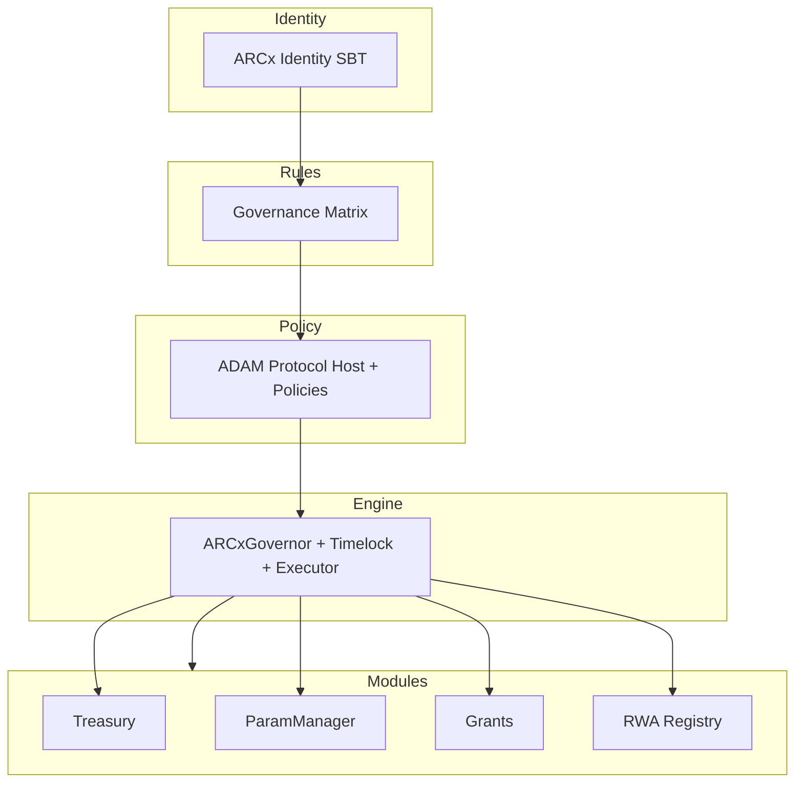

# Governance Map (Birdeye View)

> This is designed to demonstrate the **Who → What → How → When → What** with guardrails at every stage.

# The Arc — Bird’s-Eye System Overview


#### Legend

- Who you are → Identity SBT.
- What rules apply → Governance Matrix.
- How rules evolve → ADAM policies.
- When/where execution happens → Governor + Timelock + Executor.
- What gets changed → Execution modules (Treasury, Params, Grants, RWA).


### ============= Governance Stack =====================

flowchart LR
    %% Swimlane style layout
    subgraph SBT["ARCx Identity SBT (Who)"]
        A[Proposer proves role via SBT<br/>EAS attestation + decay weights]
    end

    subgraph Matrix["Governance Matrix (Rules)"]
        B[Check topic = ENERGY<br/>Token 5% + SBT 8% + RWA 5% quorum<br/>+ total 7% quorum, 58% supermajority] 
        A --> B
    end

    subgraph ADAM["ADAM Protocol (How)"]
        C[Build Context snapshot: weights, params, oracles] 
        D[Run Policy Chain → ParamsGuard, RWARecency, Dual-2FA] 
        E[Verdict = ALLOW / AMEND / DENY / REQUIRE_2FA]
        B --> C --> D --> E
    end

    subgraph Governor["Governor + Timelock (When)"]
        F[Proposal passes vote tally] 
        G[Timelock: 7d delay] 
        H[Challenge Window: 72h dispute period]
        E --> F --> G --> H
    end

    subgraph Executor["Executor (Where)"]
        I[Safe Module executes validated diff]
        H --> I
    end

    subgraph Registry["RWA Registry / Modules (What)"]
        J[ParamManager.setUint(ENERGY_CAP, newVal)] 
        K[Emit Events + Update Subgraph]
        I --> J --> K
    end

    subgraph Monitor["Monitoring & Disputes"]
        L[Dashboards & alerts track proposal execution] 
        M[If fraud: bonded dispute flips or cancels outcome]
        K --> L --> M
    end


#### Legend:

- Left → Right = Lifecycle flow.

- Top → Bottom = Layer responsibility.

- Every change flows through all six layers (SBT → Matrix → ADAM → Governor → Executor → Registry → Monitor).

- Each layer has its own failure modes + guardrails, making the system redundant and bulletproof.


- **SBT** → Who can propose? Identity verification via Soulbound Tokens (SBTs) with decay weights.

- **Matrix** → What rules apply? Governance Matrix enforces topic-specific quorums, supermajorities, and bonds.

- **ADAM** → How is the proposal evaluated? Constitutional Programs run policies like ParamsGuard, RWARecency, and Dual-2FA.

# ================ Governance Map with Guardrails ================

flowchart TD
    subgraph SBT[ARCx Identity SBT — Who?]
        A1[Roles: CODE, VALIDATOR, GOV, RWA_CURATOR, ORACLE_OP, AUDITOR]
        A2[Issued via EAS attestation, non-transferable, decay-weighted]
        A3[Guards: One-time UID • Issuer allowlist • Rate-limit • Revocation]
    end

    subgraph MATRIX[Governance Matrix — What Rules?]
        B1[Topics: Treasury, Params, Energy, Carbon, Grants]
        B2[Quorums: total + per-layer • Supermajorities]
        B3[Guards: Bonds • Concurrency caps • Duplicate cooldowns • Emergency dual-quorum + 2FA]
    end

    subgraph ADAM[ADAM Protocol — How?]
        C1[Constitutional Programs (Wasm policies)]
        C2[Verdicts: ALLOW • DENY • AMEND • REQUIRE_2FA]
        C3[Guards: ProofBundle (EAS+oracles) • Param bounds • Disjoint quorum • Fuel/memory caps]
    end

    subgraph GOV[Governor + Timelock — When?]
        D1[Proposal submitted → Voting → Tally → Timelock → Challenge]
        D2[MACI integration: secret ballots, Sybil resistance]
        D3[Guards: Timelock delay • Challenge window • Executor allowlist]
    end

    subgraph MODULES[Execution Modules — What Changes?]
        E1[Treasury: transfers, streams, swaps]
        E2[Params: setUint/setAddr/setBool with bounds]
        E3[RWA Registry: oracle attestations, disputes, slashing]
        E4[Grants: milestone payouts, clawbacks]
        E5[Guards: Module-specific invariants • Dispute resolution • Monitoring dashboards]
    end

    SBT --> MATRIX --> ADAM --> GOV --> MODULES


### Guardrail Highlights at Each Stage

- Identity (SBT): issuer-controlled, revocable, decays without contribution → stops Sybil/capture.

- Matrix: fixed math & thresholds → stops plutocracy, spam, and low-quorum coups.

- ADAM: programmable Wasm policies with proofs → stops invalid oracles, out-of-bounds params, ethics breaches.

- Governor+Timelock: enforced waiting + challenge window → stops rushed or hidden execution.

- Modules: domain-specific invariants, dispute channels, monitoring → stops misexecution or silent corruption.

---


## ============== Governance Map (Legacy) =========================

```
flowchart TD
    subgraph SBT[ARCx Identity SBT — Who?]
        A1[Roles: CODE, VALIDATOR, GOV, RWA_CURATOR, ORACLE_OP, AUDITOR]
        A2[Issued via EAS attestation, non-transferable, decay-weighted]
        A3[Guards: One-time UID • Issuer allowlist • Rate-limit • Revocation]
    end

    subgraph MATRIX[Governance Matrix — What Rules?]
        B1[Topics: Treasury, Params, Energy, Carbon, Grants]
        B2[Quorums: total + per-layer • Supermajorities]
        B3[Guards: Bonds • Concurrency caps • Duplicate cooldowns • Emergency dual-quorum + 2FA]
    end

    subgraph ADAM[ADAM Protocol — How?]
        C1[Constitutional Programs (Wasm policies)]
        C2[Verdicts: ALLOW • DENY • AMEND • REQUIRE_2FA]
        C3[Guards: ProofBundle (EAS+oracles) • Param bounds • Disjoint quorum • Fuel/memory caps]
    end

    subgraph GOV[Governor + Timelock — When?]
        D1[Proposal submitted → Voting → Tally → Timelock → Challenge]
        D2[MACI integration: secret ballots, Sybil resistance]
        D3[Guards: Timelock delay • Challenge window • Executor allowlist]
    end

    subgraph MODULES[Execution Modules — What Changes?]
        E1[Treasury: transfers, streams, swaps]
        E2[Params: setUint/setAddr/setBool with bounds]
        E3[RWA Registry: oracle attestations, disputes, slashing]
        E4[Grants: milestone payouts, clawbacks]
        E5[Guards: Module-specific invariants • Dispute resolution • Monitoring dashboards]
    end

    SBT --> MATRIX --> ADAM --> GOV --> MODULES
```


#### Legend:

- SBT → defines who you are (roles, identity weights).

- Matrix → enforces what rules govern participation.

- ADAM → evaluates proposals how they adapt or amend.

- Governor+Timelock → decides when execution is permitted.

- Execution Modules → apply what state changes actually happen (Treasury, Params, RWA, Grants).


