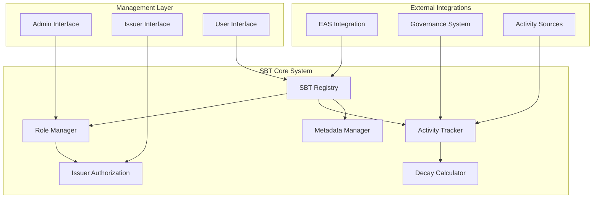

# Soulbound Token (SBT) Complete Specification and Implementation Guide

version 0.1


## Table of Contents

1. [Overview](#1-overview)
2. [Technical Specification](#2-technical-specification)
3. [Architecture Design](#3-architecture-design)
4. [Implementation Guide](#4-implementation-guide)
5. [Smart Contract Code](#5-smart-contract-code)
6. [Integration Patterns](#6-integration-patterns)
7. [Security Considerations](#7-security-considerations)
8. [Operational Procedures](#8-operational-procedures)
9. [Governance Integration](#9-governance-integration)
10. [Testing and Validation](#10-testing-and-validation)

---

## 1. Overview

### 1.1 What are Soulbound Tokens?

Soulbound Tokens (SBTs) are non-transferable digital credentials that represent achievements, roles, or attributes permanently bound to an individual's wallet address. Unlike traditional NFTs, SBTs cannot be sold or transferred, making them ideal for representing:

- **Identity Credentials**: Proof of identity, qualifications, or certifications
- **Achievement Records**: Completed courses, certifications, or milestones
- **Reputation Scores**: Community standing, contribution history
- **Access Rights**: Permissions or memberships that shouldn't be tradeable
- **Governance Roles**: Non-transferable positions in DAOs and protocols

### 1.2 ADAM Protocol SBT Implementation

In the ADAM Protocol, SBTs serve multiple critical functions:

1. **Governance Weight**: SBTs contribute to voting power based on role and activity
2. **Access Control**: Different proposal types require specific SBT credentials
3. **Reputation System**: Activity decay ensures active participation is rewarded
4. **Specialization**: Domain-specific roles enable expert participation in relevant decisions
5. **Anti-Sybil**: Non-transferable nature prevents identity farming

### 1.3 Key Design Principles

- **Non-Transferability**: Tokens cannot be moved between addresses
- **Revocability**: Issuers can revoke tokens for violations or inactivity
- **Upgradability**: Metadata and attributes can be updated by authorized parties
- **Activity Tracking**: Built-in decay mechanisms reward continued participation
- **EAS Integration**: Leverages Ethereum Attestation Service for credibility

---

## 2. Technical Specification

### 2.1 Standard Compliance

The ADAM Protocol SBT implementation extends ERC-721 with the following modifications:

- **Transfer Restrictions**: All transfer functions are disabled or restricted
- **Burn Capability**: Tokens can be burned by owner or authorized issuer
- **Metadata Updates**: Dynamic metadata updates for activity tracking
- **Batch Operations**: Efficient batch minting and updating
- **Event Logging**: Comprehensive event system for governance integration

### 2.2 Core Interfaces

#### ISBT Interface
```solidity
interface ISBT {
    // Core SBT Functions
    function mint(address to, uint256 tokenId, bytes calldata data) external;
    function burn(uint256 tokenId) external;
    function revoke(uint256 tokenId, string calldata reason) external;
    
    // Metadata Management
    function updateMetadata(uint256 tokenId, string calldata newURI) external;
    function setRoleWeight(uint256 tokenId, uint256 weight) external;
    function updateActivity(uint256 tokenId) external;
    
    // Governance Integration
    function getVotingWeight(uint256 tokenId) external view returns (uint256);
    function isActive(uint256 tokenId) external view returns (bool);
    function getRole(uint256 tokenId) external view returns (string memory);
    
    // Activity Tracking
    function getLastActivity(uint256 tokenId) external view returns (uint256);
    function getActivityDecay(uint256 tokenId) external view returns (uint256);
}
```

#### ISBTIssuer Interface
```solidity
interface ISBTIssuer {
    function isAuthorizedIssuer(address issuer, bytes32 roleType) external view returns (bool);
    function addIssuer(address issuer, bytes32 roleType) external;
    function removeIssuer(address issuer, bytes32 roleType) external;
    function getIssuerCount(bytes32 roleType) external view returns (uint256);
}
```

### 2.3 Data Structures

#### SBTData Structure
```solidity
struct SBTData {
    bytes32 roleType;          // Type of role (TECH_CONTRIBUTOR, GOV_PARTICIPANT, etc.)
    uint256 baseWeight;        // Base voting weight for this role
    uint256 issueTimestamp;    // When the SBT was issued
    uint256 lastActivity;      // Last recorded activity timestamp
    uint256 activityCount;     // Total number of activities recorded
    address issuer;            // Address that issued this SBT
    string metadataURI;        // IPFS URI for additional metadata
    bool isRevoked;            // Whether the SBT has been revoked
    string revokeReason;       // Reason for revocation (if applicable)
}
```

#### RoleConfiguration Structure
```solidity
struct RoleConfig {
    string name;               // Human-readable role name
    uint256 baseWeight;        // Base voting weight
    uint256 decayPeriod;       // Time in seconds for activity decay
    uint256 minActivity;       // Minimum activities required to maintain role
    uint256 maxSupply;         // Maximum number of SBTs for this role
    bool requiresStaking;      // Whether role requires token staking
    uint256 stakingAmount;     // Required staking amount
    address[] authorizedIssuers; // Addresses authorized to issue this role
}
```

---

## 3. Architecture Design

### 3.1 System Architecture



### 3.2 Role Type Hierarchy

```
ROOT
├── TECHNICAL
│   ├── CORE_DEVELOPER
│   ├── SECURITY_AUDITOR
│   ├── INFRASTRUCTURE_OPS
│   └── PROTOCOL_RESEARCHER
├── GOVERNANCE
│   ├── GOVERNANCE_PARTICIPANT
│   ├── PROPOSAL_REVIEWER
│   ├── COMMUNITY_MODERATOR
│   └── LEGAL_ADVISOR
├── RWA_SPECIALIST
│   ├── ENERGY_EXPERT
│   ├── CARBON_SPECIALIST
│   ├── DATA_CURATOR
│   └── ORACLE_OPERATOR
└── COMMUNITY
    ├── COMMUNITY_LEADER
    ├── EDUCATOR
    ├── PARTNERSHIP_MANAGER
    └── MARKETING_CONTRIBUTOR
```

### 3.3 Activity Sources Integration

The SBT system integrates with multiple activity sources to track real contributions:

- **GitHub Integration**: Code commits, PR reviews, issue resolution
- **Forum Activity**: High-quality posts, helpful responses, moderation actions
- **Governance Participation**: Proposal submissions, voting participation, debate quality
- **RWA Contributions**: Asset verifications, oracle operations, data quality
- **Community Building**: Event organization, educational content, support provision

---

## 4. Implementation Guide

### 4.1 Development Environment Setup

#### Prerequisites
```bash
# Install Node.js and npm
curl -fsSL https://deb.nodesource.com/setup_18.x | sudo -E bash -
sudo apt-get install -y nodejs

# Install development dependencies
npm install -g hardhat truffle ganache-cli

# Create project directory
mkdir adam-sbt-system
cd adam-sbt-system
npm init -y

# Install required packages
npm install @openzeppelin/contracts @ethereum-attestation-service/eas-contracts
npm install hardhat @nomiclabs/hardhat-ethers @nomiclabs/hardhat-waffle
npm install chai ethereum-waffle ethers
```

#### Project Structure
```
adam-sbt-system/
├── contracts/
│   ├── interfaces/
│   │   ├── ISBT.sol
│   │   ├── ISBTIssuer.sol
│   │   └── ISBTGovernance.sol
│   ├── core/
│   │   ├── SBTRegistry.sol
│   │   ├── RoleManager.sol
│   │   ├── ActivityTracker.sol
│   │   └── MetadataManager.sol
│   ├── integrations/
│   │   ├── EASIntegration.sol
│   │   ├── GovernanceIntegration.sol
│   │   └── ActivitySources.sol
│   └── ARCxSBT.sol
├── scripts/
│   ├── deploy.js
│   ├── setup-roles.js
│   └── mint-initial.js
├── test/
│   ├── SBT.test.js
│   ├── RoleManager.test.js
│   └── ActivityTracker.test.js
└── docs/
    ├── API.md
    ├── DEPLOYMENT.md
    └── OPERATIONS.md
```

### 4.2 Core Contract Implementation

The main SBT contract extends ERC-721 with soulbound functionality:

```solidity
// SPDX-License-Identifier: MIT
pragma solidity ^0.8.19;

import "@openzeppelin/contracts/token/ERC721/ERC721.sol";
import "@openzeppelin/contracts/access/AccessControl.sol";
import "@openzeppelin/contracts/security/Pausable.sol";
import "@openzeppelin/contracts/utils/Counters.sol";
import "./interfaces/ISBT.sol";

contract ARCxSBT is ERC721, AccessControl, Pausable, ISBT {
    using Counters for Counters.Counter;
    
    // Role definitions
    bytes32 public constant ISSUER_ROLE = keccak256("ISSUER_ROLE");
    bytes32 public constant ADMIN_ROLE = keccak256("ADMIN_ROLE");
    bytes32 public constant ACTIVITY_UPDATER_ROLE = keccak256("ACTIVITY_UPDATER_ROLE");
    
    // Counter for token IDs
    Counters.Counter private _tokenIdCounter;
    
    // SBT data mapping
    mapping(uint256 => SBTData) public sbtData;
    mapping(bytes32 => RoleConfig) public roleConfigs;
    mapping(address => uint256[]) public userTokens;
    mapping(bytes32 => uint256) public roleSupply;
    
    // Activity decay parameters
    uint256 public constant DECAY_DENOMINATOR = 86400; // 1 day in seconds
    uint256 public constant MIN_DECAY_FACTOR = 2500; // 25% minimum retention
    
    // Events
    event SBTMinted(
        address indexed to,
        uint256 indexed tokenId,
        bytes32 indexed roleType,
        address issuer
    );
    
    event SBTRevoked(
        uint256 indexed tokenId,
        address indexed revoker,
        string reason
    );
    
    event ActivityUpdated(
        uint256 indexed tokenId,
        uint256 timestamp,
        uint256 newCount
    );
    
    event RoleConfigured(
        bytes32 indexed roleType,
        uint256 baseWeight,
        uint256 decayPeriod,
        uint256 minActivity
    );
    
    constructor(
        string memory name,
        string memory symbol,
        address admin
    ) ERC721(name, symbol) {
        _grantRole(DEFAULT_ADMIN_ROLE, admin);
        _grantRole(ADMIN_ROLE, admin);
        _setupInitialRoles();
    }
    
    // Override transfer functions to make tokens soulbound
    function _beforeTokenTransfer(
        address from,
        address to,
        uint256 tokenId,
        uint256 batchSize
    ) internal override whenNotPaused {
        require(
            from == address(0) || to == address(0),
            "SBT: Transfers not allowed"
        );
        super._beforeTokenTransfer(from, to, tokenId, batchSize);
    }
    
    function approve(address, uint256) public pure override {
        revert("SBT: Approvals not allowed");
    }
    
    function setApprovalForAll(address, bool) public pure override {
        revert("SBT: Approvals not allowed");
    }
    
    function transferFrom(address, address, uint256) public pure override {
        revert("SBT: Transfers not allowed");
    }
    
    function safeTransferFrom(address, address, uint256) public pure override {
        revert("SBT: Transfers not allowed");
    }
    
    function safeTransferFrom(
        address,
        address,
        uint256,
        bytes memory
    ) public pure override {
        revert("SBT: Transfers not allowed");
    }
    
    // Core SBT Functions
    function mint(
        address to,
        uint256 tokenId,
        bytes calldata data
    ) external override onlyRole(ISSUER_ROLE) {
        bytes32 roleType = abi.decode(data, (bytes32));
        require(roleConfigs[roleType].baseWeight > 0, "SBT: Role not configured");
        require(
            roleSupply[roleType] < roleConfigs[roleType].maxSupply,
            "SBT: Role supply exceeded"
        );
        
        _safeMint(to, tokenId);
        
        sbtData[tokenId] = SBTData({
            roleType: roleType,
            baseWeight: roleConfigs[roleType].baseWeight,
            issueTimestamp: block.timestamp,
            lastActivity: block.timestamp,
            activityCount: 0,
            issuer: msg.sender,
            metadataURI: "",
            isRevoked: false,
            revokeReason: ""
        });
        
        userTokens[to].push(tokenId);
        roleSupply[roleType]++;
        
        emit SBTMinted(to, tokenId, roleType, msg.sender);
    }
    
    function burn(uint256 tokenId) external override {
        require(
            ownerOf(tokenId) == msg.sender ||
            hasRole(ADMIN_ROLE, msg.sender) ||
            sbtData[tokenId].issuer == msg.sender,
            "SBT: Not authorized to burn"
        );
        
        bytes32 roleType = sbtData[tokenId].roleType;
        roleSupply[roleType]--;
        
        address owner = ownerOf(tokenId);
        _removeTokenFromUser(owner, tokenId);
        
        delete sbtData[tokenId];
        _burn(tokenId);
    }
    
    function revoke(
        uint256 tokenId,
        string calldata reason
    ) external override onlyRole(ADMIN_ROLE) {
        require(_exists(tokenId), "SBT: Token does not exist");
        require(!sbtData[tokenId].isRevoked, "SBT: Already revoked");
        
        sbtData[tokenId].isRevoked = true;
        sbtData[tokenId].revokeReason = reason;
        
        emit SBTRevoked(tokenId, msg.sender, reason);
    }
    
    // Metadata Management
    function updateMetadata(
        uint256 tokenId,
        string calldata newURI
    ) external override {
        require(_exists(tokenId), "SBT: Token does not exist");
        require(
            hasRole(ADMIN_ROLE, msg.sender) ||
            sbtData[tokenId].issuer == msg.sender,
            "SBT: Not authorized"
        );
        
        sbtData[tokenId].metadataURI = newURI;
    }
    
    function setRoleWeight(
        uint256 tokenId,
        uint256 weight
    ) external override onlyRole(ADMIN_ROLE) {
        require(_exists(tokenId), "SBT: Token does not exist");
        sbtData[tokenId].baseWeight = weight;
    }
    
    function updateActivity(uint256 tokenId) external override {
        require(_exists(tokenId), "SBT: Token does not exist");
        require(
            hasRole(ACTIVITY_UPDATER_ROLE, msg.sender) ||
            ownerOf(tokenId) == msg.sender,
            "SBT: Not authorized"
        );
        require(!sbtData[tokenId].isRevoked, "SBT: Token revoked");
        
        sbtData[tokenId].lastActivity = block.timestamp;
        sbtData[tokenId].activityCount++;
        
        emit ActivityUpdated(
            tokenId,
            block.timestamp,
            sbtData[tokenId].activityCount
        );
    }
    
    // Governance Integration
    function getVotingWeight(uint256 tokenId) external view override returns (uint256) {
        if (!_exists(tokenId) || sbtData[tokenId].isRevoked) {
            return 0;
        }
        
        uint256 baseWeight = sbtData[tokenId].baseWeight;
        uint256 decayFactor = getActivityDecay(tokenId);
        
        return (baseWeight * decayFactor) / 10000;
    }
    
    function isActive(uint256 tokenId) external view override returns (bool) {
        if (!_exists(tokenId) || sbtData[tokenId].isRevoked) {
            return false;
        }
        
        bytes32 roleType = sbtData[tokenId].roleType;
        uint256 timeSinceActivity = block.timestamp - sbtData[tokenId].lastActivity;
        
        return timeSinceActivity <= roleConfigs[roleType].decayPeriod;
    }
    
    function getRole(uint256 tokenId) external view override returns (string memory) {
        require(_exists(tokenId), "SBT: Token does not exist");
        return roleConfigs[sbtData[tokenId].roleType].name;
    }
    
    // Activity Tracking
    function getLastActivity(uint256 tokenId) external view override returns (uint256) {
        require(_exists(tokenId), "SBT: Token does not exist");
        return sbtData[tokenId].lastActivity;
    }
    
    function getActivityDecay(uint256 tokenId) public view override returns (uint256) {
        if (!_exists(tokenId) || sbtData[tokenId].isRevoked) {
            return 0;
        }
        
        bytes32 roleType = sbtData[tokenId].roleType;
        uint256 timeSinceActivity = block.timestamp - sbtData[tokenId].lastActivity;
        uint256 decayPeriod = roleConfigs[roleType].decayPeriod;
        
        if (timeSinceActivity >= decayPeriod) {
            return MIN_DECAY_FACTOR;
        }
        
        // Exponential decay formula: e^(-t/T) scaled to 0-10000
        uint256 decayExponent = (timeSinceActivity * 10000) / decayPeriod;
        uint256 decayFactor = 10000 - decayExponent;
        
        return decayFactor < MIN_DECAY_FACTOR ? MIN_DECAY_FACTOR : decayFactor;
    }
    
    // Role Management
    function configureRole(
        bytes32 roleType,
        string memory name,
        uint256 baseWeight,
        uint256 decayPeriod,
        uint256 minActivity,
        uint256 maxSupply,
        bool requiresStaking,
        uint256 stakingAmount
    ) external onlyRole(ADMIN_ROLE) {
        roleConfigs[roleType] = RoleConfig({
            name: name,
            baseWeight: baseWeight,
            decayPeriod: decayPeriod,
            minActivity: minActivity,
            maxSupply: maxSupply,
            requiresStaking: requiresStaking,
            stakingAmount: stakingAmount,
            authorizedIssuers: new address[](0)
        });
        
        emit RoleConfigured(roleType, baseWeight, decayPeriod, minActivity);
    }
    
    // Batch Operations
    function batchMint(
        address[] calldata recipients,
        bytes32[] calldata roleTypes
    ) external onlyRole(ISSUER_ROLE) {
        require(recipients.length == roleTypes.length, "SBT: Array length mismatch");
        
        for (uint256 i = 0; i < recipients.length; i++) {
            uint256 tokenId = _tokenIdCounter.current();
            _tokenIdCounter.increment();
            
            bytes memory data = abi.encode(roleTypes[i]);
            this.mint(recipients[i], tokenId, data);
        }
    }
    
    function batchUpdateActivity(
        uint256[] calldata tokenIds
    ) external onlyRole(ACTIVITY_UPDATER_ROLE) {
        for (uint256 i = 0; i < tokenIds.length; i++) {
            if (_exists(tokenIds[i]) && !sbtData[tokenIds[i]].isRevoked) {
                sbtData[tokenIds[i]].lastActivity = block.timestamp;
                sbtData[tokenIds[i]].activityCount++;
                
                emit ActivityUpdated(
                    tokenIds[i],
                    block.timestamp,
                    sbtData[tokenIds[i]].activityCount
                );
            }
        }
    }
    
    // User Token Management
    function getUserTokens(address user) external view returns (uint256[] memory) {
        return userTokens[user];
    }
    
    function getUserActiveTokens(address user) external view returns (uint256[] memory) {
        uint256[] memory allTokens = userTokens[user];
        uint256 activeCount = 0;
        
        // Count active tokens
        for (uint256 i = 0; i < allTokens.length; i++) {
            if (this.isActive(allTokens[i])) {
                activeCount++;
            }
        }
        
        // Create array of active tokens
        uint256[] memory activeTokens = new uint256[](activeCount);
        uint256 index = 0;
        
        for (uint256 i = 0; i < allTokens.length; i++) {
            if (this.isActive(allTokens[i])) {
                activeTokens[index] = allTokens[i];
                index++;
            }
        }
        
        return activeTokens;
    }
    
    function getUserTotalWeight(address user) external view returns (uint256) {
        uint256[] memory tokens = userTokens[user];
        uint256 totalWeight = 0;
        
        for (uint256 i = 0; i < tokens.length; i++) {
            totalWeight += this.getVotingWeight(tokens[i]);
        }
        
        return totalWeight;
    }
    
    // Internal Functions
    function _removeTokenFromUser(address user, uint256 tokenId) internal {
        uint256[] storage tokens = userTokens[user];
        for (uint256 i = 0; i < tokens.length; i++) {
            if (tokens[i] == tokenId) {
                tokens[i] = tokens[tokens.length - 1];
                tokens.pop();
                break;
            }
        }
    }
    
    function _setupInitialRoles() internal {
        // Technical Contributor Role
        roleConfigs[keccak256("TECH_CONTRIBUTOR")] = RoleConfig({
            name: "Technical Contributor",
            baseWeight: 100,
            decayPeriod: 90 days,
            minActivity: 10,
            maxSupply: 100,
            requiresStaking: false,
            stakingAmount: 0,
            authorizedIssuers: new address[](0)
        });
        
        // Governance Participant Role
        roleConfigs[keccak256("GOV_PARTICIPANT")] = RoleConfig({
            name: "Governance Participant",
            baseWeight: 80,
            decayPeriod: 60 days,
            minActivity: 5,
            maxSupply: 200,
            requiresStaking: false,
            stakingAmount: 0,
            authorizedIssuers: new address[](0)
        });
        
        // RWA Curator Role
        roleConfigs[keccak256("RWA_CURATOR")] = RoleConfig({
            name: "RWA Curator",
            baseWeight: 120,
            decayPeriod: 120 days,
            minActivity: 3,
            maxSupply: 50,
            requiresStaking: true,
            stakingAmount: 10000 ether, // 10,000 ARCx
            authorizedIssuers: new address[](0)
        });
        
        // Oracle Operator Role
        roleConfigs[keccak256("ORACLE_OPERATOR")] = RoleConfig({
            name: "Oracle Operator",
            baseWeight: 150,
            decayPeriod: 30 days,
            minActivity: 30,
            maxSupply: 20,
            requiresStaking: true,
            stakingAmount: 50000 ether, // 50,000 ARCx
            authorizedIssuers: new address[](0)
        });
    }
    
    // Required overrides
    function supportsInterface(bytes4 interfaceId)
        public
        view
        override(ERC721, AccessControl)
        returns (bool)
    {
        return super.supportsInterface(interfaceId);
    }
    
    function tokenURI(uint256 tokenId) public view override returns (string memory) {
        require(_exists(tokenId), "SBT: URI query for nonexistent token");
        
        string memory baseURI = _baseURI();
        if (bytes(sbtData[tokenId].metadataURI).length > 0) {
            return sbtData[tokenId].metadataURI;
        }
        
        return bytes(baseURI).length > 0 
            ? string(abi.encodePacked(baseURI, Strings.toString(tokenId)))
            : "";
    }
    
    // Admin Functions
    function pause() external onlyRole(ADMIN_ROLE) {
        _pause();
    }
    
    function unpause() external onlyRole(ADMIN_ROLE) {
        _unpause();
    }
    
    function nextTokenId() external view returns (uint256) {
        return _tokenIdCounter.current();
    }
}
```

### 4.3 Activity Tracker Implementation

The Activity Tracker manages real-time updates from various sources:

```solidity
// SPDX-License-Identifier: MIT
pragma solidity ^0.8.19;

import "@openzeppelin/contracts/access/AccessControl.sol";
import "@openzeppelin/contracts/security/ReentrancyGuard.sol";
import "./interfaces/ISBT.sol";

contract ActivityTracker is AccessControl, ReentrancyGuard {
    bytes32 public constant ACTIVITY_REPORTER_ROLE = keccak256("ACTIVITY_REPORTER_ROLE");
    bytes32 public constant ADMIN_ROLE = keccak256("ADMIN_ROLE");
    
    ISBT public sbtContract;
    
    // Activity source configurations
    mapping(bytes32 => ActivitySource) public activitySources;
    mapping(address => mapping(bytes32 => uint256)) public userActivityCounts;
    mapping(uint256 => uint256) public tokenActivityScores;
    
    struct ActivitySource {
        string name;
        uint256 weight;
        uint256 cooldownPeriod;
        bool isActive;
        address reporter;
    }
    
    struct ActivityRecord {
        bytes32 sourceType;
        uint256 timestamp;
        uint256 value;
        bytes32 metadata;
    }
    
    mapping(uint256 => ActivityRecord[]) public tokenActivities;
    
    event ActivityRecorded(
        uint256 indexed tokenId,
        bytes32 indexed sourceType,
        uint256 value,
        uint256 timestamp
    );
    
    event ActivitySourceConfigured(
        bytes32 indexed sourceType,
        string name,
        uint256 weight,
        address reporter
    );
    
    constructor(address _sbtContract, address admin) {
        sbtContract = ISBT(_sbtContract);
        _grantRole(DEFAULT_ADMIN_ROLE, admin);
        _grantRole(ADMIN_ROLE, admin);
        _setupActivitySources();
    }
    
    function recordActivity(
        uint256 tokenId,
        bytes32 sourceType,
        uint256 value,
        bytes32 metadata
    ) external onlyRole(ACTIVITY_REPORTER_ROLE) nonReentrant {
        require(activitySources[sourceType].isActive, "Activity: Source not active");
        require(
            activitySources[sourceType].reporter == msg.sender,
            "Activity: Unauthorized reporter"
        );
        
        ActivityRecord memory record = ActivityRecord({
            sourceType: sourceType,
            timestamp: block.timestamp,
            value: value,
            metadata: metadata
        });
        
        tokenActivities[tokenId].push(record);
        
        // Update activity score
        uint256 weight = activitySources[sourceType].weight;
        tokenActivityScores[tokenId] += value * weight;
        
        // Update SBT activity timestamp
        sbtContract.updateActivity(tokenId);
        
        emit ActivityRecorded(tokenId, sourceType, value, block.timestamp);
    }
    
    function batchRecordActivity(
        uint256[] calldata tokenIds,
        bytes32 sourceType,
        uint256[] calldata values,
        bytes32[] calldata metadatas
    ) external onlyRole(ACTIVITY_REPORTER_ROLE) nonReentrant {
        require(
            tokenIds.length == values.length && 
            tokenIds.length == metadatas.length,
            "Activity: Array length mismatch"
        );
        
        for (uint256 i = 0; i < tokenIds.length; i++) {
            this.recordActivity(tokenIds[i], sourceType, values[i], metadatas[i]);
        }
    }
    
    function configureActivitySource(
        bytes32 sourceType,
        string memory name,
        uint256 weight,
        uint256 cooldownPeriod,
        address reporter
    ) external onlyRole(ADMIN_ROLE) {
        activitySources[sourceType] = ActivitySource({
            name: name,
            weight: weight,
            cooldownPeriod: cooldownPeriod,
            isActive: true,
            reporter: reporter
        });
        
        _grantRole(ACTIVITY_REPORTER_ROLE, reporter);
        
        emit ActivitySourceConfigured(sourceType, name, weight, reporter);
    }
    
    function getTokenActivityHistory(
        uint256 tokenId
    ) external view returns (ActivityRecord[] memory) {
        return tokenActivities[tokenId];
    }
    
    function getTokenActivityScore(uint256 tokenId) external view returns (uint256) {
        return tokenActivityScores[tokenId];
    }
    
    function getUserActivityCount(
        address user,
        bytes32 sourceType
    ) external view returns (uint256) {
        return userActivityCounts[user][sourceType];
    }
    
    function _setupActivitySources() internal {
        // GitHub Contributions
        activitySources[keccak256("GITHUB")] = ActivitySource({
            name: "GitHub Contributions",
            weight: 10,
            cooldownPeriod: 1 hours,
            isActive: true,
            reporter: address(0) // To be set later
        });
        
        // Forum Participation
        activitySources[keccak256("FORUM")] = ActivitySource({
            name: "Forum Participation",
            weight: 5,
            cooldownPeriod: 30 minutes,
            isActive: true,
            reporter: address(0)
        });
        
        // Governance Voting
        activitySources[keccak256("GOVERNANCE")] = ActivitySource({
            name: "Governance Voting",
            weight: 20,
            cooldownPeriod: 1 days,
            isActive: true,
            reporter: address(0)
        });
        
        // RWA Verification
        activitySources[keccak256("RWA_VERIFY")] = ActivitySource({
            name: "RWA Verification",
            weight: 50,
            cooldownPeriod: 1 days,
            isActive: true,
            reporter: address(0)
        });
        
        // Oracle Operations
        activitySources[keccak256("ORACLE_OPS")] = ActivitySource({
            name: "Oracle Operations",
            weight: 30,
            cooldownPeriod: 6 hours,
            isActive: true,
            reporter: address(0)
        });
    }
}
```

### 4.4 EAS Integration Implementation

Integration with Ethereum Attestation Service for credibility:

```solidity
// SPDX-License-Identifier: MIT
pragma solidity ^0.8.19;

import "@ethereum-attestation-service/eas-contracts/contracts/IEAS.sol";
import "@ethereum-attestation-service/eas-contracts/contracts/ISchemaRegistry.sol";
import "@openzeppelin/contracts/access/AccessControl.sol";
import "./interfaces/ISBT.sol";

contract SBTEASIntegration is AccessControl {
    bytes32 public constant ATTESTOR_ROLE = keccak256("ATTESTOR_ROLE");
    bytes32 public constant ADMIN_ROLE = keccak256("ADMIN_ROLE");
    
    IEAS public immutable eas;
    ISchemaRegistry public immutable schemaRegistry;
    ISBT public sbtContract;
    
    // Schema UIDs for different SBT types
    mapping(bytes32 => bytes32) public roleSchemas;
    mapping(bytes32 => bytes32) public sbtAttestations;
    mapping(address => bytes32[]) public userAttestations;
    
    struct AttestationData {
        bytes32 roleType;
        uint256 score;
        uint256 timestamp;
        address attestor;
        bool isRevoked;
    }
    
    mapping(bytes32 => AttestationData) public attestationData;
    
    event SBTAttested(
        address indexed recipient,
        bytes32 indexed attestationUID,
        bytes32 indexed roleType,
        uint256 score
    );
    
    event AttestationRevoked(
        bytes32 indexed attestationUID,
        address indexed revoker,
        string reason
    );
    
    constructor(
        address _eas,
        address _schemaRegistry,
        address _sbtContract,
        address admin
    ) {
        eas = IEAS(_eas);
        schemaRegistry = ISchemaRegistry(_schemaRegistry);
        sbtContract = ISBT(_sbtContract);
        
        _grantRole(DEFAULT_ADMIN_ROLE, admin);
        _grantRole(ADMIN_ROLE, admin);
        _setupSchemas();
    }
    
    function attestSBTEligibility(
        address recipient,
        bytes32 roleType,
        uint256 score,
        bytes calldata evidence
    ) external onlyRole(ATTESTOR_ROLE) returns (bytes32) {
        bytes32 schemaUID = roleSchemas[roleType];
        require(schemaUID != bytes32(0), "EAS: Schema not configured");
        
        AttestationRequestData memory requestData = AttestationRequestData({
            recipient: recipient,
            expirationTime: 0, // No expiration
            revocable: true,
            refUID: bytes32(0),
            data: abi.encode(roleType, score, evidence),
            value: 0
        });
        
        AttestationRequest memory request = AttestationRequest({
            schema: schemaUID,
            data: requestData
        });
        
        bytes32 attestationUID = eas.attest(request);
        
        // Store attestation data
        attestationData[attestationUID] = AttestationData({
            roleType: roleType,
            score: score,
            timestamp: block.timestamp,
            attestor: msg.sender,
            isRevoked: false
        });
        
        sbtAttestations[attestationUID] = attestationUID;
        userAttestations[recipient].push(attestationUID);
        
        emit SBTAttested(recipient, attestationUID, roleType, score);
        
        return attestationUID;
    }
    
    function revokeAttestation(
        bytes32 attestationUID,
        string calldata reason
    ) external {
        AttestationData storage data = attestationData[attestationUID];
        require(
            data.attestor == msg.sender || 
            hasRole(ADMIN_ROLE, msg.sender),
            "EAS: Not authorized to revoke"
        );
        
        RevocationRequestData memory revocationData = RevocationRequestData({
            uid: attestationUID,
            value: 0
        });
        
        RevocationRequest memory request = RevocationRequest({
            schema: roleSchemas[data.roleType],
            data: revocationData
        });
        
        eas.revoke(request);
        
        data.isRevoked = true;
        
        emit AttestationRevoked(attestationUID, msg.sender, reason);
    }
    
    function verifyAttestation(
        bytes32 attestationUID
    ) external view returns (bool isValid, AttestationData memory data) {
        data = attestationData[attestationUID];
        
        if (data.timestamp == 0) {
            return (false, data);
        }
        
        Attestation memory attestation = eas.getAttestation(attestationUID);
        isValid = attestation.uid != bytes32(0) && 
                 attestation.revocationTime == 0 && 
                 !data.isRevoked;
        
        return (isValid, data);
    }
    
    function getUserAttestations(
        address user
    ) external view returns (bytes32[] memory) {
        return userAttestations[user];
    }
    
    function getValidAttestations(
        address user
    ) external view returns (bytes32[] memory validUIDs) {
        bytes32[] memory allUIDs = userAttestations[user];
        uint256 validCount = 0;
        
        // Count valid attestations
        for (uint256 i = 0; i < allUIDs.length; i++) {
            (bool isValid,) = this.verifyAttestation(allUIDs[i]);
            if (isValid) {
                validCount++;
            }
        }
        
        // Create array of valid UIDs
        validUIDs = new bytes32[](validCount);
        uint256 index = 0;
        
        for (uint256 i = 0; i < allUIDs.length; i++) {
            (bool isValid,) = this.verifyAttestation(allUIDs[i]);
            if (isValid) {
                validUIDs[index] = allUIDs[i];
                index++;
            }
        }
        
        return validUIDs;
    }
    
    function registerSchema(
        bytes32 roleType,
        string calldata schema
    ) external onlyRole(ADMIN_ROLE) returns (bytes32) {
        bytes32 schemaUID = schemaRegistry.register(schema, address(this), true);
        roleSchemas[roleType] = schemaUID;
        return schemaUID;
    }
    
    function _setupSchemas() internal {
        // These would be registered with the actual schema strings
        // Example schemas for different role types
        
        bytes32 techSchema = schemaRegistry.register(
            "bytes32 roleType,uint256 contributionScore,bytes32 evidenceHash,uint256 timestamp",
            address(this),
            true
        );
        roleSchemas[keccak256("TECH_CONTRIBUTOR")] = techSchema;
        
        bytes32 govSchema = schemaRegistry.register(
            "bytes32 roleType,uint256 participationScore,uint256 proposalCount,uint256 voteCount",
            address(this),
            true
        );
        roleSchemas[keccak256("GOV_PARTICIPANT")] = govSchema;
        
        bytes32 rwaSchema = schemaRegistry.register(
            "bytes32 roleType,uint256 verificationScore,uint256 assetCount,bytes32 specialization",
            address(this),
            true
        );
        roleSchemas[keccak256("RWA_CURATOR")] = rwaSchema;
        
        bytes32 oracleSchema = schemaRegistry.register(
            "bytes32 roleType,uint256 reliabilityScore,uint256 uptimePercentage,bytes32 feedTypes",
            address(this),
            true
        );
        roleSchemas[keccak256("ORACLE_OPERATOR")] = oracleSchema;
    }
}
```

---

## 5. Smart Contract Code

The complete smart contract implementations are provided in the previous sections. Here's the deployment and setup guide:

### 5.1 Deployment Scripts

```javascript
// scripts/deploy.js
const { ethers, upgrades } = require("hardhat");

async function main() {
    const [deployer] = await ethers.getSigners();
    console.log("Deploying contracts with account:", deployer.address);
    
    // Deploy SBT Contract
    const SBTContract = await ethers.getContractFactory("ARCxSBT");
    const sbt = await SBTContract.deploy(
        "ARCx Soulbound Token",
        "ARCxSBT",
        deployer.address
    );
    await sbt.deployed();
    console.log("SBT deployed to:", sbt.address);
    
    // Deploy Activity Tracker
    const ActivityTracker = await ethers.getContractFactory("ActivityTracker");
    const activityTracker = await ActivityTracker.deploy(
        sbt.address,
        deployer.address
    );
    await activityTracker.deployed();
    console.log("Activity Tracker deployed to:", activityTracker.address);
    
    // Deploy EAS Integration
    const EASIntegration = await ethers.getContractFactory("SBTEASIntegration");
    const easIntegration = await EASIntegration.deploy(
        process.env.EAS_CONTRACT_ADDRESS,
        process.env.SCHEMA_REGISTRY_ADDRESS,
        sbt.address,
        deployer.address
    );
    await easIntegration.deployed();
    console.log("EAS Integration deployed to:", easIntegration.address);
    
    // Grant roles
    await sbt.grantRole(await sbt.ACTIVITY_UPDATER_ROLE(), activityTracker.address);
    await activityTracker.grantRole(
        await activityTracker.ACTIVITY_REPORTER_ROLE(),
        deployer.address
    );
    
    console.log("Deployment completed successfully");
    
    return {
        sbt: sbt.address,
        activityTracker: activityTracker.address,
        easIntegration: easIntegration.address
    };
}

main()
    .then(() => process.exit(0))
    .catch((error) => {
        console.error(error);
        process.exit(1);
    });
```

### 5.2 Testing Suite

```javascript
// test/SBT.test.js
const { expect } = require("chai");
const { ethers } = require("hardhat");

describe("ARCxSBT", function() {
    let sbt, owner, user1, user2;
    
    beforeEach(async function() {
        [owner, user1, user2] = await ethers.getSigners();
        
        const SBTContract = await ethers.getContractFactory("ARCxSBT");
        sbt = await SBTContract.deploy(
            "Test SBT",
            "TSBT",
            owner.address
        );
        await sbt.deployed();
    });
    
    describe("Minting", function() {
        it("Should mint SBT with correct role", async function() {
            const roleType = ethers.utils.keccak256(ethers.utils.toUtf8Bytes("TECH_CONTRIBUTOR"));
            const data = ethers.utils.defaultAbiCoder.encode(["bytes32"], [roleType]);
            
            await expect(sbt.mint(user1.address, 1, data))
                .to.emit(sbt, "SBTMinted")
                .withArgs(user1.address, 1, roleType, owner.address);
                
            expect(await sbt.ownerOf(1)).to.equal(user1.address);
            expect(await sbt.getRole(1)).to.equal("Technical Contributor");
        });
        
        it("Should not allow minting invalid role", async function() {
            const invalidRole = ethers.utils.keccak256(ethers.utils.toUtf8Bytes("INVALID_ROLE"));
            const data = ethers.utils.defaultAbiCoder.encode(["bytes32"], [invalidRole]);
            
            await expect(sbt.mint(user1.address, 1, data))
                .to.be.revertedWith("SBT: Role not configured");
        });
    });
    
    describe("Transfer Restrictions", function() {
        beforeEach(async function() {
            const roleType = ethers.utils.keccak256(ethers.utils.toUtf8Bytes("TECH_CONTRIBUTOR"));
            const data = ethers.utils.defaultAbiCoder.encode(["bytes32"], [roleType]);
            await sbt.mint(user1.address, 1, data);
        });
        
        it("Should not allow transfers", async function() {
            await expect(sbt.connect(user1).transferFrom(user1.address, user2.address, 1))
                .to.be.revertedWith("SBT: Transfers not allowed");
        });
        
        it("Should not allow approvals", async function() {
            await expect(sbt.connect(user1).approve(user2.address, 1))
                .to.be.revertedWith("SBT: Approvals not allowed");
        });
    });
    
    describe("Activity Tracking", function() {
        beforeEach(async function() {
            const roleType = ethers.utils.keccak256(ethers.utils.toUtf8Bytes("TECH_CONTRIBUTOR"));
            const data = ethers.utils.defaultAbiCoder.encode(["bytes32"], [roleType]);
            await sbt.mint(user1.address, 1, data);
        });
        
        it("Should update activity", async function() {
            const initialActivity = await sbt.getLastActivity(1);
            
            // Fast forward time
            await network.provider.send("evm_increaseTime", [3600]); // 1 hour
            await network.provider.send("evm_mine");
            
            await expect(sbt.connect(user1).updateActivity(1))
                .to.emit(sbt, "ActivityUpdated");
            
            const newActivity = await sbt.getLastActivity(1);
            expect(newActivity).to.be.gt(initialActivity);
        });
        
        it("Should calculate decay correctly", async function() {
            const initialWeight = await sbt.getVotingWeight(1);
            
            // Fast forward time by 45 days (half decay period)
            await network.provider.send("evm_increaseTime", [45 * 24 * 3600]);
            await network.provider.send("evm_mine");
            
            const decayedWeight = await sbt.getVotingWeight(1);
            expect(decayedWeight).to.be.lt(initialWeight);
            expect(decayedWeight).to.be.gte(initialWeight * 25 / 100); // At least 25% retained
        });
    });
    
    describe("Revocation", function() {
        beforeEach(async function() {
            const roleType = ethers.utils.keccak256(ethers.utils.toUtf8Bytes("TECH_CONTRIBUTOR"));
            const data = ethers.utils.defaultAbiCoder.encode(["bytes32"], [roleType]);
            await sbt.mint(user1.address, 1, data);
        });
        
        it("Should revoke SBT", async function() {
            await expect(sbt.revoke(1, "Violation of terms"))
                .to.emit(sbt, "SBTRevoked")
                .withArgs(1, owner.address, "Violation of terms");
            
            expect(await sbt.getVotingWeight(1)).to.equal(0);
            expect(await sbt.isActive(1)).to.be.false;
        });
        
        it("Should not allow double revocation", async function() {
            await sbt.revoke(1, "First revocation");
            
            await expect(sbt.revoke(1, "Second revocation"))
                .to.be.revertedWith("SBT: Already revoked");
        });
    });
});
```

---

## 6. Integration Patterns

### 6.1 Governance System Integration

The SBT system integrates seamlessly with the ADAM Protocol governance:

```solidity
// Integration with Governor contract
function getVotingPower(address voter, uint256 proposalId) external view returns (uint256) {
    uint256[] memory tokens = sbtContract.getUserActiveTokens(voter);
    uint256 totalWeight = 0;
    
    for (uint256 i = 0; i < tokens.length; i++) {
        // Check if token role is eligible for this proposal topic
        if (isEligibleForProposal(tokens[i], proposalId)) {
            totalWeight += sbtContract.getVotingWeight(tokens[i]);
        }
    }
    
    return totalWeight;
}
```

### 6.2 Activity Source Integrations

#### GitHub Integration
```javascript
// GitHub webhook handler for tracking contributions
app.post('/webhook/github', async (req, res) => {
    const payload = req.body;
    
    if (payload.action === 'closed' && payload.pull_request.merged) {
        const author = payload.pull_request.user.login;
        const userAddress = await getUserAddress(author);
        
        if (userAddress) {
            await recordActivity(
                userAddress,
                'GITHUB_PR_MERGED',
                calculateContributionScore(payload.pull_request),
                payload.pull_