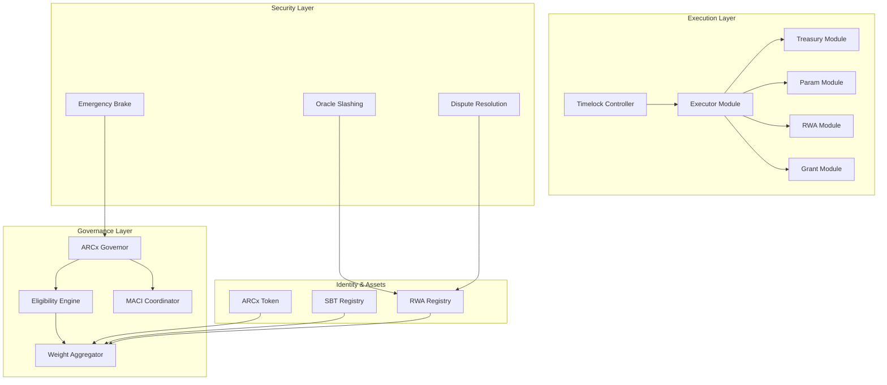
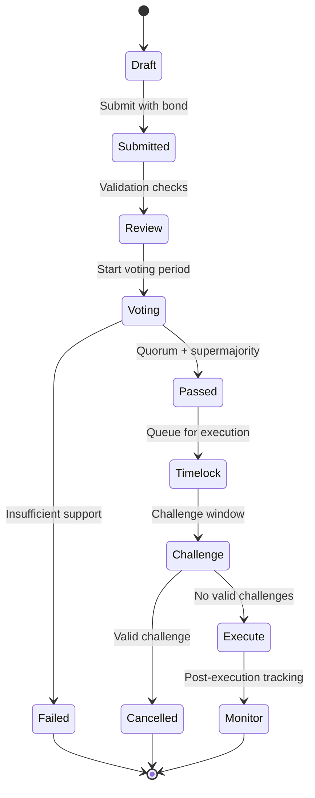

# ADAM Protocol: Constitutional Intelligence

> version 0.1


<div align="center">
  <h2>Authoritative Governance Specification v1.0</h2>
  <p><em>Constitutional Protocol for Real-World Asset DAOs</em></p>
</div>

---

## Table of Contents

1. [Executive Summary](#1-executive-summary)
2. [Architecture Overview](#2-architecture-overview)
3. [Core Components](#3-core-components)
4. [Voting Weight Mathematics](#4-voting-weight-mathematics)
5. [Governance Mechanics](#5-governance-mechanics)
6. [Security Framework](#6-security-framework)
7. [Implementation Specifications](#7-implementation-specifications)
8. [Operational Procedures](#8-operational-procedures)
9. [Economic Model](#9-economic-model)
10. [Legal Framework](#10-legal-framework)
11. [Technical Architecture](#11-technical-architecture)
12. [Deployment Strategy](#12-deployment-strategy)

---

## 1. Executive Summary

### 1.1 Mission Statement

The ADAM Protocol implements Constitutional Intelligence - a deterministic, auditable governance framework that binds capital, reputation, and verifiable real-world impact into a unified decision-making system. Unlike traditional DAOs that rely on simple token-weighted voting or informal social consensus, ADAM Protocol creates a machine-enforceable constitution where every rule is implemented without ambiguity.

### 1.2 Core Innovation

**Multi-Dimensional Voting Power**: Voting weight is calculated from three distinct but complementary sources:
- **Capital Commitment**: ARCx token stake with duration multipliers
- **Reputation Authority**: Soulbound tokens proving specialized expertise
- **Real-World Impact**: Attestations of verifiable off-chain contributions

**Context-Aware Governance**: Different proposal types activate different voter constituencies, ensuring domain expertise drives relevant decisions while maintaining democratic oversight.

### 1.3 Key Differentiators

1. **Formalist Design Philosophy**: Every governance rule is implementable in smart contract code
2. **Anti-Plutocracy Mechanisms**: Quadratic voting and component caps prevent whale dominance
3. **RWA-Native Architecture**: Real-world assets are first-class participants in governance
4. **Cryptographic Privacy**: MACI integration ensures secret balloting and anti-collusion
5. **Emergency Safeguards**: Bytecode-limited emergency powers with dual-quorum requirements

---

## 2. Architecture Overview

### 2.1 System Components



### 2.2 Actor Model

**Primary Actors**:
- **Voters**: Hold ARCx, SBTs, and/or RWA attestations
- **Proposers**: Submit governance proposals with required bonds
- **Oracle Operators**: Attest to real-world asset states
- **Emergency Council**: Limited emergency pause/cancel powers
- **MACI Coordinator**: Operates anti-collusion voting infrastructure

**Secondary Actors**:
- **Validators**: Verify RWA attestations and oracle data
- **Challengers**: Dispute fraudulent attestations or oracle updates
- **Delegates**: Receive voting power delegation per component type

### 2.3 Data Flow

1. **Proposal Submission**: Proposers submit typed proposals with bonds
2. **Eligibility Determination**: Engine calculates voter eligibility per topic
3. **Weight Calculation**: Aggregator computes multi-component voting power
4. **Secret Voting**: MACI enables private ballot casting with ZK proofs
5. **Execution**: Passed proposals execute through timelock and modular executors
6. **Monitoring**: All actions emit events for transparency and analysis

---

## 3. Core Components

### 3.1 ARCx Token System

The ARCx token serves as the foundational governance asset with enhanced staking mechanics:

#### Token Mechanics
- **Total Supply**: Fixed at 100,000,000 ARCx
- **Decimals**: 18
- **Standard**: ERC-20 with ERC-20Votes extension
- **Staking**: Lock mechanism with duration multipliers
- **Slashing**: Optional for high-privilege roles

#### Staking Formula
```
stake_weight = min(1 + log(1 + stake_days / 30), 2.5) * stake_amount
voting_power = floor(sqrt(stake_weight)) * slashing_risk_factor
```

Where:
- `stake_days`: Duration of token lock in days
- `slashing_risk_factor`: 0.5-1.2 based on role exposure
- Maximum multiplier caps prevent excessive concentration

### 3.2 Soulbound Token (SBT) System

Soulbound tokens represent non-transferable credentials proving specialized expertise and contribution history.

#### SBT Categories
1. **Technical Contributor**: Code commits, audits, infrastructure
2. **Governance Participant**: Proposal quality, voting consistency
3. **RWA Curator**: Real-world asset verification and management
4. **Community Leader**: Moderation, education, onboarding
5. **Oracle Operator**: Data feed reliability and accuracy

#### Activity Decay Model
```
activity_weight = base_weight * exp(-(time_since_last_contribution / decay_constant))
```

- **Decay Constant**: 90 days default
- **Minimum Floor**: 25% of base weight retained
- **Refresh Mechanism**: On-chain contributions reset decay timer

### 3.3 Real-World Asset (RWA) Integration

RWA attestations provide governance weight based on verified real-world impact and contributions.

#### Supported RWA Types
1. **Energy Assets**: Solar, wind, battery storage installations
2. **Carbon Credits**: Verified emission reductions and offsets
3. **Data Feeds**: High-quality oracle data provision
4. **Infrastructure**: Physical network infrastructure deployment
5. **Liquidity Provision**: DEX liquidity and market making

#### Attestation Process
1. **Oracle Submission**: 2-of-N oracle operators sign attestation
2. **EAS Recording**: Ethereum Attestation Service stores proof
3. **Impact Calculation**: Quantity, quality, and recency weighting
4. **Challenge Period**: 72-hour window for dispute submission
5. **Weight Activation**: Confirmed attestations add to voting power

---

## 4. Voting Weight Mathematics

### 4.1 Canonical Weight Formula

For voter `v` on proposal `p` with topic `τ`:

```
W(v,p) = α·f_token(v,p) + β·f_identity(v,p) + Σ_k γ_k(τ)·f_rwa,k(v,p)
```

### 4.2 Component Calculations

#### Token Component
```
f_token = QV(sqrt(stake_weight)) * slashing_risk_factor
stake_weight = min(1 + log(1 + stake_days/30), 2.5) * stake_amount
QV(x) = min(floor(sqrt(x)), 100)
```

#### Identity Component  
```
f_identity = Σ_i role_weight_i * activity_decay(Δt_i)
activity_decay(Δt) = max(0.25, exp(-Δt / 90_days))
```

#### RWA Components
```
f_rwa,k = impact_score_k * recency_decay_k(Δt) * stake_lock_factor_k
recency_decay_k(Δt) = exp(-Δt / recency_window_k)
stake_lock_factor_k ∈ [0.5, 1.2]
```

### 4.3 Weight Normalization

```
W_normalized = min(W_raw, W_max)
component_cap_check: each component ≤ 0.6 * W_normalized
```

### 4.4 Default Parameters

| Parameter | Value | Description |
|-----------|-------|-------------|
| α (token weight) | 0.5 | Token component multiplier |
| β (identity weight) | 0.2 | SBT component multiplier |
| γ_energy | 0.2 | Energy RWA multiplier |
| γ_carbon | 0.1 | Carbon RWA multiplier |
| W_max | 10,000 | Maximum total voting power |
| Component cap | 0.6 | Maximum single component share |
| QV cap | 100 | Quadratic voting ceiling |

---

## 5. Governance Mechanics

### 5.1 Proposal Types and Topics

#### Topic Categories with Eligibility
```
TREASURY = TOKEN | SBT                    // Financial decisions
PARAMS = TOKEN | SBT                     // Protocol parameters  
ENERGY = TOKEN | SBT | RWA_ENERGY        // Energy infrastructure
CARBON = TOKEN | SBT | RWA_CARBON        // Carbon markets
GRANTS = TOKEN | SBT                     // Grant distributions
RWA_ONBOARD = TOKEN | SBT | RWA_ALL      // New RWA category approval
EMERGENCY = TOKEN | SBT (dual quorum)    // Emergency actions
```

### 5.2 Proposal Lifecycle



### 5.3 Voting Parameters by Topic

| Topic | Quorum | Supermajority | Voting Period | Timelock | Challenge Window |
|-------|--------|---------------|---------------|----------|------------------|
| TREASURY | 8% | 60% | 7 days | 7 days | 72 hours |
| PARAMS | 6% | 55% | 5 days | 5 days | 48 hours |
| ENERGY | 7% | 58% | 6 days | 7 days | 72 hours |
| CARBON | 7% | 58% | 6 days | 7 days | 72 hours |
| GRANTS | 5% | 55% | 5 days | 5 days | 48 hours |
| RWA_ONBOARD | 10% | 65% | 10 days | 14 days | 5 days |
| EMERGENCY | 15% | 75% | 24 hours | 0 | 0 |

### 5.4 Proposal Bond Requirements

- **TREASURY**: 1% of requested amount (min 1000 ARCx, max 50000 ARCx)
- **PARAMS**: 5000 ARCx flat
- **ENERGY/CARBON**: 10000 ARCx flat  
- **GRANTS**: 2000 ARCx flat
- **RWA_ONBOARD**: 25000 ARCx flat
- **EMERGENCY**: 50000 ARCx flat

Bonds are slashed for spam/invalid proposals and returned for legitimate proposals regardless of outcome.

---

## 6. Security Framework

### 6.1 Attack Vector Analysis

#### Plutocracy Prevention
- **Quadratic Voting**: √(stake) reduces large holder advantage
- **Component Caps**: No single component >60% of voting power
- **Multi-Asset Requirements**: Diverse asset types required for major decisions

#### Sybil Resistance  
- **SBT Verification**: Identity tokens require proof of contribution
- **Activity Monitoring**: Decay functions reduce inactive credential value
- **Cross-Reference Checks**: Multiple attestation sources required

#### Collusion Mitigation
- **MACI Integration**: Secret ballot prevents vote buying verification
- **Per-Proposal Salts**: Unique identifiers prevent vote replay
- **Delegation Limits**: Component-specific delegation prevents consolidation

### 6.2 Oracle Security Model

#### Multi-Signature Requirements
- **2-of-N Threshold**: Minimum two oracle signatures for attestations
- **Stake Requirements**: Operators post significant collateral
- **Slash Conditions**: Proven fraud results in stake loss

#### Dispute Resolution Process
1. **Challenge Submission**: Bonded challenge with evidence
2. **Evidence Review**: Public review period with counter-evidence
3. **Adjudication**: Automated or community resolution
4. **Outcome Execution**: Slash fraudulent operators, return bonds

### 6.3 Emergency Procedures

#### Emergency Council Powers (Bytecode Limited)
- **Pause Protocol**: Halt new proposals and voting
- **Cancel Proposals**: Stop pre-execution proposals only
- **No Treasury Access**: Cannot move funds or change parameters

#### Dual-Quorum Requirement
- **Token Quorum**: 4% of total token supply
- **SBT Quorum**: 20% of active SBT holders
- **Time Window**: Both quorums must be achieved within 6 hours

### 6.4 Upgradeability Controls

#### Governance-Controlled Upgrades
- **Proxy Patterns**: OpenZeppelin upgradeable contracts
- **Timelock Requirements**: All upgrades through governance timelock
- **Migration Procedures**: Formal process for major version changes

---

## 7. Implementation Specifications

### 7.1 Smart Contract Architecture

#### Core Contracts
1. **ARCxToken.sol**: ERC-20 with staking and delegation
2. **ARCxGovernor.sol**: Custom Governor with MACI integration
3. **ARCxSBT.sol**: Soulbound token implementation
4. **ARCxRWARegistry.sol**: RWA attestation and scoring
5. **ARCxEligibility.sol**: Voter eligibility determination
6. **ARCxExecutor.sol**: Modular proposal execution
7. **ARCxTimelock.sol**: Topic-specific execution delays

#### Module Contracts
1. **TreasuryModule.sol**: Fund management and payments
2. **ParamModule.sol**: Protocol parameter updates
3. **RWAModule.sol**: RWA onboarding and management
4. **GrantModule.sol**: Grant distribution and tracking
5. **EmergencyModule.sol**: Emergency action execution

### 7.2 Interface Specifications

#### IEligibility Interface
```solidity
interface IEligibility {
    function canVote(uint256 proposalId, address voter) 
        external view returns (bool eligible, uint256 weight);
    
    function getVotingWeight(address voter, uint256 proposalId)
        external view returns (
            uint256 tokenWeight,
            uint256 sbtWeight, 
            uint256 rwaWeight,
            uint256 totalWeight
        );
    
    function getTopicEligibility(bytes32 topic, address voter)
        external view returns (bool eligible, uint256 componentMask);
}
```

#### IRWA Registry Interface
```solidity  
interface IRWARegistry {
    function attestRWA(
        bytes32 schemaId,
        address beneficiary,
        bytes calldata data,
        bytes[] calldata signatures
    ) external;
    
    function challengeAttestation(
        bytes32 attestationId,
        bytes calldata evidence
    ) external payable;
    
    function getImpactScore(address voter, bytes32 rwType)
        external view returns (uint256 score, uint256 timestamp);
}
```

### 7.3 Event Specifications

#### Governance Events
```solidity
event ProposalCreated(uint256 indexed proposalId, address proposer, bytes32 topic);
event VoteCast(uint256 indexed proposalId, address voter, uint256 weight);
event ProposalExecuted(uint256 indexed proposalId, bytes32 topic);
event ProposalCancelled(uint256 indexed proposalId, string reason);
```

#### RWA Events  
```solidity
event RWAAttested(bytes32 indexed attestationId, address beneficiary, uint256 impact);
event AttestationChallenged(bytes32 indexed attestationId, address challenger);
event OracleSlashed(address indexed oracle, uint256 amount, bytes32 reason);
```

---

## 8. Operational Procedures

### 8.1 Proposal Submission Process

#### Step-by-Step Guide
1. **Draft Creation**: Use governance forum for community feedback
2. **Bond Preparation**: Ensure sufficient ARCx for proposal bond
3. **Proposal Formatting**: Follow standard proposal templates
4. **Technical Review**: Optional but recommended technical validation
5. **Formal Submission**: Submit through governance interface
6. **Community Engagement**: Promote proposal during voting period

#### Proposal Templates

**Treasury Proposal Template**:
```markdown
# Treasury Proposal: [Title]

## Summary
[One paragraph summary]

## Specification  
- Amount: [ARCx amount]
- Recipient: [Address]
- Purpose: [Detailed description]
- Timeline: [Expected timeline]
- Success Metrics: [How success will be measured]

## Rationale
[Why this proposal benefits the protocol]

## Implementation
[Technical implementation details]

## Risks
[Identified risks and mitigations]
```

### 8.2 Voting Procedures

#### For Voters
1. **Eligibility Check**: Verify voting eligibility for proposal topic
2. **Weight Calculation**: Review your voting power components  
3. **Research**: Review proposal details and community discussion
4. **Vote Casting**: Submit vote through MACI interface
5. **Verification**: Confirm vote receipt and privacy

#### For Delegates
1. **Delegation Setup**: Configure delegation per component type
2. **Responsibility**: Vote on behalf of delegators
3. **Communication**: Explain voting rationale to delegators
4. **Revocation**: Respect delegator revocation requests

### 8.3 RWA Onboarding Process

#### For Asset Providers
1. **Documentation**: Prepare asset verification documents
2. **Oracle Selection**: Choose approved oracle operators  
3. **Attestation Schema**: Define data structure for your asset type
4. **Initial Attestation**: Submit first attestation with oracle signatures
5. **Challenge Period**: Wait for challenge period to complete
6. **Integration**: Asset becomes available for governance weight

#### For Oracle Operators
1. **Registration**: Register as oracle with stake deposit
2. **Schema Review**: Understand attestation requirements
3. **Verification Process**: Implement asset verification procedures
4. **Signature Submission**: Sign attestations with private key
5. **Monitoring**: Monitor for challenges and disputes
6. **Maintenance**: Keep systems updated and responsive

---

## 9. Economic Model

### 9.1 Token Economics

#### Supply Distribution
- **Community Treasury**: 40% (40M ARCx)
- **Team & Advisors**: 20% (20M ARCx, 4-year vest)
- **Ecosystem Fund**: 20% (20M ARCx)  
- **Public Launch**: 15% (15M ARCx)
- **Reserve Fund**: 5% (5M ARCx)

#### Utility Framework
- **Governance Voting**: Primary use case for token holders
- **Proposal Bonds**: Required for proposal submission
- **Oracle Staking**: Collateral for oracle operators
- **Fee Payment**: Transaction fees within ecosystem
- **Incentive Rewards**: Distributed for positive contributions

### 9.2 Treasury Management

#### Asset Allocation Strategy
- **Stablecoins**: 60% for operational expenses
- **ARCx Tokens**: 25% for alignment and incentives  
- **Blue-chip Assets**: 10% for treasury diversification
- **RWA Investments**: 5% for mission alignment

#### Spending Categories
- **Development**: 40% for core development
- **Operations**: 25% for day-to-day operations
- **Marketing**: 15% for community growth
- **Grants**: 10% for ecosystem development
- **Reserve**: 10% for emergencies

### 9.3 Incentive Mechanisms

#### SBT Reward System
- **Contribution Multipliers**: Higher rewards for consistent contributors
- **Skill Premiums**: Additional rewards for specialized skills
- **Leadership Bonuses**: Extra incentives for community leadership
- **Long-term Alignment**: Vesting schedules for major contributors

#### RWA Impact Rewards
- **Impact Measurement**: Quantified real-world benefits
- **Sustainability Bonuses**: Extra rewards for environmental benefits
- **Innovation Premiums**: Rewards for novel RWA categories
- **Network Effects**: Increased rewards for ecosystem growth

---

## 10. Legal Framework

### 10.1 Entity Structure

#### Primary Entity
- **Type**: Unincorporated Nonprofit Association (UNA)
- **Jurisdiction**: Wyoming, United States
- **Purpose**: Decentralized governance of digital assets
- **Liability**: Limited liability for members
- **Governance**: Fully on-chain through smart contracts

#### Supporting Entities
- **Service Provider LLC**: Operational support and legal compliance
- **Foundation (Foreign)**: International operations and partnerships
- **Treasury Entity**: Asset custody and management

### 10.2 Compliance Framework

#### Regulatory Considerations
- **Securities Law**: Token classification and compliance
- **Tax Obligations**: Member and entity tax responsibilities  
- **AML/KYC**: Required procedures for large transactions
- **International Law**: Cross-border operation compliance
- **Intellectual Property**: Protection of protocol innovations

#### Risk Mitigation
- **Legal Opinions**: Regular legal review of operations
- **Compliance Monitoring**: Automated compliance checking
- **Regulatory Engagement**: Proactive regulator communication
- **Insurance Coverage**: Protection against operational risks

### 10.3 Member Rights and Obligations

#### Member Rights
- **Governance Participation**: Right to vote on proposals
- **Information Access**: Transparency into all operations
- **Fair Treatment**: Equal treatment regardless of token holdings
- **Exit Rights**: Ability to withdraw from participation

#### Member Obligations  
- **Good Faith Participation**: Honest and constructive engagement
- **Compliance**: Following all protocol rules and procedures
- **Confidentiality**: Protecting sensitive information
- **Non-interference**: Avoiding manipulation or gaming

---

## 11. Technical Architecture

### 11.1 Blockchain Infrastructure

#### Network Selection
- **Primary Network**: Base (Ethereum L2)
  - Low transaction costs for frequent governance actions
  - Strong security through Ethereum mainnet
  - Growing DeFi ecosystem for integrations
  - Developer-friendly tooling and infrastructure

#### Deployment Architecture
- **Core Contracts**: Base mainnet for maximum security
- **Auxiliary Services**: Base for lower-priority functions
- **Cross-chain**: Bridges for multi-chain asset management
- **Upgrades**: Governance-controlled proxy patterns

### 11.2 Oracle Infrastructure

#### Oracle Network Design
- **Primary Oracles**: 3-of-5 multisig for critical attestations
- **Specialized Oracles**: Domain-specific operators for niche RWAs
- **Fallback Systems**: Backup oracle networks for continuity
- **Quality Metrics**: Comprehensive tracking of oracle performance

#### Data Sources
- **Energy**: Utility companies, grid operators, IoT devices
- **Carbon**: Verified carbon registries, monitoring systems
- **Financial**: Price feeds, liquidity data, market metrics
- **Infrastructure**: Network monitoring, uptime tracking

### 11.3 Privacy and Security

#### Cryptographic Primitives
- **MACI**: Minimal Anti-Collusion Infrastructure for secret voting
- **ZK-SNARKs**: Zero-knowledge proofs for privacy preservation
- **Multi-signatures**: Distributed key management for critical functions
- **Timelock Encryption**: Future reveal of sensitive information

#### Security Monitoring
- **Automated Monitoring**: 24/7 system health and anomaly detection
- **Incident Response**: Rapid response procedures for security events
- **Regular Audits**: Quarterly security audits of all components
- **Bug Bounty Program**: Community-driven vulnerability discovery

---

## 12. Deployment Strategy

### 12.1 Phase 1: Foundation (Weeks 1-4)

#### Core Infrastructure
- Deploy ARCx token with staking functionality
- Launch SBT registry with initial credential types
- Implement basic governance contracts
- Set up oracle operator registration

#### Initial Operations
- Distribute initial token allocations
- Issue founding member SBTs
- Register first oracle operators
- Conduct governance system testing

### 12.2 Phase 2: Governance Activation (Weeks 5-8)

#### Full Governance Launch
- Enable all proposal types except TREASURY
- Begin regular governance proposal cycle
- Launch community forum and voting interface
- Start SBT reward distribution system

#### RWA Integration Pilot
- Onboard first energy RWA category
- Process initial RWA attestations
- Test oracle operator procedures
- Validate dispute resolution system

### 12.3 Phase 3: Full Operations (Weeks 9-12)

#### Complete Feature Set
- Enable all governance functionality including TREASURY
- Launch all RWA categories
- Implement full reward and incentive systems
- Begin regular treasury management

#### Community Growth
- Launch grant program for ecosystem development
- Begin marketing and partnership activities
- Scale oracle operator network
- Establish regular governance cadence

### 12.4 Phase 4: Optimization (Month 4+)

#### Performance Enhancement
- Optimize gas usage and user experience
- Implement advanced analytics and reporting
- Launch mobile and improved web interfaces
- Add advanced governance features

#### Ecosystem Expansion
- Cross-chain bridge deployment
- Additional RWA category support
- Integration with external protocols
- International expansion planning

---

## Conclusion

The ADAM Protocol represents a fundamental advancement in decentralized governance, combining the democratic principles of DAOs with the precision and reliability required for managing real-world assets. Through its multi-dimensional voting system, cryptographic privacy protections, and formal mathematical framework, ADAM Protocol creates a governance system that is both inclusive and secure.

The protocol's commitment to Constitutional Intelligence - where every rule is implemented in deterministic smart contract code - provides the foundation for managing significant real-world value with the same rigor and auditability as traditional financial institutions, while maintaining the transparency and democratic participation that makes decentralized governance compelling.

This specification provides the complete technical, operational, and legal framework necessary for implementing ADAM Protocol. The modular design allows for iterative deployment and continuous improvement, while the formal mathematical foundations ensure consistent and predictable behavior under all conditions.

---

*This document represents the authoritative specification for ADAM Protocol v1.0. All implementations must conform to the specifications detailed herein. For questions, clarifications, or proposed amendments, please engage through the official governance process.*